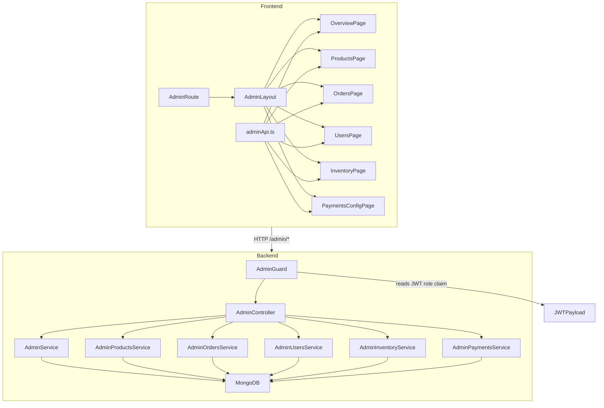

# Design Document: Admin Dashboard

## Overview

The Admin Dashboard is a production-grade administrative interface layered on top of the existing Atlas Commerce Lab platform. It extends the NestJS backend with a dedicated `admin` module and extends the React/Vite frontend with a new `admin` feature directory. No existing functionality is replaced — the feature is purely additive.

The design follows the same architectural patterns already established in the codebase: NestJS feature modules with Mongoose schemas, React feature-based folder structure, JWT-based authentication, and CSS variable-based theming.

**Key design decisions:**

- All admin API endpoints live under the `/admin/*` prefix and are protected by a dedicated `AdminGuard` that reads the JWT role claim without a database lookup (performance-first).
- Role and active-state are embedded in the JWT payload so the guard is stateless and fast.
- CSV export uses Node.js streaming responses to avoid buffering large datasets in memory.
- Revenue aggregation uses MongoDB `$group` pipeline stages, keeping computation in the database layer.
- Inline stock editing uses optimistic UI updates on the frontend for perceived responsiveness.
- `ProviderConfig` documents are seeded via `OnModuleInit` so the payment toggle feature works from first boot without manual setup.
- `StockHistoryEntry` is stored as an embedded array on the `Product` document to keep stock history co-located with the product and avoid a separate collection join on every inventory read.

---

## Architecture



The `AdminGuard` sits at the controller level and is applied to every route in `AdminController`. It reads the `role` and `isActive` claims from the already-validated JWT payload (populated by `JwtStrategy`) — no additional database query is needed.

The frontend `AdminRoute` component mirrors the existing `ProtectedRoute` pattern: it checks `user.role === 'admin'` from the auth context and redirects non-admins to `/`.

---

## Components and Interfaces

### Backend

#### `AdminGuard` — `backend/src/admin/guards/admin.guard.ts`

```typescript
@Injectable()
export class AdminGuard implements CanActivate {
  canActivate(context: ExecutionContext): boolean {
    const request = context.switchToHttp().getRequest();
    const user = request.user; // populated by JwtAuthGuard / JwtStrategy
    if (!user || user.role !== 'admin' || user.isActive === false) {
      throw new ForbiddenException('Admin access required');
    }
    return true;
  }
}
```

`AdminGuard` is always used in combination with `JwtAuthGuard`. The controller applies both guards in order: `@UseGuards(JwtAuthGuard, AdminGuard)`.

#### `AdminController` — `backend/src/admin/admin.controller.ts`

Route prefix: `/admin`. All routes require `JwtAuthGuard` + `AdminGuard`.

| Method | Path | Handler | Description |
|--------|------|---------|-------------|
| GET | `/admin/overview` | `getOverview` | Aggregate overview stats |
| GET | `/admin/products` | `listProducts` | Paginated product list with search/filter/sort |
| POST | `/admin/products` | `createProduct` | Create new product |
| PUT | `/admin/products/:slug` | `updateProduct` | Update product fields |
| DELETE | `/admin/products/:slug` | `deleteProduct` | Remove product |
| PATCH | `/admin/products/bulk-stock` | `bulkUpdateStock` | Bulk inventoryCount update |
| PATCH | `/admin/products/:slug/flags` | `updateProductFlags` | Toggle featured/bestSeller/newArrival |
| GET | `/admin/orders` | `listOrders` | Paginated order list with filters |
| GET | `/admin/orders/export/csv` | `exportOrdersCsv` | Streaming CSV export |
| GET | `/admin/orders/:orderNumber` | `getOrder` | Single order detail |
| PATCH | `/admin/orders/:orderNumber/status` | `overrideOrderStatus` | Admin status override |
| GET | `/admin/users` | `listUsers` | Paginated user list |
| GET | `/admin/users/:id` | `getUserProfile` | User profile + order stats |
| GET | `/admin/users/:id/orders` | `getUserOrders` | User's order history |
| PATCH | `/admin/users/:id/role` | `updateUserRole` | Promote/demote |
| PATCH | `/admin/users/:id/status` | `updateUserStatus` | Enable/disable |
| GET | `/admin/inventory` | `listInventory` | Inventory list with stock filter |
| PATCH | `/admin/inventory/:slug/stock` | `updateStock` | Inline stock update |
| POST | `/admin/inventory/bulk-restock` | `bulkRestock` | Bulk restock |
| GET | `/admin/inventory/:slug/history` | `getStockHistory` | Stock change history |
| GET | `/admin/payment-config` | `getPaymentConfig` | Provider config status |
| PATCH | `/admin/payment-config/:provider` | `toggleProvider` | Enable/disable provider |

#### Service Responsibilities

**`AdminService`** — dashboard aggregation queries using MongoDB `$group` and `$match` pipeline stages against the `checkout_orders` and `catalog_products` collections.

**`AdminProductsService`** — wraps the existing `catalog_products` collection with admin-specific CRUD, bulk stock update, and flag toggle operations. Reuses the existing `Product` Mongoose model.

**`AdminOrdersService`** — queries `checkout_orders` with compound filters (status, provider, date range, text search). Status override appends to the `history` array. CSV export uses `cursor()` for streaming.

**`AdminUsersService`** — queries the `users` collection. Promote/demote and enable/disable mutate `role` and `isActive` fields. Self-action prevention checks the requesting admin's `_id` against the target user's `_id`.

**`AdminInventoryService`** — reads and writes `inventoryCount` on `Product` documents. Every stock change appends a `StockHistoryEntry` to the embedded `stockHistory` array.

**`AdminPaymentsService`** — reads and writes `ProviderConfig` documents. Implements `OnModuleInit` to seed missing configs. The `PaymentsService` is updated to call `AdminPaymentsService.isProviderEnabled()` before creating checkout sessions.

### Frontend

#### `AdminRoute` — `frontend/src/features/admin/AdminRoute.tsx`

Mirrors `ProtectedRoute`. Checks `isLoading` (shows spinner), then checks `user?.role === 'admin'` (redirects to `/` if false).

```tsx
export function AdminRoute({ children }: { children: JSX.Element }): JSX.Element {
  const { user, isLoading } = useAuth();

  if (isLoading) {
    return <div className="auth-loading-screen"><div className="auth-loading-spinner" /></div>;
  }

  if (!user || user.role !== 'admin') {
    return <Navigate to={ROUTES.HOME} replace />;
  }

  return children;
}
```

#### `AdminLayout` — `frontend/src/features/admin/AdminLayout.tsx`

Sidebar navigation + breadcrumbs + `<Outlet />`. Sidebar collapses to hamburger on viewports < 768px using a CSS media query and a `useState` toggle. Uses existing CSS variables for theming.

#### Admin Pages

| Component | Route | Description |
|-----------|-------|-------------|
| `OverviewPage` | `/admin/overview` | Stats cards, revenue chart, recent orders, low-stock alerts |
| `ProductsPage` | `/admin/products` | DataTable with search/filter, ProductForm modal, delete confirm |
| `OrdersPage` | `/admin/orders` | DataTable with filters, status override, CSV export button |
| `UsersPage` | `/admin/users` | DataTable with search, role/status actions |
| `InventoryPage` | `/admin/inventory` | DataTable with inline stock editing, StockBadge |
| `PaymentConfigPage` | `/admin/settings` | Provider toggle cards with env var status |

#### Shared Admin Components

- **`StatsCard`** — displays a metric label, value, and optional trend indicator.
- **`RevenueChart`** — renders daily revenue data using Recharts. Receives `{ date: string; revenue: number }[]` as props.
- **`OrdersTable`** — paginated table for orders with column definitions, sort headers, and loading/empty states.
- **`ProductForm`** — controlled form for create/edit product. Validates required fields client-side before submission.
- **`UserTable`** — paginated table for users with role/status action buttons.
- **`InventoryTable`** — paginated table with inline `inventoryCount` editing.
- **`ConfirmDialog`** — modal confirmation dialog used before destructive actions (delete product, demote admin).

#### `adminApi.ts` — `frontend/src/features/admin/api/adminApi.ts`

Thin HTTP client wrapping `fetch` with the auth token header. Exports typed functions for each admin endpoint. Follows the same pattern as any existing API client in the project.

---

## Data Models

### User Schema Changes

```typescript
// backend/src/users/schemas/user.schema.ts — additions
@Prop({ type: String, enum: ['user', 'admin'], default: 'user' })
role!: 'user' | 'admin';

@Prop({ type: Boolean, default: true })
isActive!: boolean;
```

### JWT Payload

```typescript
// Updated payload shape in AuthService.generateToken()
{
  sub: user._id,          // existing
  email: user.email,      // existing
  name: user.name,        // existing
  role: user.role,        // NEW
  isActive: user.isActive // NEW
}
```

The `JwtStrategy.validate()` method returns the full user document from the database, so `request.user` will have `role` and `isActive` available to `AdminGuard` without any additional changes to the strategy. The JWT payload claims are also embedded so the guard can operate statelessly if needed.

### ProviderConfig Schema

```typescript
// backend/src/admin/schemas/provider-config.schema.ts
@Schema({ collection: 'payment_provider_configs', timestamps: false })
export class ProviderConfig {
  @Prop({ required: true, enum: ['stripe', 'esewa'], unique: true })
  provider!: 'stripe' | 'esewa';

  @Prop({ required: true, default: true })
  enabled!: boolean;

  @Prop({ required: true, default: () => new Date() })
  updatedAt!: Date;
}
```

### StockHistoryEntry (embedded in Product)

```typescript
// Embedded sub-document added to Product schema
@Schema({ _id: false })
export class StockHistoryEntry {
  @Prop({ required: true })
  previousCount!: number;

  @Prop({ required: true })
  newCount!: number;

  @Prop({ required: true, trim: true })
  reason!: string;

  @Prop({ type: mongoose.Schema.Types.ObjectId, ref: 'User', required: true })
  changedBy!: mongoose.Types.ObjectId;

  @Prop({ required: true, default: () => new Date() })
  changedAt!: Date;
}

// Added to Product class:
@Prop({ type: [StockHistoryEntry], default: [] })
stockHistory!: StockHistoryEntry[];
```

### AuthContext User Interface Update

```typescript
// frontend/src/features/auth/AuthContext.tsx — updated User interface
interface User {
  id: string;
  email: string;
  name: string;
  avatar?: string;
  role: 'user' | 'admin';   // NEW
  isActive: boolean;         // NEW
}
```

### Dashboard Stats Response Shape

```typescript
interface AdminOverviewResponse {
  userCount: number;
  orderCount: number;
  productCount: number;
  totalRevenue: number;
  dailyRevenue: Array<{ date: string; revenue: number }>;   // 30 days, ISO date strings
  recentOrders: Array<{
    orderNumber: string;
    status: string;
    customer: { fullName: string; email: string };
    pricing: { total: number; currency: string };
    paymentProvider: string;
    createdAt: string;
  }>;
  lowStockProducts: Array<{
    slug: string;
    name: string;
    inventoryCount: number;
    categoryName: string;
  }>;
  ordersByStatus: Array<{ status: string; count: number }>;
  revenueByProvider: Array<{ provider: string; revenue: number }>;
}
```

### Admin User List Response

```typescript
interface AdminUserResponse {
  _id: string;
  email: string;
  name: string;
  role: 'user' | 'admin';
  isActive: boolean;
  avatar?: string;
  createdAt: string;
  updatedAt: string;
  // password and resetToken are NEVER included
}
```

### Route Constants

```typescript
// Additions to frontend/src/app/constants/routes.ts
ADMIN:             '/admin',
ADMIN_OVERVIEW:    '/admin/overview',
ADMIN_PRODUCTS:    '/admin/products',
ADMIN_ORDERS:      '/admin/orders',
ADMIN_USERS:       '/admin/users',
ADMIN_INVENTORY:   '/admin/inventory',
ADMIN_SETTINGS:    '/admin/settings',
```

---

## Data Flow Diagrams

### Admin Overview Data Flow

```
Browser → GET /admin/overview
       → JwtAuthGuard validates JWT
       → AdminGuard checks role === 'admin' && isActive === true
       → AdminService.getOverview()
         → parallel:
           countDocuments(users)
           countDocuments(checkout_orders)
           countDocuments(catalog_products)
           aggregate(checkout_orders, $match status=paid, $group sum pricing.total)
         → aggregate: dailyRevenue (30 days, $group by date)
         → find: recentOrders (10, sort createdAt desc)
         → find: lowStockProducts (inventoryCount < 5)
         → aggregate: ordersByStatus ($group by status)
         → aggregate: revenueByProvider ($match paid, $group by paymentProvider)
       → Returns AdminOverviewResponse
```

### Provider Config Flow

```
Checkout request → PaymentsService.createStripeCheckoutSession / createEsewaCheckout
               → AdminPaymentsService.isProviderEnabled(provider)
               → ProviderConfig.findOne({ provider })
               → If enabled === false → throw BadRequestException(400)
               → If enabled === true → proceed with checkout
```

### Stock Update Flow

```
PATCH /admin/inventory/:slug/stock
  → AdminGuard
  → AdminInventoryService.updateStock(slug, newCount, adminUserId, reason)
    → Product.findOne({ slug })
    → previousCount = product.inventoryCount
    → product.inventoryCount = newCount
    → product.stockHistory.push({ previousCount, newCount, reason, changedBy, changedAt })
    → product.save()
  → Returns updated product
```

---

## Correctness Properties

*A property is a characteristic or behavior that should hold true across all valid executions of a system — essentially, a formal statement about what the system should do. Properties serve as the bridge between human-readable specifications and machine-verifiable correctness guarantees.*

### Property 1: AdminGuard access control

*For any* JWT payload object, the AdminGuard SHALL grant access if and only if `role === 'admin'` AND `isActive === true`. Any payload where `role !== 'admin'` or `isActive === false` or `user` is absent SHALL result in a ForbiddenException.

**Validates: Requirements 1.4, 1.5, 1.6**

---

### Property 2: JWT payload includes role and isActive

*For any* user document with any combination of `role` (`'user'` or `'admin'`) and `isActive` (`true` or `false`) values, the JWT token generated by `AuthService.generateToken()` SHALL contain a `role` claim equal to `user.role` and an `isActive` claim equal to `user.isActive`.

**Validates: Requirements 1.3**

---

### Property 3: AdminRoute redirects non-admin users

*For any* auth context state where `user` is null or `user.role !== 'admin'`, the `AdminRoute` component SHALL redirect to `/` and SHALL NOT render the protected child component.

**Validates: Requirements 1.7**

---

### Property 4: Dashboard stats accurately reflect database state

*For any* combination of users, orders (with varying statuses and `pricing.total` values), and products in the database, the dashboard overview response SHALL return `userCount`, `orderCount`, and `productCount` equal to the actual document counts in their respective collections, and `totalRevenue` equal to the exact sum of `pricing.total` for all orders where `status === 'paid'`.

**Validates: Requirements 2.1, 2.2, 2.3, 2.4**

---

### Property 5: Daily revenue aggregation correctness

*For any* set of paid orders distributed across dates within the last 30 days, the `dailyRevenue` array SHALL contain one entry per date that has paid orders, each entry's `revenue` SHALL equal the sum of `pricing.total` for paid orders on that date, and no entry SHALL include revenue from orders with a non-paid status.

**Validates: Requirements 2.5**

---

### Property 6: Paginated list returns correct slice

*For any* collection of documents (products, orders, or users) and any valid `page` and `limit` parameters, the returned items SHALL be the correct slice of the full sorted collection — `items[(page-1)*limit .. page*limit-1]` — and the total count SHALL equal the full unfiltered collection size.

**Validates: Requirements 3.1, 4.1, 5.1, 7.1**

---

### Property 7: Search filter returns only matching documents

*For any* search query string applied to the product, order, or user list, every document in the response SHALL contain the search term in the relevant searchable fields, and no document that does not match SHALL appear in the results.

**Validates: Requirements 3.2, 4.2, 5.2**

---

### Property 8: Product create-then-fetch round trip

*For any* valid product input object, creating the product via the Admin Catalog API and then fetching it by slug SHALL return a product document whose fields match the input values exactly.

**Validates: Requirements 3.5**

---

### Property 9: Product update preserves non-updated fields

*For any* existing product and any partial update payload, after the update the product's updated fields SHALL reflect the new values and all fields not included in the update payload SHALL remain unchanged from their pre-update values.

**Validates: Requirements 3.7**

---

### Property 10: Bulk stock update applies to all targets and only targets

*For any* array of `{ slug, inventoryCount }` pairs where all slugs exist, after a bulk stock update every referenced product's `inventoryCount` SHALL equal the value specified in the request, and products not referenced in the request SHALL have unchanged `inventoryCount` values.

**Validates: Requirements 3.10, 7.4**

---

### Property 11: Order status override appends history entry

*For any* existing order and any valid target status, after an admin status override the order's `status` field SHALL equal the target status and the `history` array SHALL contain a new entry with `note === 'Admin override'` and a `changedAt` timestamp within the current request's execution window.

**Validates: Requirements 4.7**

---

### Property 12: CSV export contains one row per filtered order with all required columns

*For any* set of active filters applied to the order list, the CSV export SHALL contain exactly one data row per order that satisfies those filters, each row SHALL include all required columns (`orderNumber`, `status`, `paymentProvider`, `customer.fullName`, `customer.email`, `pricing.total`, `pricing.currency`, `paidAt`, `createdAt`), and no order that does not satisfy the filters SHALL appear in the export.

**Validates: Requirements 4.9, 4.10**

---

### Property 13: User list never exposes sensitive fields

*For any* query to the Admin Users API, no response document SHALL contain a `password` field or a `resetToken` field, regardless of what is stored in the database.

**Validates: Requirements 5.1**

---

### Property 14: User role promote/demote round trip

*For any* non-self user, promoting them to admin SHALL set `role === 'admin'`, and subsequently demoting them SHALL set `role === 'user'`, returning the user to their original role state.

**Validates: Requirements 5.5, 5.6**

---

### Property 15: User enable/disable round trip

*For any* non-self user, disabling them SHALL set `isActive === false`, and subsequently enabling them SHALL set `isActive === true`, returning the user to their original active state.

**Validates: Requirements 5.8, 5.9**

---

### Property 16: Provider config seeding is idempotent

*For any* initial state of the `payment_provider_configs` collection, calling `OnModuleInit` any number of times SHALL result in exactly one `ProviderConfig` document per provider (`stripe` and `esewa`), with no duplicates created.

**Validates: Requirements 6.2**

---

### Property 17: Provider config toggle is an involution

*For any* payment provider with any initial `enabled` state, toggling its `enabled` state SHALL flip the value (`true → false` or `false → true`), and toggling it a second time SHALL return it to the original value.

**Validates: Requirements 6.4**

---

### Property 18: Disabled provider rejects checkout

*For any* payment provider with `enabled === false` in its `ProviderConfig` document, any checkout session creation request for that provider SHALL be rejected with HTTP 400.

**Validates: Requirements 6.5**

---

### Property 19: Stock update appends correct history entry

*For any* product and any new `inventoryCount` value submitted via the inventory update endpoint, after the update the product's `inventoryCount` SHALL equal the new value and the `stockHistory` array SHALL contain a new `StockHistoryEntry` with `previousCount` equal to the pre-update count, `newCount` equal to the submitted value, `changedBy` equal to the requesting admin's user ID, and a `changedAt` timestamp within the current request's execution window.

**Validates: Requirements 7.3, 7.5**

---

### Property 20: Stock history is sorted descending by changedAt

*For any* product with two or more `StockHistoryEntry` records, the stock history endpoint SHALL return entries sorted by `changedAt` in descending order (most recent first).

**Validates: Requirements 7.6**

---

### Property 21: Stock filter returns only matching products

*For any* `stockFilter` value (`in_stock`, `low_stock`, `out_of_stock`), every product in the response SHALL satisfy the corresponding `inventoryCount` condition (`> 4`, `> 0 AND < 5`, or `=== 0` respectively), and no product that does not satisfy the condition SHALL appear in the results.

**Validates: Requirements 7.2**

---

## Error Handling

### Backend

| Scenario | HTTP Status | Message |
|----------|-------------|---------|
| Non-admin JWT | 403 | `"Admin access required"` |
| Inactive user JWT | 403 | `"Admin access required"` |
| Product slug conflict on create | 409 | `"A product with slug '{slug}' already exists"` |
| Product/order/user not found | 404 | `"Resource not found"` |
| Self-demotion attempt | 400 | `"Admins cannot demote their own account"` |
| Self-disable attempt | 400 | `"Admins cannot disable their own account"` |
| Checkout with disabled provider | 400 | `"Payment provider '{provider}' is currently disabled"` |
| Invalid bulk stock payload | 400 | Validation error from class-validator |

All errors follow the existing `HttpExceptionFilter` format already in `backend/src/common/filters/http-exception.filter.ts`.

### Frontend

- API errors surface via a toast notification system or inline error state on the relevant component.
- `AdminRoute` handles `isLoading` with a spinner to prevent premature redirects on hard refresh.
- Optimistic UI updates for inline stock editing are rolled back on API error with a user-visible error message.
- The `InventoryTable` and `OrdersTable` components render an empty state with a descriptive message when no results are returned.
- The `ConfirmDialog` component prevents accidental destructive actions (delete product, demote admin, disable user).

---

## Testing Strategy

### Unit Tests

Unit tests cover specific examples, edge cases, and error conditions:

- **`AdminGuard`**: test with admin+active payload (allow), non-admin payload (403), admin+inactive payload (403), missing user (403).
- **`AdminService`**: test dashboard aggregation with a known fixture dataset — verify counts and revenue sums match expected values.
- **`AdminOrdersService`**: test CSV row generation with a known order fixture — verify all required columns are present and correctly formatted.
- **`AdminUsersService`**: test self-demotion and self-disable rejection with the requesting user's ID matching the target ID.
- **`AdminPaymentsService.isProviderEnabled()`**: test with `enabled=true` (allow) and `enabled=false` (reject).
- **`AdminRoute` component**: test with `isLoading=true` (spinner shown, no redirect), `user=null` (redirect to `/`), `user.role='user'` (redirect to `/`), `user.role='admin'` (renders children).
- **`StockBadge` component**: test with `inventoryCount=0` (out-of-stock), `inventoryCount=3` (low-stock), `inventoryCount=10` (in-stock).

### Property-Based Tests

The property-based testing library for this project is **fast-check** (TypeScript-native, works with Jest/Vitest, no additional runtime dependencies).

Each property test runs a minimum of **100 iterations**.

Tag format: `// Feature: admin-dashboard, Property N: <property_text>`

**Property 1 — AdminGuard access control**
Generate arbitrary `{ role: string, isActive: boolean }` payloads using `fc.record({ role: fc.string(), isActive: fc.boolean() })`. Verify: guard returns `true` iff `role === 'admin' && isActive === true`, throws `ForbiddenException` otherwise.

**Property 2 — JWT payload includes role and isActive**
Generate arbitrary users with `role ∈ ['user', 'admin']` and `isActive ∈ [true, false]`. Verify: decoded JWT contains matching `role` and `isActive` claims.

**Property 4 — Dashboard stats accuracy**
Generate arbitrary arrays of user, order (with varying statuses and totals), and product documents. Seed a test database, call the dashboard service, verify counts and revenue sum match the generated data.

**Property 6 — Paginated list correctness**
Generate arbitrary product arrays and `{ page, limit }` pairs where `page >= 1` and `limit >= 1`. Verify: returned items match the expected slice and total count is correct.

**Property 7 — Search filter correctness**
Generate arbitrary product catalogs and search terms. Verify: all returned products contain the search term in `name`, `subtitle`, or `tags`.

**Property 8 — Product create-then-fetch round trip**
Generate arbitrary valid product inputs. Create via service, then fetch by slug. Verify: fetched document fields match input.

**Property 11 — Order status override appends history**
Generate arbitrary orders and target statuses from the `OrderStatus` enum. Apply override. Verify: `status` updated and `history` entry appended with `note === 'Admin override'`.

**Property 13 — User list never exposes sensitive fields**
Generate arbitrary user queries with varying search terms and pagination. Verify: no response document contains `password` or `resetToken` keys.

**Property 17 — Provider config toggle is an involution**
Generate arbitrary initial `enabled` states (`fc.boolean()`). Toggle once, verify flipped. Toggle again, verify restored to original.

**Property 18 — Stock update appends correct history entry**
Generate arbitrary products and new stock counts (`fc.nat()`). Apply update. Verify: `inventoryCount` updated and `StockHistoryEntry` appended with correct `previousCount`, `newCount`, `changedBy`, `changedAt`.

**Property 21 — Stock filter returns only matching products**
Generate arbitrary product catalogs with varying `inventoryCount` values (`fc.nat()`). Apply each `stockFilter` value. Verify: all returned products satisfy the filter condition.

### Integration Tests

- End-to-end: seed admin user, obtain JWT, call `GET /admin/overview`, verify 200 response with expected shape.
- End-to-end: call `PATCH /admin/payment-config/:provider` with non-admin JWT, verify 403.
- End-to-end: disable a provider via `PATCH /admin/payment-config/:provider`, attempt checkout for that provider, verify 400.
- CSV export: call `GET /admin/orders/export/csv`, verify `Content-Type: text/csv` header and correct column headers in response body.
- Seed script: run `seed-admin.ts` with `ADMIN_EMAIL` set to an existing user's email, verify that user's `role` is updated to `'admin'`.
