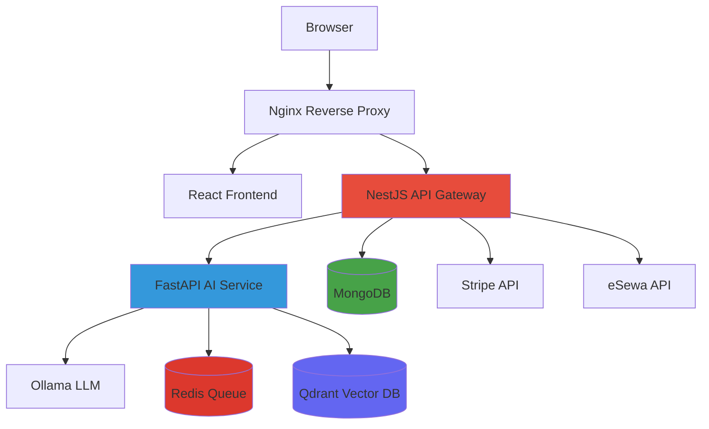
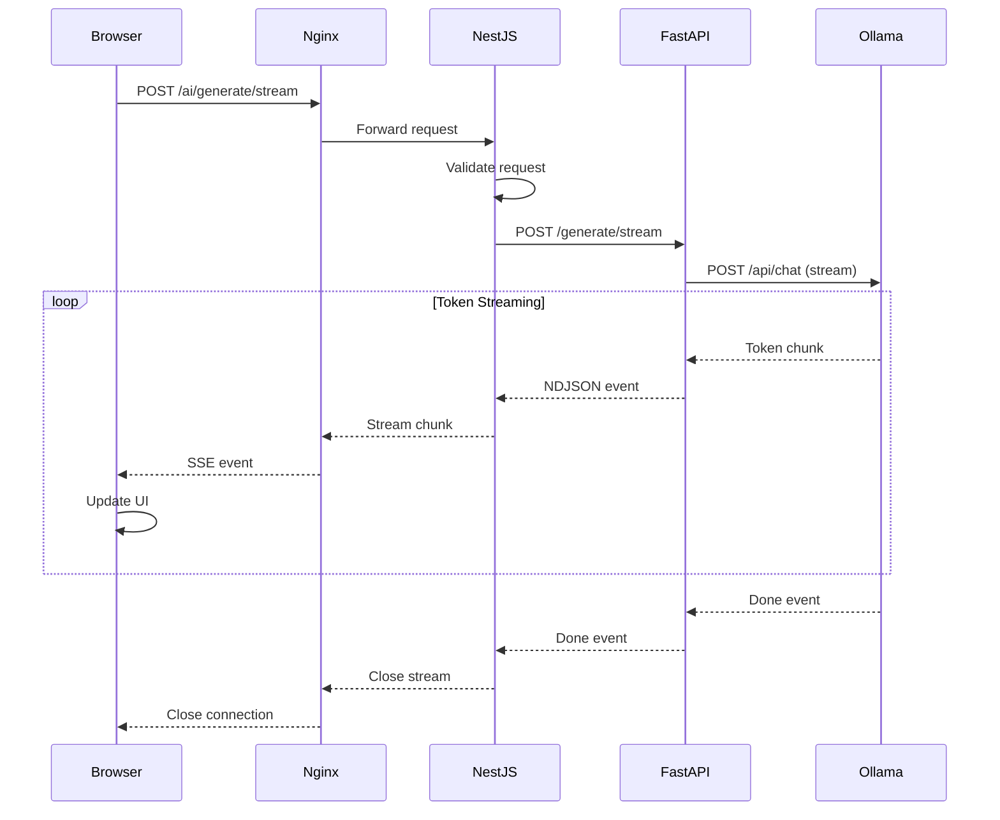
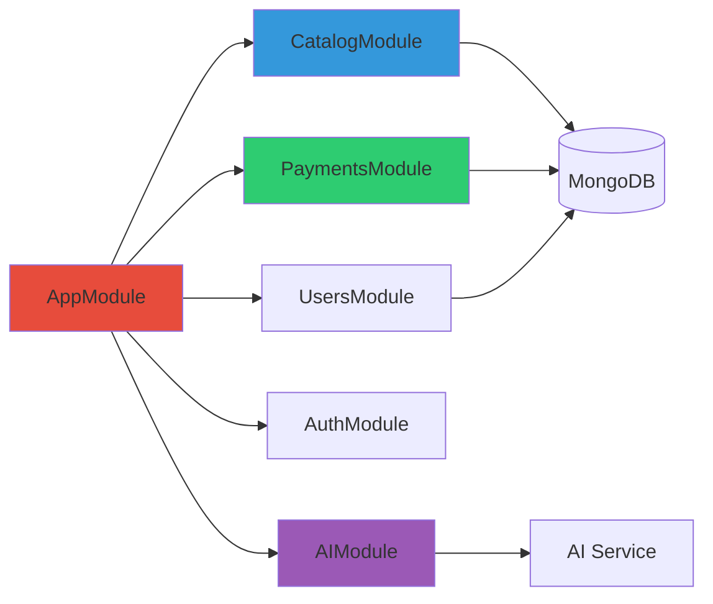

# Design Document: Comprehensive Architecture Documentation

## Overview

This design specifies a comprehensive documentation system for the Atlas Commerce Lab codebase. The documentation will be created as a collection of interconnected Markdown files in the `docs/` folder, providing educational, in-depth explanations of the system architecture, design decisions, data flows, and integration patterns.

### Goals

1. **Educational Focus**: Explain WHAT each component does, WHY architectural decisions were made, and HOW everything works together
2. **Developer Onboarding**: Enable new developers to understand the complete system quickly
3. **Reference Material**: Provide detailed technical specifications for extending the system
4. **Code Examples**: Include real code snippets from the codebase to illustrate patterns in practice

### Target Audience

- Developers new to the codebase
- System architects evaluating the design
- Engineers extending or modifying the system
- Technical stakeholders understanding the platform capabilities

### Documentation Philosophy

The documentation follows these principles:

- **Depth over breadth**: Comprehensive explanations rather than surface-level overviews
- **Context-rich**: Every technical decision includes the reasoning behind it
- **Code-grounded**: Real examples from the actual codebase, not theoretical patterns
- **Cross-referenced**: Documents link to related concepts and source files
- **Diagram-enhanced**: Visual representations using Mermaid for complex flows

## Architecture

### Documentation File Structure

All documentation files will be created in the `docs/` folder with the following organization:

```
docs/
├── README.md                          # Documentation index and navigation
├── architecture/
│   ├── overview.md                    # High-level system architecture
│   ├── microservices.md               # Service responsibilities and communication
│   ├── data-flow.md                   # Complete request/response flows
│   └── design-decisions.md            # Architectural decision records (ADRs)
├── backend/
│   ├── nestjs-architecture.md         # NestJS patterns and module structure
│   ├── api-gateway.md                 # REST API design and orchestration
│   ├── catalog-module.md              # Ecommerce catalog implementation
│   ├── payments-module.md             # Payment processing and providers
│   └── error-handling.md              # Exception filters and validation
├── ai/
│   ├── ai-service-architecture.md     # FastAPI AI service design
│   ├── ollama-integration.md          # Local LLM integration patterns
│   ├── streaming-responses.md         # Token streaming implementation
│   └── rag-system.md                  # Retrieval-Augmented Generation
├── infrastructure/
│   ├── redis-queue.md                 # Task queue and async processing
│   ├── qdrant-vector-db.md            # Vector database and embeddings
│   ├── mongodb-integration.md         # Database design and Mongoose
│   └── docker-compose.md              # Container orchestration
├── frontend/
│   ├── react-architecture.md          # Frontend structure and patterns
│   ├── api-clients.md                 # HTTP client implementation
│   └── streaming-ui.md                # Real-time token rendering
├── guides/
│   ├── adding-modules.md              # How to add new NestJS modules
│   ├── adding-ai-capabilities.md      # Extending AI functionality
│   ├── adding-payment-providers.md    # Integrating new payment methods
│   ├── switching-llm-providers.md     # Moving from Ollama to cloud LLMs
│   └── deployment.md                  # Production deployment guide
└── reference/
    ├── environment-variables.md       # Complete env var reference
    ├── api-endpoints.md               # REST API specification
    └── code-patterns.md               # Common patterns and examples
```

### Naming Conventions

- **File names**: lowercase with hyphens (kebab-case): `nestjs-architecture.md`
- **Folder names**: lowercase, descriptive: `architecture/`, `backend/`, `guides/`
- **Document titles**: Title Case with clear scope: "NestJS Architecture and Module Design"
- **Section headers**: Sentence case for readability: "How the API gateway orchestrates requests"

### Cross-Reference Strategy

Documents will use relative links to reference:

1. **Other documentation files**: `[NestJS Architecture](../backend/nestjs-architecture.md)`
2. **Source code files**: `[catalog.service.ts](../../backend/src/catalog/catalog.service.ts)`
3. **Specific code sections**: `[CatalogService.getHomePage](../../backend/src/catalog/catalog.service.ts#L30-L50)`
4. **External resources**: `[NestJS Documentation](https://docs.nestjs.com/)`

### Documentation Index (docs/README.md)

The main index will provide:

- **Quick Start**: Links to essential documents for new developers
- **By Topic**: Organized navigation by system area
- **By Role**: Curated paths for different developer roles (backend, frontend, DevOps)
- **Search Tips**: How to find specific information

## Components and Interfaces

### Document Structure Template

Each documentation file will follow this structure:

```markdown
# [Document Title]

## Overview
Brief introduction to the topic (2-3 paragraphs)

## Why This Matters
Explanation of why this component/pattern exists

## Architecture
High-level design with Mermaid diagrams

## Implementation Details
Deep dive into how it works

## Code Examples
Real code from the codebase with explanations

## Common Patterns
Reusable patterns developers should follow

## Extension Points
How to extend or modify this component

## Related Documentation
Links to related docs and source files

## References
External resources and further reading
```

### Mermaid Diagram Specifications

#### System Architecture Diagram



#### Data Flow Diagram (AI Request)



#### NestJS Module Architecture



### Code Example Integration Strategy

Code examples will be extracted from actual source files and presented with:

1. **File path header**: Clear indication of source location
2. **Line number references**: Specific line ranges when relevant
3. **Syntax highlighting**: Language-specific formatting
4. **Inline comments**: Explanatory annotations
5. **Context**: Why this code matters and what pattern it demonstrates

Example format:

````markdown
### Dependency Injection Pattern

**File**: `backend/src/catalog/catalog.service.ts`

```typescript
@Injectable()
export class CatalogService {
  constructor(
    @InjectModel(Category.name)
    private readonly categoryModel: Model<CategoryDocument>,
    @InjectModel(Product.name)
    private readonly productModel: Model<ProductDocument>,
  ) {}
  
  // Service methods...
}
```

**What's happening here:**
- `@Injectable()` marks this class for NestJS dependency injection
- `@InjectModel()` injects Mongoose models as constructor dependencies
- NestJS automatically resolves and provides these dependencies
- This pattern keeps services testable and decoupled from infrastructure

**Why this matters:**
Dependency injection is the foundation of NestJS architecture. It enables:
- Easy testing with mock dependencies
- Clear separation of concerns
- Flexible service composition
- Runtime dependency resolution
````

### Documentation Validation Checklist

Each document must satisfy:

- [ ] **Completeness**: Addresses all relevant requirements
- [ ] **Accuracy**: Code examples match actual source files
- [ ] **Clarity**: Explanations are understandable to target audience
- [ ] **Cross-references**: Links to related docs and source files work
- [ ] **Diagrams**: Visual representations are accurate and helpful
- [ ] **Code examples**: Real code from codebase with proper context
- [ ] **Extension guidance**: Clear instructions for extending functionality
- [ ] **Design rationale**: Explains WHY decisions were made

## Data Models

### Documentation Metadata

Each documentation file will include frontmatter metadata:

```yaml
---
title: "NestJS Architecture and Module Design"
category: "Backend"
tags: ["nestjs", "architecture", "modules", "dependency-injection"]
related:
  - "../architecture/microservices.md"
  - "../guides/adding-modules.md"
last_updated: "2025-01-26"
---
```

### Document Categories

Documents are organized into these categories:

1. **Architecture**: High-level system design and patterns
2. **Backend**: NestJS implementation details
3. **AI**: AI service and LLM integration
4. **Infrastructure**: Databases, queues, and deployment
5. **Frontend**: React application structure
6. **Guides**: How-to documentation for common tasks
7. **Reference**: API specs and configuration details

### Content Structure Models

#### Architecture Document Model

```typescript
interface ArchitectureDocument {
  title: string;
  overview: string;
  components: Component[];
  dataFlows: DataFlow[];
  diagrams: MermaidDiagram[];
  designDecisions: DesignDecision[];
  relatedDocs: string[];
}

interface Component {
  name: string;
  responsibility: string;
  technology: string;
  interfaces: string[];
  dependencies: string[];
}

interface DataFlow {
  name: string;
  steps: FlowStep[];
  diagram: MermaidDiagram;
  errorHandling: string;
}

interface DesignDecision {
  decision: string;
  rationale: string;
  alternatives: string[];
  tradeoffs: string[];
}
```

#### Code Example Model

```typescript
interface CodeExample {
  title: string;
  filePath: string;
  lineRange?: { start: number; end: number };
  language: string;
  code: string;
  explanation: string;
  pattern: string;
  relatedExamples: string[];
}
```

## Error Handling

### Documentation Quality Assurance

To ensure documentation accuracy and completeness:

1. **Automated Link Checking**: Verify all internal and external links resolve correctly
2. **Code Example Validation**: Ensure code snippets match actual source files
3. **Diagram Rendering**: Test all Mermaid diagrams render properly
4. **Cross-Reference Validation**: Confirm all document references exist
5. **Requirement Traceability**: Map each document to requirements it satisfies

### Handling Documentation Drift

As the codebase evolves, documentation must stay synchronized:

1. **Version Tagging**: Include last_updated dates in frontmatter
2. **Change Notifications**: Flag documents affected by code changes
3. **Review Cycles**: Periodic documentation audits
4. **Inline Warnings**: Note when examples may be outdated

### Missing Information Handling

When information is incomplete or uncertain:

1. **Explicit Gaps**: Mark sections with `[TODO: Research X]` or `[Needs verification]`
2. **Partial Documentation**: Document what is known, flag what needs investigation
3. **Community Contribution**: Provide guidelines for others to fill gaps
4. **Iterative Improvement**: Treat documentation as living, evolving content

## Testing Strategy

### Why Property-Based Testing Does Not Apply

This feature creates **documentation files** (Markdown content), not executable code with testable behavioral properties. Property-based testing is designed for validating universal properties across input spaces (e.g., "for any valid input X, property P(X) holds"), which does not apply to documentation generation.

**Appropriate testing approaches for this feature:**

1. **Manual Review**: Human verification of technical accuracy and clarity
2. **Automated Link Checking**: Scripts to verify cross-references resolve
3. **Code Example Validation**: Ensure code snippets match source files
4. **Diagram Rendering Tests**: Verify Mermaid diagrams display correctly
5. **Completeness Checks**: Validate all requirements are documented

### Documentation Testing Approach

Since this feature creates documentation rather than executable code, testing focuses on:

1. **Content Accuracy**: Verify technical information matches implementation
2. **Link Integrity**: Ensure all cross-references resolve correctly
3. **Code Example Validity**: Confirm code snippets compile/run
4. **Diagram Rendering**: Test Mermaid diagrams display properly
5. **Completeness**: Validate all requirements are addressed

### Validation Methods

#### Manual Review Checklist

For each document:

- [ ] Technical accuracy verified against source code
- [ ] All code examples tested and working
- [ ] Cross-references checked and valid
- [ ] Diagrams render correctly in Markdown viewers
- [ ] Explanations clear and understandable
- [ ] Design rationale provided for key decisions
- [ ] Extension guidance is actionable

#### Automated Checks

Implement automated validation for:

1. **Link Checking**: Script to verify all `[text](path)` links resolve
2. **Code Extraction**: Tool to extract and validate code examples from source
3. **Diagram Validation**: Mermaid syntax checker
4. **Requirement Coverage**: Map documents to requirements they satisfy

#### Peer Review Process

Documentation should undergo:

1. **Technical Review**: Verify accuracy by domain experts
2. **Clarity Review**: Ensure explanations are understandable
3. **Completeness Review**: Confirm all aspects are covered
4. **Consistency Review**: Check terminology and style consistency

### Testing Documentation Updates

When code changes:

1. **Impact Analysis**: Identify affected documentation
2. **Update Verification**: Ensure docs reflect new implementation
3. **Example Refresh**: Update code examples if APIs changed
4. **Diagram Updates**: Revise diagrams if architecture changed

### Unit Testing Strategy

While the documentation itself is not unit-testable, supporting tools can be tested:

1. **Link Validator**: Unit tests for link checking logic
2. **Code Extractor**: Tests for extracting code from source files
3. **Diagram Parser**: Tests for Mermaid syntax validation
4. **Metadata Parser**: Tests for frontmatter parsing

### Integration Testing Strategy

Integration tests validate the complete documentation workflow:

1. **End-to-End Documentation Generation**: Generate all docs and verify structure
2. **Cross-Reference Validation**: Verify all links between documents work
3. **Code Example Extraction**: Extract and validate all code examples
4. **Diagram Rendering**: Render all Mermaid diagrams and check for errors

### Success Criteria

Documentation is considered complete and accurate when:

1. **All Requirements Addressed**: Each of the 10 requirements has corresponding documentation
2. **Code Examples Valid**: All code snippets are extracted from actual source and work correctly
3. **Links Functional**: All cross-references and external links resolve
4. **Diagrams Accurate**: Visual representations match actual architecture
5. **Peer Reviewed**: Technical experts have validated accuracy
6. **User Tested**: New developers can successfully use docs for onboarding

## Implementation Notes

### Documentation Creation Process

1. **Research Phase**: Analyze codebase to understand implementation details
2. **Outline Phase**: Create document structure and section headings
3. **Content Phase**: Write explanations, extract code examples, create diagrams
4. **Review Phase**: Validate accuracy, test links, check completeness
5. **Polish Phase**: Improve clarity, add cross-references, finalize formatting

### Tools and Technologies

- **Markdown**: Primary documentation format
- **Mermaid**: Diagram generation
- **GitHub Flavored Markdown**: Syntax highlighting and formatting
- **VS Code**: Markdown editing with preview
- **markdownlint**: Style and syntax validation

### Style Guidelines

#### Writing Style

- **Active voice**: "The service processes requests" not "Requests are processed"
- **Present tense**: "The controller validates input" not "The controller will validate"
- **Second person for guides**: "You can add a module by..." not "One can add..."
- **Technical precision**: Use exact terminology from the codebase

#### Code Style

- **Consistent formatting**: Match project's code style
- **Meaningful examples**: Real-world scenarios, not toy examples
- **Complete context**: Include imports and necessary setup
- **Inline comments**: Explain non-obvious logic

#### Diagram Style

- **Clear labels**: Descriptive node and edge names
- **Consistent colors**: Same colors for same component types
- **Appropriate detail**: Right level of abstraction for audience
- **Legend when needed**: Explain symbols and colors

### Maintenance Strategy

Documentation maintenance includes:

1. **Regular Audits**: Quarterly review of all documentation
2. **Change Tracking**: Update docs when code changes
3. **Feedback Loop**: Collect and incorporate user feedback
4. **Version Control**: Track documentation changes in git
5. **Deprecation Notices**: Mark outdated content clearly

