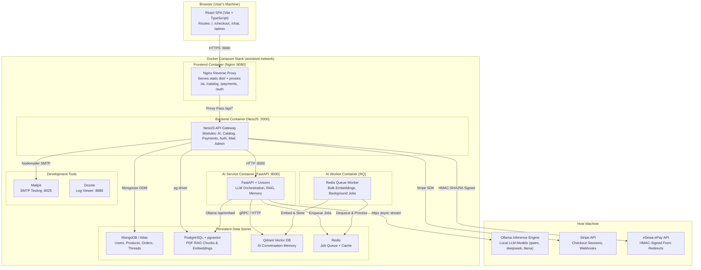
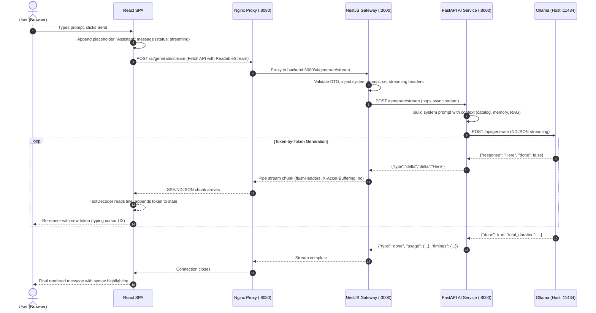
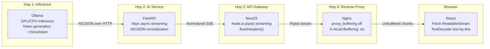
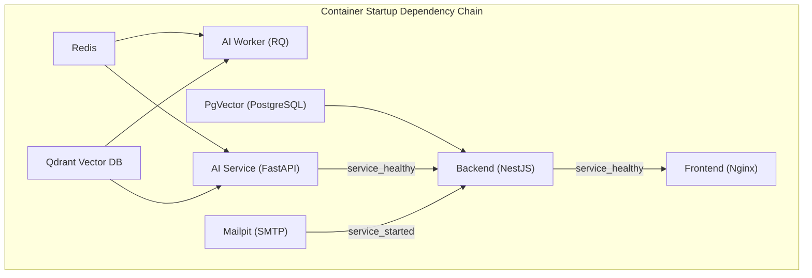
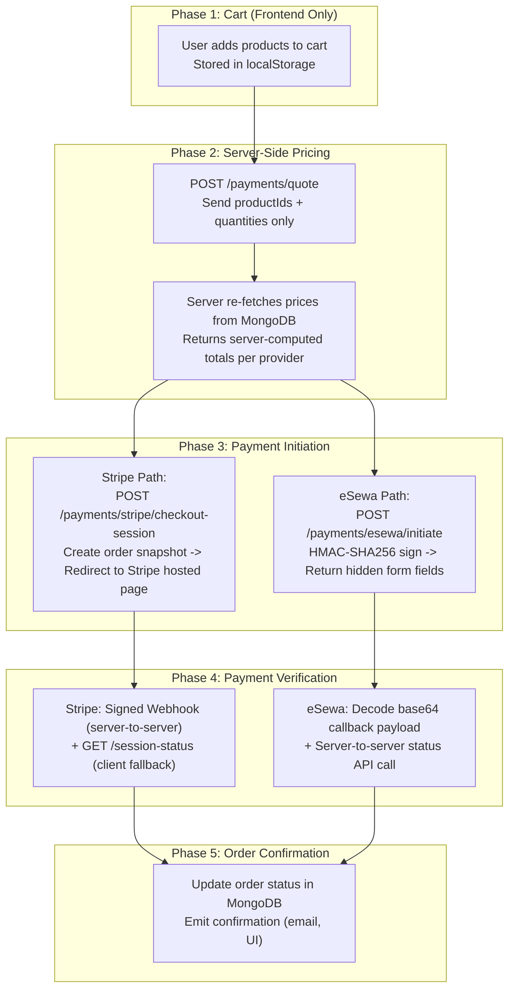

# 🏗️ Architecture & Data Flow Guide — Atlas Commerce Lab

A senior full-stack engineering deep dive into the distributed system architecture, request lifecycle, streaming data flows, and production failure modes of the Atlas Commerce Lab platform.

---

## 📖 Table of Contents
1. [System Architecture Overview](#1-system-architecture-overview)
2. [Multi-Layer Data Flow: Request Lifecycle](#2-multi-layer-data-flow-request-lifecycle)
3. [Streaming Token Pipeline (4-Hop Architecture)](#3-streaming-token-pipeline-4-hop-architecture)
4. [Service Boundary & Dependency Graph](#4-service-boundary--dependency-graph)
5. [Payment Orchestration Flow](#5-payment-orchestration-flow)
6. [How to Extend the Codebase](#6-how-to-extend-the-codebase)
7. [Senior Full-Stack Engineer Interview Q&A](#7-senior-full-stack-engineer-interview-qa)

---

## 1. System Architecture Overview

The platform is orchestrated using Docker Compose and consists of **9 containers** communicating over a single Docker bridge network (`assistant-network`), plus the host machine's Ollama inference engine.

### Component Responsibilities

| Service | Tech | Responsibility | Why Isolated? |
| :--- | :--- | :--- | :--- |
| **Frontend** | React 18, Vite, Nginx | SPA rendering, proxy routing, static asset serving | Browser security: never exposes backend topology |
| **Backend** | NestJS, TypeScript | API Gateway: validation, auth, orchestration, payment verification | Single source of truth for business logic & secrets |
| **AI Service** | FastAPI, Python | LLM streaming, RAG retrieval, memory, prompt engineering | Python ecosystem for ML; isolates GPU-bound work |
| **AI Worker** | RQ, Python | Background processing: bulk embeddings, heavy async tasks | Prevents request-time timeouts for CPU/GPU operations |
| **MongoDB** | Mongoose ODM | Users, products, orders, chat threads, admin data | Document model fits flexible catalog & order schemas |
| **PgVector** | PostgreSQL 16 | PDF chunk storage with IVFFlat cosine-similarity indexing | SQL + vector extensions for structured RAG queries |
| **Qdrant** | Vector DB | Long-term AI conversation memory via embedding similarity | Purpose-built for high-dimensional nearest-neighbor search |
| **Redis** | Alpine | Job queue for RQ workers, future caching layer | In-memory speed for task coordination |
| **Mailpit** | SMTP Trap | Catches transactional emails locally during development | Prevents accidental email sends to real users |

---

## 2. Multi-Layer Data Flow: Request Lifecycle

### What happens when a user hits "Send" in the chat?

### Critical Anti-Buffering Configuration

Every layer in this pipeline must be configured to **NOT buffer** the response, or the user sees a blank screen for 10 seconds then the entire answer dumps at once:

| Layer | Setting | Why |
| :--- | :--- | :--- |
| **Nginx** | `proxy_buffering off; X-Accel-Buffering: no` | Nginx default buffers 8KB before forwarding |
| **NestJS** | `res.flushHeaders(); Cache-Control: no-cache, no-transform` | Node.js HTTP response may batch writes |
| **FastAPI** | `StreamingResponse(media_type="application/x-ndjson")` | Must use async generator, not buffered response |
| **Ollama** | `"stream": true` in API payload | Without this, Ollama returns entire response at once |

---

## 3. Streaming Token Pipeline (4-Hop Architecture)

> **Production Insight:** The 4-hop streaming path means a single misconfigured layer (e.g., a corporate proxy adding buffering, or a Cloudflare WAF with response rewriting) can destroy the entire real-time UX. In production, always verify each hop independently using `curl --no-buffer`.

---

## 4. Service Boundary & Dependency Graph

> **Why `depends_on` with health conditions matters:** Without `service_healthy`, Docker starts containers in parallel. If NestJS boots before PgVector finishes `initdb`, Mongoose connections succeed but pgvector queries crash with `relation "pdf_chunks" does not exist`. The health-conditioned dependency chain guarantees correct sequencing.

---

## 5. Payment Orchestration Flow

> **The Cardinal Rule:** The server is the **only source of truth for money**. The frontend never sends a price. The backend fetches current prices from MongoDB, recalculates, and creates payment sessions with server-computed amounts.

---

## 6. How to Extend the Codebase

**Adding a new Database (e.g., MongoDB / PostgreSQL):**
1. Add the database image to `docker-compose.yml`.
2. Connect to it strictly inside the `/backend` (NestJS) using TypeORM or Prisma.
3. Create a `messages` table/collection to save chat history.

**Adding new AI capabilities (e.g., Image Generation):**
1. Add a new endpoint in `/ai-service/app/main.py`.
2. Add a new route in `/backend/src/modules/ai/ai.controller.ts` that points to the Python service.
3. Call the backend route from a new feature in `/frontend/src/features/`.

**Adding a new UI Page:**
1. Create a new folder under `/frontend/src/features/` (e.g., `features/settings`).
2. Build the components.
3. Import them into `/app/App.tsx` and add a React Router if you need multiple URLs.

---

## 7. Senior Full-Stack Engineer Interview Q&A

### Q1: "Why does the browser never talk directly to your AI service, database, or payment provider?"

**Answer:**
This is the API Gateway pattern. The NestJS backend is the single point of contact for the browser. This provides:
1. **Security isolation**: MongoDB connection strings, Stripe secret keys, eSewa HMAC secrets, and Ollama endpoints are never exposed to the browser's network tab.
2. **Request validation**: NestJS validates every DTO before forwarding. A malformed prompt or a negative price quantity is rejected at the gateway before consuming downstream resources.
3. **Topology hiding**: The frontend sees one origin (`localhost:8080`). Nginx proxies to NestJS. The browser has zero knowledge that FastAPI, Qdrant, or Ollama exist. If we swap Ollama for OpenAI's API tomorrow, the frontend code changes in zero files.
4. **Rate limiting & auth**: These cross-cutting concerns belong at the gateway, not scattered across 5 different services.

**Follow-up: "What's the downside of this pattern?"**
Single point of failure. If NestJS is down, the entire platform is down. In a production environment, you'd run multiple NestJS replicas behind a load balancer, and use circuit breakers (e.g., `nestjs-resilience` or `opossum`) so a failing AI service doesn't cascade into payment failures.

---

### Q2: "Walk me through a production outage scenario in your streaming pipeline."

**Answer:**
**Scenario**: Users report that the chat page shows a blank response for 15 seconds, then dumps the entire answer at once.

**Root Cause Investigation:**
1. First suspect: Nginx buffering. Check if `proxy_buffering off` is set in the location block handling `/ai/`. If a recent config deploy reset this to default (`on`), Nginx will buffer 8KB before forwarding.
2. Second suspect: A corporate proxy or CDN (Cloudflare, AWS ALB) injecting response buffering. ALBs have a default idle timeout of 60 seconds and may not support chunked streaming without explicit configuration.
3. Third suspect: NestJS not calling `res.flushHeaders()` before the first `res.write()`. Node.js HTTP responses can batch writes until the internal buffer fills.
4. Verification: Run `curl --no-buffer -N http://localhost:3000/ai/generate/stream` and observe if tokens arrive incrementally or all at once.

**Follow-up: "How would you add observability to detect this before users report it?"**
Add a `time_to_first_token_ms` metric in the NDJSON `start` event. Track the p50/p95/p99 of this metric in Prometheus/Grafana. Alert if p95 exceeds 3 seconds. The metric is computed as the delta between the NestJS request receipt timestamp and the first `delta` event from FastAPI.

---

### Q3: "Your payment system uses two verification paths for Stripe (webhook + session-status). Why both?"

**Answer:**
**Webhook-first architecture**: Stripe's signed webhook (`checkout.session.completed`) is the authoritative, server-to-server confirmation. It arrives asynchronously and can be delayed by seconds or minutes.

**Session-status fallback**: When the user's browser redirects back to our success page, the webhook may not have arrived yet. Rather than showing "Processing..." for 30 seconds, the frontend calls `GET /payments/stripe/session-status?session_id=cs_xxx`. The backend calls Stripe's API directly to check the session's `payment_status`.

**Why this dual approach?**
1. **Webhook alone is unreliable for UX**: Stripe guarantees eventual delivery but not latency. The user would see a spinner.
2. **Session-status alone is unreliable for state**: The user could close their browser before the redirect. The order would stay in `pending` forever.
3. **Both together provide resilience**: Whichever arrives first updates the order. The second is idempotent (checks current status before writing).

**Follow-up: "What if the webhook and session-status disagree?"**
Trust the webhook. It uses cryptographic signature verification (`Stripe-Signature` header against the raw body). The session-status call trusts TLS to Stripe's API, which is also reliable, but the webhook is the canonical confirmation path per Stripe's own documentation.

---

### Q4: "You have two vector databases (Qdrant + pgvector). Why not consolidate?"

**Answer:**
They serve fundamentally different workloads:

| Dimension | Qdrant | pgvector |
| :--- | :--- | :--- |
| **Use Case** | AI conversation memory (long-term) | PDF document RAG (structured retrieval) |
| **Data Shape** | Free-form conversation embeddings, no schema | Chunked documents with metadata (page number, source file, overlap context) |
| **Query Pattern** | Similarity search with score threshold (0.6) | SQL-driven vector search with `WHERE` filters on document ID |
| **Lifecycle** | Persists forever, grows with conversations | Scoped to uploaded documents, can be deleted per-document |
| **Index Type** | HNSW (fast approximate NN, in-memory) | IVFFlat (PostgreSQL-native, disk-backed, supports ACID) |

Consolidating would force one tool to handle both access patterns poorly. Qdrant excels at high-throughput, schema-less vector similarity. pgvector excels when you need SQL joins, transactions, and relational metadata alongside vectors.

**Follow-up: "At what scale would you reconsider this?"**
If conversation memory grows beyond 100 million vectors, I'd consider moving to a managed vector service (Pinecone, Weaviate Cloud) with sharding. For pgvector, if PDF ingestion exceeds 10,000 documents, I'd benchmark IVFFlat vs HNSW index types and consider partitioning by document.

---

### Q5: "How does your system handle a Docker container restart mid-request?"

**Answer:**
It depends on which container restarts:

1. **AI Service restarts**: The `httpx` streaming connection from NestJS to FastAPI breaks. NestJS receives a `ECONNRESET` error, which propagates as a broken pipe to the browser. The React `catch` handler shows "Connection lost — please retry." The AI Service has a healthcheck; Docker restarts it within 15 seconds.

2. **Backend restarts**: The Nginx proxy receives a `502 Bad Gateway`. All in-flight payment webhooks from Stripe are lost (Stripe retries with exponential backoff up to 3 days, so no data loss). All streaming chat connections break. The frontend shows an error toast.

3. **Redis restarts**: The RQ worker loses its connection, crashes, and Docker restarts it. Queued jobs in Redis are lost if Redis has no persistence configured (our Alpine config uses no AOF/RDB by default). In production, enable `appendonly yes`.

4. **MongoDB restarts**: NestJS Mongoose driver has built-in reconnection with exponential backoff (`serverSelectionTimeoutMS`). If Mongo restarts within 30 seconds, in-flight queries fail but the connection pool recovers automatically. New requests succeed without a container restart.

**Follow-up: "How would you make the streaming pipeline resilient to intermittent failures?"**
Implement a retry-with-checkpoint pattern: save the last `delta` token index in the NDJSON stream. If the connection breaks, the frontend sends a `resume_from_token: 47` parameter. The backend replays from cached partial results (stored in Redis with a 5-minute TTL keyed by `requestId`).
