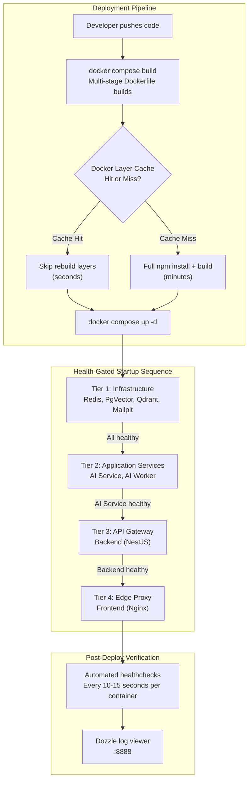
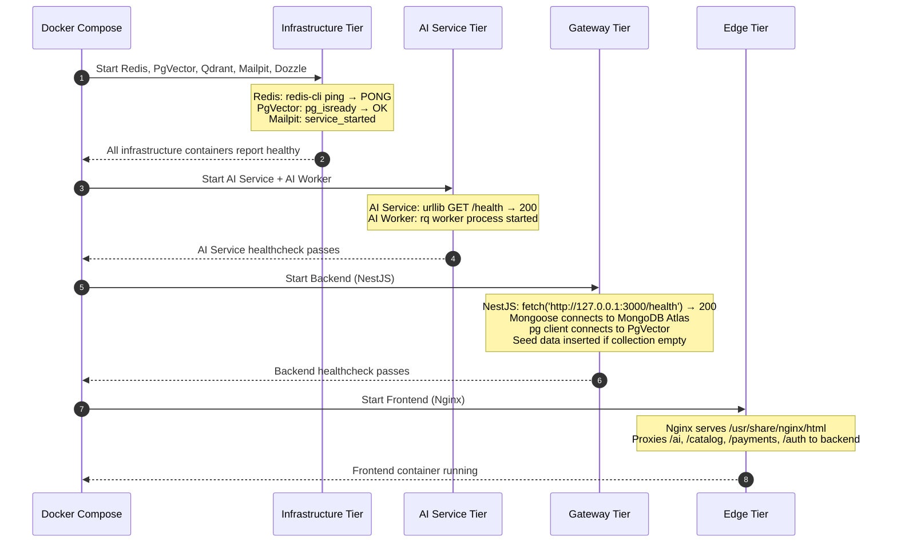
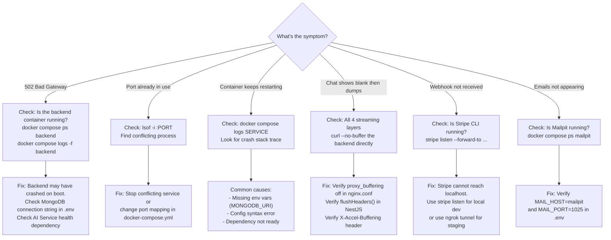

# 🎉 Atlas Commerce Lab — Production Deployment & Operations Guide

A senior full-stack engineering guide covering zero-downtime deployments, container health verification, production failure debugging, admin operations, and real-world deployment interview scenarios.

---

## 📖 Table of Contents
1. [Deployment Architecture Overview](#1-deployment-architecture-overview)
2. [Container Health & Startup Sequence](#2-container-health--startup-sequence)
3. [Admin Dashboard Operations](#3-admin-dashboard-operations)
4. [Production Readiness Checklist](#4-production-readiness-checklist)
5. [Deployment Verification Procedures](#5-deployment-verification-procedures)
6. [Troubleshooting Runbook](#6-troubleshooting-runbook)
7. [Operational Commands Reference](#7-operational-commands-reference)
8. [Senior Full-Stack Engineer Interview Q&A](#8-senior-full-stack-engineer-interview-qa)

---

## 1. Deployment Architecture Overview



### Running Services After Successful Deployment

| Service | Container Name | URL | Health |
| :--- | :--- | :--- | :--- |
| **Frontend (React + Nginx)** | `atlas-commerce-lab-frontend-1` | [http://localhost:8080](http://localhost:8080) | Nginx process running |
| **Backend (NestJS)** | `atlas-commerce-lab-backend-1` | [http://localhost:3000](http://localhost:3000) | `/health` returns 200 |
| **AI Service (FastAPI)** | `atlas-commerce-lab-ai-service-1` | [http://localhost:8000](http://localhost:8000) | `/health` returns 200 |
| **AI Worker (RQ)** | `atlas-commerce-lab-ai-worker-1` | — | RQ process running |
| **Mailpit (Email UI)** | `atlas-commerce-lab-mailpit-1` | [http://localhost:8025](http://localhost:8025) | SMTP + Web UI |
| **Dozzle (Logs)** | `atlas-commerce-lab-monitoring-1` | [http://localhost:8888](http://localhost:8888) | Web UI |
| **PgVector** | `atlas-commerce-lab-pgvector-1` | `localhost:5433` | `pg_isready` passes |
| **Qdrant** | `atlas-commerce-lab-vector-db-1` | [http://localhost:6333/dashboard](http://localhost:6333/dashboard) | HTTP API available |
| **Redis** | `atlas-commerce-lab-redis-1` | `localhost:6381` | `redis-cli ping` returns PONG |

---

## 2. Container Health & Startup Sequence



### Healthcheck Implementations Per Service

| Service | Healthcheck Command | Interval | Why This Method? |
| :--- | :--- | :--- | :--- |
| **Backend** | `node -e "fetch('http://127.0.0.1:3000/health')"` | 15s | Uses Node 20+ built-in `fetch`, no curl needed in slim image |
| **AI Service** | `python -c "urllib.request.urlopen('http://127.0.0.1:8000/health')"` | 15s | Uses Python stdlib, no external dependencies |
| **Redis** | `redis-cli ping` | 10s | Native Redis CLI built into the image |
| **PgVector** | `pg_isready -U postgres -d pdf_rag` | 10s | PostgreSQL's own readiness probe |
| **Mailpit** | `service_started` (no healthcheck) | — | Lightweight service, starts instantly |

---

## 3. Admin Dashboard Operations

### 🔐 Default Admin Credentials

```
Email:    admin@example.com
Password: Admin@123456
```

> **⚠️ CRITICAL:** Change this password immediately after first login in any non-local environment.

### Admin Panel Routes

| Feature | Route | Capabilities |
| :--- | :--- | :--- |
| **Dashboard** | `/admin` | Revenue stats, recent orders, low stock alerts, top sellers |
| **Products** | `/admin/products` | CRUD, stock management, search, pagination |
| **Orders** | `/admin/orders` | Status updates, customer details, order history |
| **Users** | `/admin/users` | Role management, activate/deactivate, purchase history |
| **Settings** | `/admin/settings` | Store configuration |

### Creating Admin Users

```bash
# In Docker (production)
docker compose exec backend node dist/scripts/seed-admin.js

# With custom credentials
docker compose exec \
  -e ADMIN_EMAIL=newadmin@company.com \
  -e ADMIN_PASSWORD=SecurePass123 \
  -e ADMIN_NAME="New Admin" \
  backend node dist/scripts/seed-admin.js

# Locally (development)
cd backend && npm run seed:admin
```

---

## 4. Production Readiness Checklist

### Security

- [ ] Change default admin password
- [ ] Set strong `JWT_SECRET` (min 64 characters, cryptographically random)
- [ ] Enable HTTPS with TLS certificates
- [ ] Configure CORS to allow only your production domain
- [ ] Set up rate limiting on auth and payment endpoints
- [ ] Remove or restrict Dozzle log viewer in production
- [ ] Rotate Stripe webhook secrets quarterly

### Infrastructure

- [ ] Enable Redis persistence (`appendonly yes`) to survive restarts
- [ ] Configure MongoDB Atlas with IP whitelisting and connection pooling
- [ ] Set up database backups (MongoDB Atlas automated backups + pg_dump for PgVector)
- [ ] Configure container resource limits (CPU/memory) to prevent noisy-neighbor effects
- [ ] Enable Docker restart policies (`unless-stopped` or `always`)
- [ ] Set up log aggregation (ELK, Loki, or Datadog)

### Monitoring

- [ ] Add application-level health endpoints with dependency checks
- [ ] Set up uptime monitoring (Pingdom, UptimeRobot)
- [ ] Configure alerting for container crashes and health failures
- [ ] Track business metrics (orders/hour, payment success rate, AI response time)

### Payments

- [ ] Switch Stripe from test keys to live keys
- [ ] Configure Stripe webhook endpoint URL to your production domain
- [ ] Set up eSewa production merchant credentials
- [ ] Test complete payment flows end-to-end in staging

---

## 5. Deployment Verification Procedures

### Automated Smoke Test Script

```bash
#!/usr/bin/env bash
set -euo pipefail

echo "🔍 Checking container health..."
docker compose ps --format "table {{.Name}}\t{{.Status}}" | grep -v NAME

echo ""
echo "🌐 Testing service endpoints..."

check_endpoint() {
    local name=$1 url=$2
    local status=$(curl -s -o /dev/null -w "%{http_code}" "$url" 2>/dev/null || echo "FAIL")
    if [ "$status" = "200" ]; then
        echo "  ✅ $name → HTTP $status"
    else
        echo "  ❌ $name → HTTP $status"
    fi
}

check_endpoint "Frontend"      "http://localhost:8080"
check_endpoint "Backend Health" "http://localhost:3000/health"
check_endpoint "AI Service"    "http://localhost:8000/health"
check_endpoint "Mailpit UI"    "http://localhost:8025"
check_endpoint "Dozzle Logs"   "http://localhost:8888"

echo ""
echo "📦 Testing API endpoints..."
check_endpoint "Catalog Home"  "http://localhost:3000/catalog/home"

echo ""
echo "✨ Deployment verification complete!"
```

### Manual Verification Flow

1. Open [http://localhost:8080](http://localhost:8080) — storefront should render with products
2. Add a product to cart → click Checkout → verify server-priced quote appears
3. Open [http://localhost:8080/chat](http://localhost:8080/chat) → send a message → verify streaming response
4. Open [http://localhost:8025](http://localhost:8025) → trigger a password reset → verify email appears
5. Open [http://localhost:8888](http://localhost:8888) → verify real-time container logs are visible

---

## 6. Troubleshooting Runbook

### Common Failures & Resolutions



### Debug Commands

```bash
# Check all container statuses
docker compose ps

# View live logs (all services)
docker compose logs -f

# View logs for specific service
docker compose logs -f backend

# Test Nginx config inside container
docker compose exec frontend nginx -t

# Check NestJS config
docker compose exec backend node -e "console.log(process.env.MONGODB_URI)"

# Test database connectivity
docker compose exec pgvector pg_isready -U postgres -d pdf_rag

# Test Redis connectivity
docker compose exec redis redis-cli ping

# Shell access to any container
docker compose exec backend sh
docker compose exec frontend sh

# Resource usage
docker stats
```

---

## 7. Operational Commands Reference

### Lifecycle Management

```bash
# Start the full stack
docker compose up -d

# Start with rebuild
docker compose up -d --build

# Stop all containers (preserves volumes)
docker compose stop

# Stop and remove containers
docker compose down

# Stop, remove containers AND volumes (data loss!)
docker compose down -v

# Restart a specific service
docker compose restart backend

# Rebuild a specific service
docker compose build backend && docker compose up -d backend

# Reload Nginx config without restart
docker compose exec frontend nginx -s reload
```

### Database Operations

```bash
# MongoDB Atlas shell (if using Atlas, connect via mongosh locally)
mongosh "mongodb+srv://cluster.mongodb.net/ai-architect"

# PgVector shell
docker compose exec pgvector psql -U postgres -d pdf_rag

# List PDF RAG chunks
docker compose exec pgvector psql -U postgres -d pdf_rag -c "SELECT id, LEFT(content, 80) FROM pdf_chunks LIMIT 10;"

# Redis inspection
docker compose exec redis redis-cli INFO keyspace
docker compose exec redis redis-cli KEYS "*"
```

---

## 8. Senior Full-Stack Engineer Interview Q&A

### Q1: "How do you deploy a multi-container application to production with zero downtime?"

**Answer:**
For a Docker Compose stack like this, true zero-downtime requires several strategies working together:

1. **Rolling updates**: Deploy one service at a time. Update the backend first, verify its healthcheck passes, then update the frontend. Never update all containers simultaneously.
2. **Health-gated dependencies**: Our `docker-compose.yml` uses `depends_on` with `condition: service_healthy`. Docker won't start the frontend until the backend's healthcheck passes. This prevents serving traffic to a half-booted system.
3. **Graceful shutdown**: NestJS listens for `SIGTERM` and finishes in-flight requests before exiting. The `stop_grace_period` in Compose (default 10s) gives it time.
4. **Database migrations**: Run schema migrations before deploying new code. For MongoDB, Mongoose handles schema evolution gracefully (new fields default to `undefined`). For PgVector, run `ALTER TABLE` migrations in a separate step.

**Follow-up: "What about in Kubernetes?"**
In K8s, you'd use `Deployment` with `strategy: RollingUpdate`, `readinessProbe` (gates traffic), `livenessProbe` (restarts crashed pods), and `PodDisruptionBudget` (prevents draining all replicas simultaneously). The same healthcheck logic applies — just expressed as K8s probe specs instead of Docker healthcheck commands.

---

### Q2: "Your backend crashes at 3 AM. Walk me through your incident response."

**Answer:**
**Detection**: Docker's restart policy (`unless-stopped`) automatically restarts the container. If the crash is transient (e.g., OOM kill), the service recovers within 15 seconds. If it crash-loops, our monitoring (Dozzle, or Datadog in production) fires an alert.

**Triage** (< 5 minutes):
```bash
# 1. Check what crashed
docker compose ps  # Look for "Restarting" or "Exit 1" states

# 2. Read the crash logs
docker compose logs --tail=200 backend

# 3. Check if dependencies are healthy
docker compose exec pgvector pg_isready -U postgres
docker compose exec redis redis-cli ping
```

**Common root causes at 3 AM:**
- **MongoDB Atlas IP whitelist expired**: If your server IP rotated (cloud auto-scaling), Atlas rejects connections. Fix: Use peered VPC or `0.0.0.0/0` whitelist (with auth).
- **Memory leak over hours**: NestJS accumulates buffers from unclosed streaming connections. Fix: Set container memory limits and investigate with heap snapshots.
- **TLS certificate expired**: Let's Encrypt certs expire every 90 days. Fix: Automate renewal with certbot cron.
- **Stripe webhook signature mismatch**: If `STRIPE_WEBHOOK_SECRET` was rotated in the Stripe dashboard but not in `.env`, every webhook fails with `400`. Fix: Sync the secret and restart.

**Follow-up: "How do you prevent this from happening again?"**
Post-incident review (blameless postmortem). Add the specific failure mode to the healthcheck. For example, if the crash was caused by MongoDB disconnect, add a MongoDB ping to the `/health` endpoint so the healthcheck catches it before users do.

---

### Q3: "What happens to in-flight Stripe webhook events if your backend is down for 5 minutes?"

**Answer:**
**Nothing is lost.** Stripe implements an exponential backoff retry schedule:
- 1st retry: ~1 minute after initial failure
- Subsequent retries: exponentially increasing intervals
- Total retry period: up to **3 days**
- Total attempts: up to 10+

When our backend comes back online and passes its healthcheck, Stripe's next retry attempt succeeds. The webhook handler is **idempotent** — it checks the current order status before updating. If the order is already marked `paid` (from a session-status poll), the webhook handler skips the update.

**The real danger** is not Stripe retries. It's that during the 5-minute outage:
1. Users who completed payment land on the success page.
2. The frontend calls `GET /session-status` — which fails because the backend is down.
3. The user sees "Something went wrong" even though they paid.

**Mitigation**: The frontend should show "Payment received — your order is being processed" with a polled retry on the status endpoint. When the backend recovers, the status resolves correctly.

---

### Q4: "How would you scale this architecture from 100 to 10,000 concurrent users?"

**Answer:**

**Immediate bottlenecks at 10,000 users:**
1. **Single NestJS instance**: One Node.js process handles ~2,000 concurrent connections comfortably. Beyond that, deploy 4-8 replicas behind an Nginx upstream or AWS ALB.
2. **Ollama on a single Mac**: Local inference scales to ~5 concurrent streams. Move to a GPU cluster (RunPod, Together AI) or switch to OpenAI/Anthropic APIs for the AI service.
3. **MongoDB connection pool**: Default pool is 100 connections. With 8 NestJS replicas, that's 800 connections to Atlas. Use connection pooling (Atlas Serverless or PgBouncer for PgVector).

**Architecture changes at scale:**
```
10,000 users → Add Nginx load balancer + 4 NestJS replicas
50,000 users → Move AI to cloud GPU inference + add Redis caching for catalog
100,000 users → Add CDN for static assets + database read replicas
500,000 users → Event-driven architecture with Kafka/NATS for async order processing
```

**Follow-up: "What's the first thing you'd cache?"**
The product catalog. `GET /catalog/home` hits MongoDB on every page load and returns the same data for all users. Cache it in Redis with a 60-second TTL. Invalidate on product update. This alone reduces MongoDB load by ~80% since the homepage is the most-hit endpoint.
