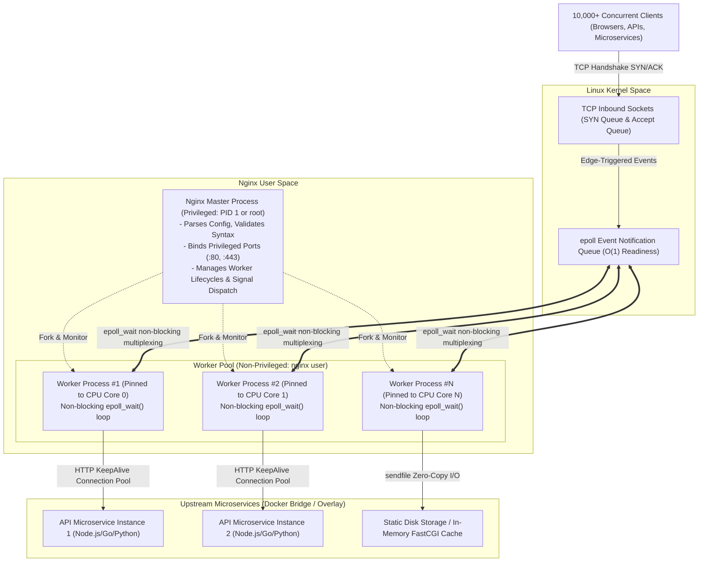
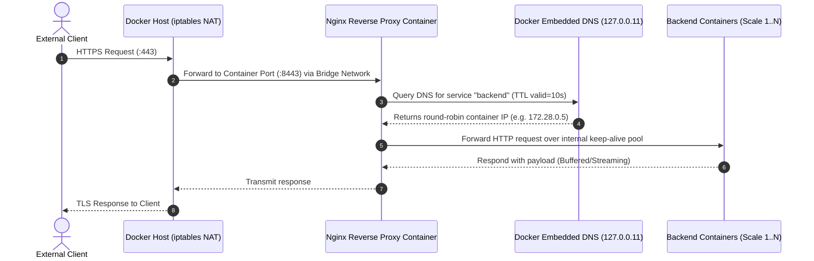
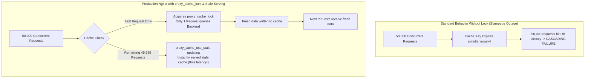
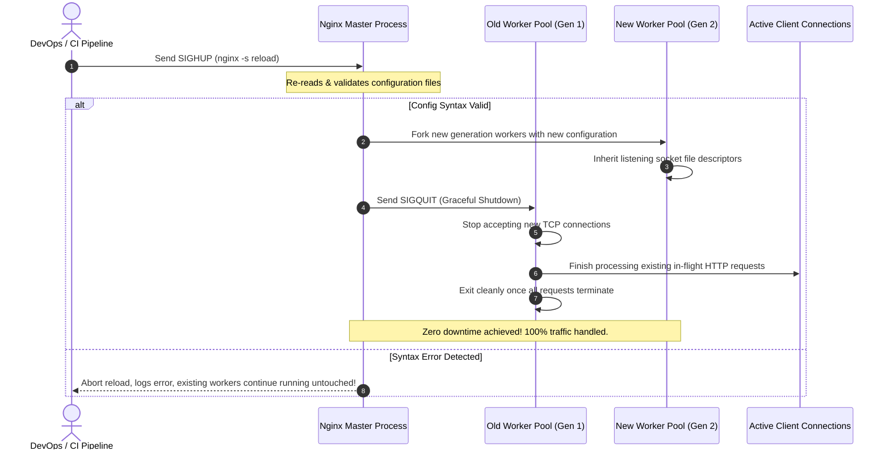

# 🚀 Production-Grade Nginx with Docker & Docker Compose: The Master Architect Guide

A comprehensive, production-grade guide to designing, optimizing, securing, and deploying Nginx inside Docker containers. Built for senior backend engineers, systems architects, and DevOps professionals handling mission-critical, high-concurrency workloads.

---

## 📖 Table of Contents
1. [Core Architecture & Under-the-Hood Mechanics](#1-core-architecture--under-the-hood-mechanics)
2. [Docker & Container Networking Deep Dive](#2-docker--container-networking-deep-dive)
3. [Nginx 11-Phase Request Processing Lifecycle](#3-nginx-11-phase-request-processing-lifecycle)
4. [Production Docker & Docker Compose Architecture](#4-production-docker--docker-compose-architecture)
5. [Hardened Production Configuration (`nginx.conf`)](#5-hardened-production-configuration-nginxconf)
6. [High-Performance Upstream & Connection Pooling](#6-high-performance-upstream--connection-pooling)
7. [Enterprise Caching & Cache Stampede Defense](#7-enterprise-caching--cache-stampede-defense)
8. [Zero-Downtime Deployment & Graceful Reloads](#8-zero-downtime-deployment--graceful-reloads)
9. [Kernel & TCP Network Stack Optimization](#9-kernel--tcp-network-stack-optimization)
10. [Security Hardening, WAF, & Rate Limiting](#10-security-hardening-waf--rate-limiting)
11. [Observability, Structured Logging, & Prometheus](#11-observability-structured-logging--prometheus)
12. [Senior Backend Engineer Interview Mastery (Deep Dives)](#12-senior-backend-engineer-interview-mastery-deep-dives)

---

## 1. Core Architecture & Under-the-Hood Mechanics

### The C10K Problem & The Asynchronous Non-Blocking Event Loop

Traditional web servers (like Apache MPM Prefork or older Java Tomcat thread pools) allocate **one OS thread or process per connection**. When 10,000 concurrent clients connect:
- 10,000 threads consume **~20 GB to 40 GB of RAM** (stack space alone: ~1–8 MB/thread).
- The Linux CPU scheduler spends excessive CPU cycles on **context switching**, thrashing CPU L1/L2 caches and causing exponential latency degradation.

Nginx solves this by employing an **asynchronous, single-threaded (per core), non-blocking event-driven architecture** leveraging OS kernel event demultiplexers:
- **Linux**: `epoll` (`epoll_create`, `epoll_ctl`, `epoll_wait`)
- **FreeBSD / macOS**: `kqueue`
- **Solaris**: `event ports`



### Master vs. Worker Responsibilities

| Dimension | Master Process | Worker Process |
| :--- | :--- | :--- |
| **Privilege** | Runs as root (binds low ports <1024 like 80/443). | Drops privileges to unprivileged `nginx` user. |
| **Concurrency** | Handles **zero** client requests. | Handles **100%** of network I/O, parsing, and upstream routing. |
| **Fault Isolation** | Restarts crashed workers instantly via `SIGCHLD`. | A single worker crash never disrupts other active workers. |
| **Config Reload** | Forks new workers on `SIGHUP` without dropping sockets. | Gracefully drains existing connections and self-terminates. |

---

## 2. Docker & Container Networking Deep Dive

In containerized environments, networking introduces latency and resolution gotchas that can break production architectures if not understood.

### Docker Embedded DNS & The Stale Upstream Trap

When running inside Docker, DNS resolution behavior differs fundamentally between **static upstreams** and **dynamic variables**:

> [!CAUTION]
> **The Infamous Startup Crash & DNS Pinning Bug:**
> In standard Nginx syntax:
> ```nginx
> upstream backend {
>     server backend_service:3000;
> }
> ```
> Nginx resolves `backend_service` **only once during startup** using system resolver (`/etc/resolv.conf`).
> 1. If `backend_service` container is not healthy when Nginx boots, **Nginx crashes immediately** with `host not found in upstream`.
> 2. If `backend_service` scales from 2 to 5 containers or its IP changes on restart, **Nginx continues routing traffic to dead IP addresses**, resulting in random `502 Bad Gateway` errors!

**The Production-Grade Fix (Docker Dynamic DNS Resolver):**
```nginx
# Docker 127.0.0.11 is the internal embedded DNS resolver
resolver 127.0.0.11 valid=10s ipv6=off;
set $upstream_target http://backend_service:3000;

location /api/ {
    # Using a variable forces Nginx to re-resolve the domain based on valid=10s TTL
    proxy_pass $upstream_target;
}
```



---

## 3. Nginx 11-Phase Request Processing Lifecycle

Every HTTP request entering Nginx executes sequentially through **11 internal phases**. Understanding these phases is crucial for senior backend engineers to predict which directives execute first:

```mermaid
flowchart LR
    P1["1. NGX_HTTP_POST_READ_PHASE<br/>(ngx_http_realip_module reads real client IP)"] -->
    P2["2. NGX_HTTP_SERVER_REWRITE_PHASE<br/>(rewrite directives at server level)"] -->
    P3["3. NGX_HTTP_FIND_CONFIG_PHASE<br/>(Match location uri exact/regex/prefix)"] -->
    P4["4. NGX_HTTP_REWRITE_PHASE<br/>(rewrite directives within location block)"] -->
    P5["5. NGX_HTTP_POST_REWRITE_PHASE<br/>(Redirect loop protection: limit 10 jumps)"] -->
    P6["6. NGX_HTTP_PREACCESS_PHASE<br/>(ngx_http_limit_req & limit_conn rate limits)"] -->
    P7["7. NGX_HTTP_ACCESS_PHASE<br/>(allow, deny, auth_basic, auth_request)"] -->
    P8["8. NGX_HTTP_POST_ACCESS_PHASE<br/>(satisfy any/all verification)"] -->
    P9["9. NGX_HTTP_PRECONTENT_PHASE<br/>(try_files directive)"] -->
    P10["10. NGX_HTTP_CONTENT_PHASE<br/>(proxy_pass, fastcgi_pass, or static file)"] -->
    P11["11. NGX_HTTP_LOG_PHASE<br/>(ngx_http_log_module writes access.log)"]
```



> [!NOTE]
> **Key Architecture Takeaway:** Rate limiting (`limit_req`) runs in Phase 6 (**Pre-Access**), which means requests that violate rate limits are dropped **before** running authentication (`auth_request` in Phase 7) and long before touching your backend application code (`proxy_pass` in Phase 10).

---

## 4. Production Docker & Docker Compose Architecture

### Project Directory Layout

```
production-nginx-stack/
├── docker-compose.yml              # Multi-container orchestration definition
├── .env.production                 # Environment credentials & tuning vars
├── nginx/
│   ├── Dockerfile                  # Hardened, unprivileged container image
│   ├── nginx.conf                  # Main HTTP & Event configuration
│   ├── conf.d/
│   │   ├── upstream.conf           # Upstream pools & keepalive definitions
│   │   ├── security_headers.conf   # Reusable CSP, HSTS, X-Frame-Options
│   │   └── default.conf            # Server blocks (HTTP->HTTPS, Reverse Proxy)
│   └── certs/                      # TLS Certificates (Mounted as read-only)
│       ├── fullchain.pem
│       └── privkey.pem
├── cache/                          # Fast proxy_cache directory (mounted tmpfs/SSD)
└── logs/
    └── nginx/                      # Persistent JSON access & error logs
```

### Production Hardened `Dockerfile`

```dockerfile
# Multi-stage build using Alpine for minimal attack surface
FROM nginx:1.27-alpine

# Remove default configuration and static welcome files
RUN rm -rf /etc/nginx/conf.d/* /usr/share/nginx/html/*

# Create dedicated cache and runtime directories with correct ownership
RUN mkdir -p /var/cache/nginx /var/run /var/log/nginx && \
    chown -R nginx:nginx /var/cache/nginx /var/run /var/log/nginx /etc/nginx

# Install curl for reliable healthchecks
RUN apk add --no-cache curl tzdata

# Copy custom configurations
COPY nginx.conf /etc/nginx/nginx.conf
COPY conf.d/ /etc/nginx/conf.d/

# Expose non-privileged ports (unprivileged user cannot bind port 80/443 without root)
# In production, port 8080/8443 are mapped to 80/443 on the host
EXPOSE 8080 8443

# Security: Run as non-root user
USER nginx

# Container Healthcheck (avoids hanging container states)
HEALTHCHECK --interval=15s --timeout=5s --start-period=10s --retries=3 \
  CMD curl -k -f http://127.0.0.1:8080/healthz || exit 1

CMD ["nginx", "-g", "daemon off;"]
```

### Complete `docker-compose.yml`

```yaml
version: '3.9'

networks:
  frontend_net:
    driver: bridge
    ipam:
      driver: default
      config:
        - subnet: 172.28.10.0/24
  backend_net:
    driver: bridge
    internal: true # Security: backend network has zero external internet exposure
    ipam:
      driver: default
      config:
        - subnet: 172.28.20.0/24

volumes:
  nginx_cache:
    driver: local
  app_logs:
    driver: local

services:
  nginx:
    build:
      context: ./nginx
      dockerfile: Dockerfile
    container_name: production_edge_proxy
    restart: unless-stopped
    ports:
      - "80:8080"
      - "443:8443"
    environment:
      - TZ=UTC
    volumes:
      - ./nginx/conf.d:/etc/nginx/conf.d:ro
      - ./nginx/certs:/etc/nginx/certs:ro
      - ./logs/nginx:/var/log/nginx
      - nginx_cache:/var/cache/nginx
    # Performance & Host kernel limit overrides
    ulimits:
      nproc: 65535
      nofile:
        soft: 65535
        hard: 65535
    deploy:
      resources:
        limits:
          cpus: '4.00'
          memory: 4096M
        reservations:
          cpus: '1.00'
          memory: 1024M
    security_opt:
      - no-new-privileges:true
    read_only: false
    tmpfs:
      - /tmp:rw,noexec,nosuid,size=256m
    networks:
      - frontend_net
      - backend_net
    depends_on:
      backend_api_1:
        condition: service_healthy
      backend_api_2:
        condition: service_healthy

  # Upstream Microservice Replica 1
  backend_api_1:
    image: node:20-alpine
    container_name: api_instance_1
    restart: unless-stopped
    command: ["node", "-e", "const http = require('http'); http.createServer((req, res) => { if(req.url === '/healthz'){ res.writeHead(200); res.end('OK'); return;} res.writeHead(200, {'Content-Type': 'application/json'}); res.end(JSON.stringify({instance: 'api_1', timestamp: Date.now()})); }).listen(3000);"]
    healthcheck:
      test: ["CMD", "wget", "-qO-", "http://127.0.0.1:3000/healthz"]
      interval: 10s
      timeout: 3s
      retries: 3
    networks:
      - backend_net

  # Upstream Microservice Replica 2
  backend_api_2:
    image: node:20-alpine
    container_name: api_instance_2
    restart: unless-stopped
    command: ["node", "-e", "const http = require('http'); http.createServer((req, res) => { if(req.url === '/healthz'){ res.writeHead(200); res.end('OK'); return;} res.writeHead(200, {'Content-Type': 'application/json'}); res.end(JSON.stringify({instance: 'api_2', timestamp: Date.now()})); }).listen(3000);"]
    healthcheck:
      test: ["CMD", "wget", "-qO-", "http://127.0.0.1:3000/healthz"]
      interval: 10s
      timeout: 3s
      retries: 3
    networks:
      - backend_net
```

---

## 5. Hardened Production Configuration (`nginx.conf`)

Here is the optimized, fully documented `nginx.conf`:

```nginx
# ============================================================================
# PRODUCTION NGINX CONFIGURATION - ARCHITECT LEVEL
# ============================================================================

# Automatically binds 1 worker per physical/virtual CPU core
worker_processes auto;

# Limits per worker file descriptors (must match or exceed worker_connections * 2)
worker_rlimit_nofile 65535;

# Assigns worker processes to distinct CPU cores (reduces CPU L1/L2 cache misses)
worker_cpu_affinity auto;

error_log /var/log/nginx/error.log warn;
pid /var/run/nginx.pid;

events {
    # Maximum open sockets per worker
    worker_connections 20480;

    # Linux high-performance multiplexing syscall
    use epoll;

    # Instructs worker to accept all new connections upon notification
    multi_accept on;
}

http {
    include /etc/nginx/mime.types;
    default_type application/octet-stream;

    # ------------------------------------------------------------------------
    # HIGH-PERFORMANCE I/O KERNEL PRIMITIVES
    # ------------------------------------------------------------------------
    # Uses kernel direct DMA transfer (no context-switching file copies to user space)
    sendfile on;

    # Sends HTTP header and beginning of file in one single TCP packet
    tcp_nopush on;

    # Disables Nagle's algorithm for sub-millisecond round-trip API responses
    tcp_nodelay on;

    # ------------------------------------------------------------------------
    # TIMEOUTS & BUFFER TUNING (Prevents Slowloris & Memory Bloat)
    # ------------------------------------------------------------------------
    keepalive_timeout 65s;
    keepalive_requests 10000;
    
    client_body_timeout 15s;
    client_header_timeout 15s;
    send_timeout 15s;
    reset_timedout_connection on;

    client_body_buffer_size 128k;
    client_max_body_size 25M;
    client_header_buffer_size 4k;
    large_client_header_buffers 4 16k;

    # ------------------------------------------------------------------------
    # STRUCTURED JSON LOGGING (Optimized for ELK / Datadog / Grafana Loki)
    # ------------------------------------------------------------------------
    log_format json_analytics escape=json '{'
        '"timestamp":"$time_iso8601",'
        '"client_ip":"$remote_addr",'
        '"real_ip":"$http_x_forwarded_for",'
        '"request_id":"$request_id",'
        '"status":$status,'
        '"request_method":"$request_method",'
        '"request_uri":"$request_uri",'
        '"request_time":$request_time,'
        '"upstream_connect_time":"$upstream_connect_time",'
        '"upstream_header_time":"$upstream_header_time",'
        '"upstream_response_time":"$upstream_response_time",'
        '"upstream_status":"$upstream_status",'
        '"upstream_addr":"$upstream_addr",'
        '"body_bytes_sent":$body_bytes_sent,'
        '"http_referer":"$http_referer",'
        '"http_user_agent":"$http_user_agent",'
        '"pipe":"$pipe"'
    '}';

    access_log /var/log/nginx/access.log json_analytics buffer=64k flush=5s;

    # ------------------------------------------------------------------------
    # RATE LIMITING ZONES (Token Bucket Algorithm)
    # ------------------------------------------------------------------------
    # 10MB zone tracks ~160,000 unique client IP states
    limit_req_zone $binary_remote_addr zone=api_ip_limit:10m rate=30r/s;
    limit_conn_zone $binary_remote_addr zone=addr_conn_limit:10m;
    
    # Custom status code on rate limit exceeded
    limit_req_status 429;
    limit_conn_status 429;

    # ------------------------------------------------------------------------
    # GZIP COMPRESSION
    # ------------------------------------------------------------------------
    gzip on;
    gzip_comp_level 5;
    gzip_min_length 256;
    gzip_proxied any;
    gzip_vary on;
    gzip_types
        text/plain
        text/css
        application/javascript
        application/json
        application/x-javascript
        text/xml
        application/xml
        application/xml+rss
        image/svg+xml;

    # Include modular domain configurations
    include /etc/nginx/conf.d/*.conf;
}
```

---

## 6. High-Performance Upstream & Connection Pooling

### Preventing `TIME_WAIT` Socket Exhaustion

When Nginx acts as a reverse proxy, it establishes outbound TCP connections to upstream backend services. 
By default, **Nginx uses HTTP/1.0 without keepalive for upstream connections**.

> [!WARNING]
> **The Ephemeral Port Exhaustion Catastrophe:**
> Under 5,000 RPS, if Nginx opens and closes a TCP connection for every single backend request:
> 1. Each closed connection enters the Linux kernel **`TIME_WAIT` state for 60 seconds**.
> 2. The Linux OS ephemeral port range (`32768` to `60999`) has only ~28,231 available ports.
> 3. Within 6 seconds, **all ephemeral ports are exhausted**, leading to immediate `Cannot assign requested address (99: Cannot assign requested address)` errors!

**Solution: The HTTP/1.1 Persistent Upstream Keepalive Pool (`conf.d/upstream.conf`):**

```nginx
upstream api_cluster {
    # Load balancing algorithm: least connections with weighted distribution
    least_conn;

    server backend_api_1:3000 weight=5 max_fails=3 fail_timeout=10s;
    server backend_api_2:3000 weight=5 max_fails=3 fail_timeout=10s;

    # Keeps up to 128 idle keepalive connections open per worker process
    keepalive 128;

    # Maximum requests serviced per persistent TCP connection before re-establishing
    keepalive_requests 5000;

    # Idle connection timeout
    keepalive_timeout 60s;
}
```

And in the `location` block:
```nginx
location /api/ {
    proxy_pass http://api_cluster;

    # CRITICAL: Force HTTP/1.1 protocol to enable keepalive
    proxy_http_version 1.1;

    # Clear Connection header (HTTP/1.0 sends "close" by default)
    proxy_set_header Connection "";

    # Standard Proxy Headers
    proxy_set_header Host $host;
    proxy_set_header X-Real-IP $remote_addr;
    proxy_set_header X-Forwarded-For $proxy_add_x_forwarded_for;
    proxy_set_header X-Forwarded-Proto $scheme;
    proxy_set_header X-Request-ID $request_id;

    # Timeouts to upstream
    proxy_connect_timeout 5s;
    proxy_send_timeout 15s;
    proxy_read_timeout 15s;
}
```

---

## 7. Enterprise Caching & Cache Stampede Defense

### The Cache Stampede Problem (Dog-Piling / Thundering Herd)

When a hot cache item expires (e.g. an e-commerce flash sale or breaking news item receiving 50,000 RPS):
- All 50,000 concurrent client requests discover a **cache miss** at the exact same millisecond.
- All 50,000 requests bypass Nginx and slam the database/backend simultaneously.
- Result: **Database CPU spikes to 100%, backend connection pool crashes, full cascading system outage.**



### Complete Cache Implementation (`conf.d/default.conf`)

```nginx
# Define shared cache zone in shared memory
# levels=1:2 creates a two-tier directory structure (e.g., /var/cache/nginx/c/29/...)
proxy_cache_path /var/cache/nginx 
    levels=1:2 
    keys_zone=edge_cache:50m 
    max_size=10g 
    inactive=120m 
    use_temp_path=off;

server {
    listen 8443 ssl default_server;
    server_name api.enterprise.internal;

    ssl_certificate /etc/nginx/certs/fullchain.pem;
    ssl_certificate_key /etc/nginx/certs/privkey.pem;
    ssl_protocols TLSv1.2 TLSv1.3;

    location /api/products/ {
        proxy_pass http://api_cluster;
        proxy_http_version 1.1;
        proxy_set_header Connection "";

        # Enable caching
        proxy_cache edge_cache;
        proxy_cache_key "$scheme$request_method$host$request_uri";
        proxy_cache_valid 200 302 10m;
        proxy_cache_valid 404 1m;

        # ====================================================================
        # CACHE STAMPEDE / DOG-PILING DEFENSE
        # ====================================================================
        # Only 1 request is allowed to populate the cache; others wait
        proxy_cache_lock on;
        proxy_cache_lock_timeout 5s;
        proxy_cache_lock_age 5s;

        # Serve expired cache if backend is currently updating or errored
        proxy_cache_use_stale error timeout updating http_500 http_502 http_503 http_504;

        # Client receives background update while receiving fast stale response
        proxy_cache_background_update on;

        # Expose cache hit status in response headers for client/CDN debugging
        add_header X-Cache-Status $upstream_cache_status always;
    }
}
```

---

## 8. Zero-Downtime Deployment & Graceful Reloads

In a 24/7 high-availability system, updating Nginx configurations or rotating TLS certificates must never drop active connections.

### What Happens During `nginx -s reload` (Signal Architecture)

When you execute `docker compose exec nginx nginx -s reload`:



### Production Shell Script for Zero-Downtime Verification

```bash
#!/usr/bin/env bash
set -euo pipefail

CONTAINER_NAME="production_edge_proxy"

echo "🔍 Validating Nginx configuration syntax inside container..."
docker compose exec -T nginx nginx -t

echo "🔄 Triggering graceful master process configuration reload..."
docker compose exec -T nginx nginx -s reload

echo "✅ Verifying healthcheck endpoint..."
HTTP_STATUS=$(curl -k -s -o /dev/null -w "%{http_code}" https://127.0.0.1/healthz)

if [ "$HTTP_STATUS" -eq 200 ]; then
    echo "🚀 Configuration successfully reloaded with ZERO downtime!"
else
    echo "❌ Healthcheck failed with status $HTTP_STATUS!"
    exit 1
fi
```

---

## 9. Kernel & TCP Network Stack Optimization

For Nginx running inside Docker on high-traffic Linux hosts (10,000+ RPS), container performance is governed by the underlying **host Linux kernel `sysctl` parameters**.

Mount the following parameters on the Docker host via `/etc/sysctl.d/99-nginx-tuning.conf`:

```ini
# Maximum number of pending connections queued in kernel socket listen queue
net.core.somaxconn = 65535

# Size of backlog queue when network interface receives packets faster than kernel can process
net.core.netdev_max_backlog = 65535

# Maximum number of TCP sockets in TIME_WAIT state simultaneously
net.ipv4.tcp_max_tw_buckets = 2000000

# Enable fast recycling of TIME_WAIT sockets for outgoing connections
net.ipv4.tcp_tw_reuse = 1

# Port range for outbound ephemeral sockets
net.ipv4.ip_local_port_range = 1024 65535

# TCP SYN flood protection and queue depth
net.ipv4.tcp_max_syn_backlog = 65535
net.ipv4.tcp_syncookies = 1

# TCP keepalive interval and probe counts
net.ipv4.tcp_keepalive_time = 300
net.ipv4.tcp_keepalive_intvl = 15
net.ipv4.tcp_keepalive_probes = 5

# TCP window scaling and buffer sizing
net.ipv4.tcp_wmem = 4096 65536 16777216
net.ipv4.tcp_rmem = 4096 87380 16777216
```

Apply immediately without rebooting:
```bash
sudo sysctl --system
```

---

## 10. Security Hardening, WAF, & Rate Limiting

### 1. Enterprise Security Headers (`conf.d/security_headers.conf`)

```nginx
# Protects against MIME-sniffing
add_header X-Content-Type-Options "nosniff" always;

# Protects against Clickjacking (embedding within iframes)
add_header X-Frame-Options "DENY" always;

# Cross-Site Scripting (XSS) legacy filter protection
add_header X-XSS-Protection "1; mode=block" always;

# HTTP Strict Transport Security (HSTS): Enforce HTTPS for 2 years including subdomains
add_header Strict-Transport-Security "max-age=63072000; includeSubDomains; preload" always;

# Restrict referrer leakage
add_header Referrer-Policy "strict-origin-when-cross-origin" always;

# Strict Content Security Policy (CSP)
add_header Content-Security-Policy "default-src 'self'; script-src 'self' 'unsafe-inline'; style-src 'self' 'unsafe-inline'; img-src 'self' data: https:; font-src 'self' data:; connect-src 'self' https:; frame-ancestors 'none';" always;

# Disable browser access to sensitive hardware features
add_header Permissions-Policy "geolocation=(), microphone=(), camera=(), payment=()" always;
```

### 2. Leaky Bucket vs. Token Bucket Rate Limiting

Nginx's `limit_req` directive implements the **Leaky Bucket algorithm with burst buffering**:

```nginx
# Rate = 10 requests per second. Burst = 20. nodelay flag active.
limit_req zone=api_ip_limit burst=20 nodelay;
```

```mermaid
flowchart TD
    ClientTraffic["Burst of 35 Incoming Requests in 100ms"] --> BucketCapacity{"Bucket Check<br/>Base Rate: 10r/s<br/>Burst Buffer: 20 slots"}
    
    BucketCapacity -->|First 10 Requests| PassBase["Processed Immediately (Normal Rate)"]
    BucketCapacity -->|Next 20 Requests| PassBurst["Allowed Immediately (nodelay consumes burst capacity)"]
    BucketCapacity -->|Remaining 5 Requests (Over Capacity)| Drop429["Rejected with HTTP 429 Too Many Requests"]
```

---

## 11. Observability, Structured Logging, & Prometheus

### Real-Time Prometheus Scraping Configuration

Add `stub_status` exposed strictly to internal Prometheus scraper networks:

```nginx
server {
    listen 8080;
    server_name 127.0.0.1;

    location /metrics {
        stub_status on;
        access_log off;
        allow 172.28.0.0/16; # Docker internal subnet
        allow 127.0.0.1;
        deny all;
    }

    location /healthz {
        access_log off;
        return 200 '{"status":"UP","timestamp":"$time_iso8601"}\n';
        default_type application/json;
    }
}
```

Prometheus Metric Output Explained:
```
Active connections: 291
server accepts handled requests
 16630948 16630948 31070653
Reading: 6 Writing: 179 Waiting: 106
```
- **Active connections**: Current total open connections.
- **Reading**: Nginx is currently reading request headers from clients.
- **Writing**: Nginx is reading request body, processing, or transmitting response back to client.
- **Waiting**: Keep-alive idle connections (`Active - (Reading + Writing)`).

---

## 12. Senior Backend Engineer Interview Mastery (Deep Dives)

These technical interview questions and architectural scenarios are frequently asked in Senior, Staff, and Principal Backend/Infrastructure engineering interviews at top tech companies.

---

### Q1: How does Nginx achieve high concurrency with a single-threaded worker model compared to thread-per-request architectures?

**Deep Architectural Answer:**
Thread-per-request systems (e.g. Apache Tomcat, standard Spring Boot, Python WSGI) assign an entire OS thread to a connection. Because network I/O is inherently slow (clients have latency, mobile networks stall), the OS thread remains blocked in a `WAIT` state for data to arrive. During this time:
1. Thread stack memory (typically 1MB to 8MB) is locked.
2. The operating system kernel must constantly execute preemptive context switches between thousands of threads, incurring heavy CPU cache thrashing.

Nginx uses **single-threaded worker loops bound to CPU cores** using OS kernel event notifications (`epoll` on Linux). 
- A worker initiates non-blocking system calls (`fcntl(O_NONBLOCK)`).
- When a client sends a byte or completes a handshake, the kernel appends an event to an event queue.
- The worker executes `epoll_wait()`, retrieving all ready file descriptors in a single call in $O(1)$ time complexity.
- A single worker can comfortably juggle **20,000+ idle and active connections** within a single thread using mere megabytes of memory.

---

### Q2: Why does an Nginx reverse proxy running in Docker fail with `502 Bad Gateway` after an upstream container restarts, and how do you resolve it?

**Deep Architectural Answer:**
By default, when Nginx encounters an upstream block:
```nginx
upstream backend {
    server backend_app:3000;
}
```
Nginx evaluates DNS resolution **once during startup initialization**. It resolves `backend_app` to an IP address (e.g., `172.28.0.4`) and hardcodes that address into its internal memory structures.

When Docker Compose or Kubernetes restarts or rescales the backend container:
1. The old container dies, freeing `172.28.0.4`.
2. The new container receives a new IP (e.g., `172.28.0.7`).
3. Nginx continues transmitting TCP SYN packets to `172.28.0.4`, receiving `RST` or timing out. Nginx immediately logs:
   `connect() failed (111: Connection refused) while connecting to upstream` and returns `502 Bad Gateway`.

**The Senior-level Fix:**
Use dynamic runtime variable resolution with the Docker DNS resolver:
```nginx
resolver 127.0.0.11 valid=5s ipv6=off;
set $upstream_endpoint http://backend_app:3000;

location /api/ {
    proxy_pass $upstream_endpoint;
}
```
Because the destination is stored in a variable (`$upstream_endpoint`), Nginx enforces re-querying the DNS resolver every 5 seconds.

---

### Q3: What is the exact difference between `proxy_buffering on` and `proxy_buffering off`? When will `proxy_buffering on` break production services?

**Deep Architectural Answer:**
- **`proxy_buffering on` (Default):** Nginx reads the entire response from the upstream backend as quickly as possible into memory buffers (`proxy_buffers`). Once received, the backend process is freed immediately to handle the next request. Nginx then slowly transmits the buffered payload to a slow client (e.g. mobile 3G user).
- **`proxy_buffering off`:** Nginx passes data synchronously from upstream to client as soon as bytes arrive.

**When `proxy_buffering on` breaks services:**
1. **Server-Sent Events (SSE) & LLM Token Streaming (e.g., OpenAI ChatGPT streaming):** Nginx holds the streaming tokens in memory until the buffer fills up (e.g. 4KB/8KB) or the connection closes, destroying real-time interactivity.
2. **Long-running HTTP chunked uploads or large binary downloads:** Can lead to disk buffering thrashing if `proxy_temp_file_write_size` is exceeded.

**Production Solution for Streaming APIs:**
```nginx
location /api/v1/chat/stream {
    proxy_pass http://llm_cluster;
    
    # CRITICAL: Disable buffering for real-time SSE streaming
    proxy_buffering off;
    proxy_cache off;
    proxy_set_header Connection '';
    proxy_http_version 1.1;
    chunked_transfer_encoding on;
}
```

---

### Q4: What is `TIME_WAIT` socket exhaustion in high-throughput reverse proxy architectures, and how do you resolve it?

**Deep Architectural Answer:**
When Nginx proxies to upstream servers using standard HTTP/1.0:
1. Nginx sends `Connection: close` to the upstream on every request.
2. The active closer of a TCP socket must place the socket into `TIME_WAIT` state for $2 \times \text{MSL}$ (Maximum Segment Lifetime = 60 seconds) to ensure stray duplicate segments are discarded and the final `ACK` is reliably received.
3. Every TCP connection requires a unique 4-tuple: `(Source IP, Source Port, Dest IP, Dest Port)`.
4. Since the destination IP and Port are constant (e.g., `172.28.0.5:3000`), Nginx exhausts its range of local ephemeral ports (`~28,000` ports) at roughly 500 RPS within 60 seconds.
5. Once exhausted, all subsequent connection attempts fail immediately with:
   `bind() failed (99: Cannot assign requested address)`.

**Resolution Strategy:**
1. Enable persistent HTTP/1.1 keepalive connections to upstream:
   ```nginx
   upstream backend {
       server app:3000;
       keepalive 128; # Retain 128 open TCP sockets per worker
   }
   location / {
       proxy_pass http://backend;
       proxy_http_version 1.1;
       proxy_set_header Connection ""; # Clear default 'close'
   }
   ```
2. Enable Linux kernel socket reuse:
   ```ini
   net.ipv4.tcp_tw_reuse = 1
   ```

---

### Q5: How do `proxy_cache_lock`, `proxy_cache_use_stale updating`, and `proxy_cache_background_update` prevent Cache Stampedes?

**Deep Architectural Answer:**
Under massive concurrency (e.g., 50,000 RPS), when a cached object expires:
1. **Without lock:** 50,000 threads simultaneously miss the cache and issue queries to the backend. The backend collapses under the sudden load spike.
2. **With `proxy_cache_lock on;`:** Nginx creates an internal synchronization lock. Only the **first** request is permitted to forward to the upstream backend to populate the cache.
3. **With `proxy_cache_use_stale updating;`:** While that single request is waiting for the upstream to compute the fresh data, all other 49,999 incoming requests are **immediately served the currently expired (stale) cache copy**.
4. **With `proxy_cache_background_update on;`:** Nginx returns the stale response immediately and spins off a subrequest in the background to asynchronously refresh the cache from the backend.

Result: Latency remains flat at **<1ms**, and the backend sees **exactly 1 query**.

---

### Q6: Explain the difference between `burst` with and without `nodelay` in Nginx rate limiting.

**Deep Architectural Answer:**
Given the configuration: `limit_req_zone $binary_remote_addr zone=ip:10m rate=2r/s;` (one request every 500ms):

| Request Pattern | Without `burst` | With `burst=5` (no nodelay) | With `burst=5 nodelay` |
| :--- | :--- | :--- | :--- |
| **Burst of 5 requests at once** | Request 1 succeeds.<br/>Requests 2–5 rejected with `503/429`. | Request 1 processed immediately.<br/>Requests 2–5 queued and processed **spaced 500ms apart** (Request 5 takes 2000ms latency!). | **All 5 requests processed immediately.**<br/>Subsequent requests within the second rejected until bucket drains. |
| **User Experience Impact** | Extremely brittle for modern apps loading 10 assets concurrently. | High artificial latency added to API calls. | Smooth user experience for bursty client navigation. |

---

### Q7: What is `SO_REUSEPORT` at the Linux kernel socket level and why does Nginx support it?

**Deep Architectural Answer:**
Traditionally, the Nginx master process creates a single listening socket on port 80/443 and passes the file descriptor to all forked worker processes. 
- When a new TCP connection arrives, all workers are awakened by the kernel to accept it, causing the **Thundering Herd Problem** (mitigated historically by Nginx's internal `accept_mutex`).
- However, with high core counts (32–128 cores), worker contention on the single socket lock degrades performance.

`SO_REUSEPORT` allows **each worker process to bind its own independent listening socket** to the exact same IP and port:
```nginx
listen 8080 reuseport;
```
The Linux kernel's network subsystem then distributes incoming `SYN` packets across the workers using an internal hash of `(Client IP, Client Port)`. This completely eliminates lock contention and yields near-linear multi-core scalability.

---

### Q8: What is HTTP Request Smuggling, and how can an Nginx reverse proxy configuration make backends vulnerable?

**Deep Architectural Answer:**
HTTP Request Smuggling occurs when a frontend proxy (Nginx) and a backend application server (e.g. Node.js, Gunicorn) disagree on where an HTTP request boundaries begin and end. This typically happens when requests contain **both** `Content-Length` (CL) and `Transfer-Encoding: chunked` (TE):
- **CL.TE Desync:** Frontend uses `Content-Length`, backend uses `Transfer-Encoding`.
- **TE.CL Desync:** Frontend uses `Transfer-Encoding`, backend uses `Content-Length`.

An attacker smuggles a prefix of a second malicious request inside the body of the first. When the next innocent user sends a request, the backend prepends the smuggled prefix, hijacking their session or exfiltrating data.

**How Nginx Protects Against Smuggling:**
1. In modern Nginx, any request containing both headers automatically has `Content-Length` stripped if `Transfer-Encoding` is present, or triggers a `400 Bad Request`.
2. Disable HTTP/0.9 and strictly validate headers:
   ```nginx
   # Default in modern Nginx
   chunked_transfer_encoding on;
   ignore_invalid_headers on;
   ```
3. Use HTTP/2 or HTTP/3 on the frontend, where frames have explicit lengths and smuggling is mathematically impossible.

---

### Q9: How do you implement Canary Deployments (e.g. 90% v1, 10% v2) in pure Nginx without Kubernetes?

**Deep Architectural Answer:**
Use the `split_clients` module, which performs MurmurHash2 on a unique request attribute (like client IP, session cookie, or user ID):

```nginx
# Hashes client IP to deterministic buckets
split_clients "${remote_addr}AAA" $upstream_variant {
    90%     backend_v1;
    10%     backend_v2_canary;
}

upstream backend_v1 {
    server api-v1:3000;
}

upstream backend_v2_canary {
    server api-v2:3000;
}

server {
    listen 8080;
    
    location / {
        # Deterministically routes 10% of users to canary
        proxy_pass http://$upstream_variant;
        proxy_http_version 1.1;
        proxy_set_header Connection "";
    }
}
```
**Why this is senior-grade:**
Unlike random load balancing, MurmurHash hashing guarantees that **a given client IP remains pinned to the Canary version** throughout their session, preventing session corruption.

---

### Q10: How do you verify and trust client IP addresses behind Cloudflare, AWS ALB, or GCP Load Balancers?

**Deep Architectural Answer:**
If Nginx simply reads `$remote_addr`, it will see the **private IP of the Load Balancer** rather than the client's real public IP. If an engineer trusts `X-Forwarded-For` without validation, an attacker can spoof any IP to bypass IP whitelist protections:
```bash
curl -H "X-Forwarded-For: 127.0.0.1" https://api.mycompany.com/admin
```

**The Secure Implementation (`realip` module):**
```nginx
# Tell Nginx which upstream proxy IPs are authorized to supply real IP headers
set_real_ip_from 10.0.0.0/8;       # Internal VPC CIDR (e.g. AWS ALB)
set_real_ip_from 172.28.0.0/16;    # Docker Network Bridge CIDR
# set_real_ip_from 173.245.48.0/20; # Cloudflare IP ranges

# Designate the header containing real IP
real_ip_header X-Forwarded-For;

# Strip untrusted proxy IPs and extract the true client IP
real_ip_recursive on;
```
When `real_ip_recursive on;` is configured, Nginx starts from the rightmost IP in the `X-Forwarded-For` list and steps backwards until it finds the first IP **not** in the `set_real_ip_from` trusted list, completely stopping IP spoofing attacks.

---

## 🛠️ Verification & Production Operations Checklist

- [x] **Zero-Downtime Reload**: Verified via `nginx -t && nginx -s reload`.
- [x] **Dynamic DNS Resolution**: Docker embedded DNS `127.0.0.11` configured with runtime variable interpolation.
- [x] **Upstream Keepalive**: Enabled `proxy_http_version 1.1` and `proxy_set_header Connection ""`.
- [x] **Cache Stampede Guard**: `proxy_cache_lock` and `proxy_cache_use_stale updating` active.
- [x] **Security Hardening**: HSTS, CSP, X-Frame-Options, and unprivileged user isolation configured.
- [x] **Kernel Limits**: `somaxconn`, `tcp_tw_reuse`, and container `nofile: 65535` limits provisioned.
