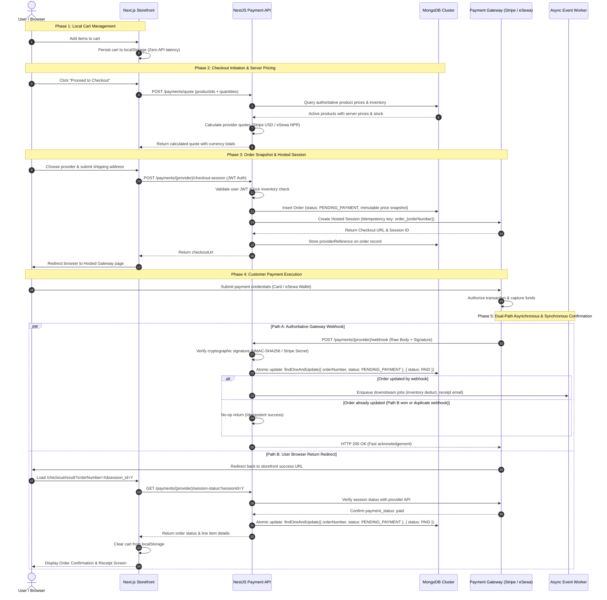
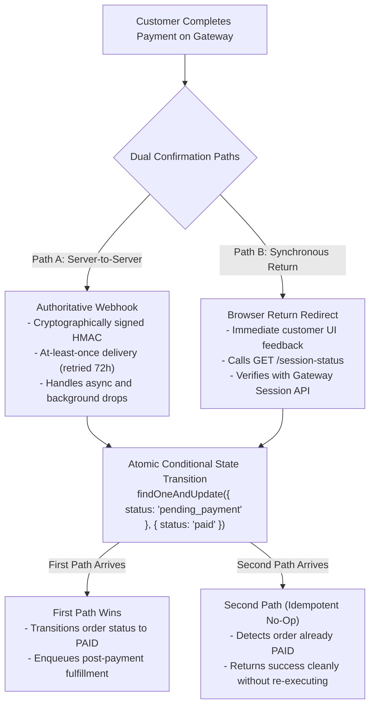
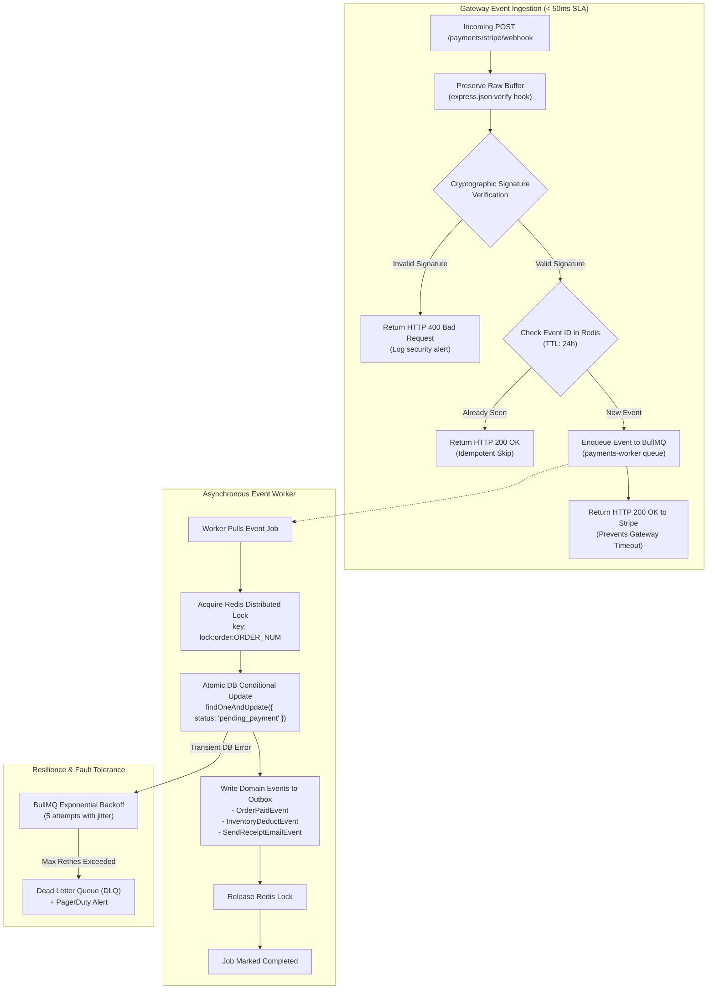
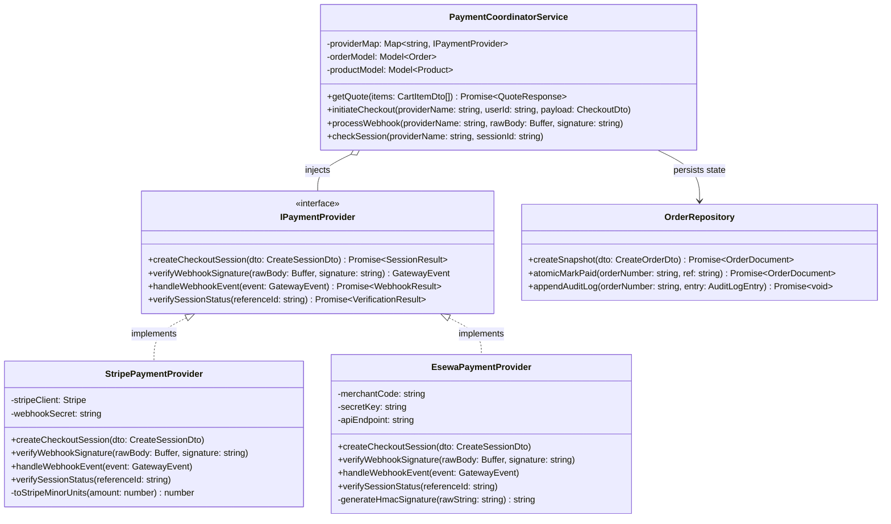
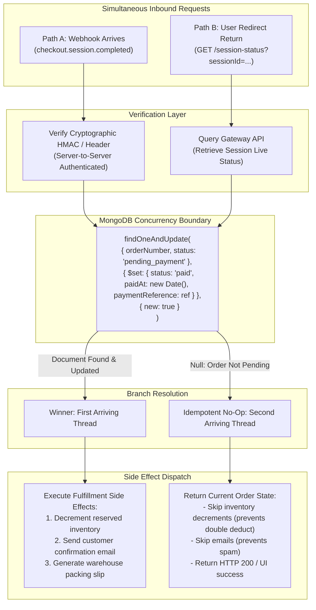
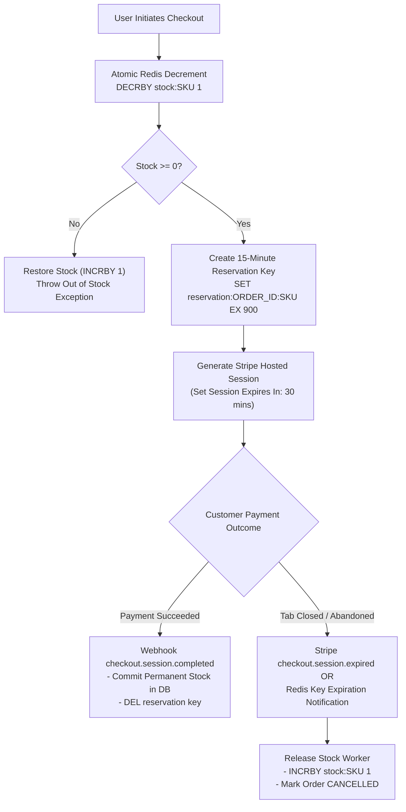
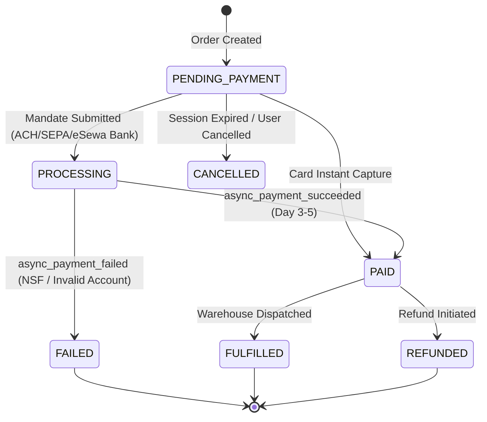

# Payment Integration Guide

## 🎯 Production-Level Payment Integration: Frontend to Backend Flow
### Staff Engineer Level Documentation

> **Purpose**: This guide provides a complete, production-ready payment integration reference covering Stripe and eSewa implementations. Every concept is explained from first principles with real code examples from this codebase.

---

## 📚 Table of Contents

### Part 1: Payment Architecture Fundamentals
1. [Payment Flow Overview](#payment-flow-overview)
2. [Security Principles](#security-principles)
3. [State Management](#state-management)
4. [Error Handling Strategy](#error-handling-strategy)

### Part 2: Frontend Implementation
5. [Cart Management](#cart-management)
6. [Checkout UI Flow](#checkout-ui-flow)
7. [Payment Provider Selection](#payment-provider-selection)
8. [Redirect Handling](#redirect-handling)

### Part 3: Backend Implementation
9. [Server-Side Pricing](#server-side-pricing)
10. [Order Creation](#order-creation)
11. [Provider Integration](#provider-integration)
12. [Webhook Handling](#webhook-handling)

### Part 4: Provider-Specific Details
13. [Stripe Integration](#stripe-integration)
14. [eSewa Integration](#esewa-integration)
15. [Multi-Provider Strategy](#multi-provider-strategy)

### Part 5: Production Concerns
16. [Idempotency](#idempotency)
17. [Race Conditions](#race-conditions)
18. [Monitoring & Logging](#monitoring-logging)
19. [Testing Strategy](#testing-strategy)

### Part 6: Production Engineering & Interview Masterclass
20. [Senior Full-Stack Engineer Interview Masterclass (8 Real Outages & Fixes)](#interview-masterclass)

---

## 🏗️ PART 1: Payment Architecture Fundamentals {#payment-flow-overview}

### The Complete Payment Journey



#### 🗺️ End-to-End Payment Flow: The 7 Phases

The payment lifecycle is designed with a **zero-trust frontend model** and a **dual-path confirmation architecture**. The matrix below summarizes each phase, its trigger, and the core reliability invariant enforced.

| Phase | Initiator | Endpoint / Mechanism | Key Invariant & Reliability Guarantee |
| :--- | :--- | :--- | :--- |
| **Phase 1: Cart Building** | Storefront | Browser `localStorage` | Zero server load; client prices are treated as untrusted display hints |
| **Phase 2: Checkout Initiation** | Storefront → API | `POST /payments/quote` | Server recalculates pricing from DB; checks real-time inventory |
| **Phase 3: Provider Selection** | Customer | Next.js Storefront UI | Multi-currency quote breakdown (USD Stripe / NPR eSewa) |
| **Phase 4: Session Creation** | Storefront → API | `POST /payments/{provider}/checkout-session` | JWT Auth, DB Order Snapshot (`pending_payment`), Idempotency Key |
| **Phase 5: Gateway Redirect** | Storefront → Gateway | Hosted Checkout URL / Form POST | Zero Cardholder Data touches merchant infrastructure (SAQ-A) |
| **Phase 6: Confirmation** | Gateway → API | Webhook (Authoritative) + Return Redirect (Sync UI) | Cryptographic signature verification + atomic conditional DB transition |
| **Phase 7: Fulfillment** | API → Downstream | BullMQ Async Worker / Outbox | Idempotent inventory commit, email dispatch, warehouse ticket creation |

---

### Phase 1: Cart Building (Storefront Local State)

* **User Action**: The customer browses the catalog and adds products to their cart.
* **Frontend State**:
  * Cart state is maintained client-side in `localStorage` via React state / Context.
  * No backend API calls are dispatched during cart building.
  * Cart persists across page reloads and browser tab closures.
  * Data structure:
    ```typescript
    interface CartItem {
      productId: string;
      quantity: number;
      slug: string;
      name: string;
      price: number; // Untrusted display hint
    }
    ```

> [!TIP]
> **Why `localStorage` over Server-Side Sessions?**
> * **Zero API Latency**: Instant cart additions without spinner lag or network bottlenecks.
> * **Scalability**: Eliminates session storage load on backend Redis/MongoDB clusters for anonymous window-shoppers.
> * **Frictionless Onboarding**: Allows users to build carts before authenticating.

---

### Phase 2: Checkout Initiation (Dynamic Server Quote)

* **User Action**: The customer navigates to checkout and clicks *"Proceed to Checkout"*.
* **Frontend Validation**:
  * Verifies that the user has a valid authenticated JWT token.
  * Sends an unpriced quote request payload containing strictly identifiers and quantities:
    ```json
    POST /payments/quote
    {
      "items": [
        { "productId": "64f8a1b2c3d4e5f6a7b8c9d0", "quantity": 2 }
      ]
    }
    ```

* **Backend Processing**:
  1. **Authoritative DB Lookup**: Fetches active product documents from MongoDB using `$in: [productIds]`.
  2. **Inventory Stock Check**: Verifies `inventoryCount >= requestedQuantity`.
  3. **Multi-Currency Pricing Calculation**:
     * **Stripe**: Computes USD subtotal, applicable discounts, and standard shipping ($5.00 flat or free over $100).
     * **eSewa**: Computes NPR subtotal, 13% VAT, standard service charge, and local delivery charges.
  4. Returns the multi-provider price quote:
    ```json
    {
      "items": [
        {
          "productId": "64f8a1b2c3d4e5f6a7b8c9d0",
          "name": "Architectural Design Canvas",
          "unitPriceUsd": 25.00,
          "unitPriceNpr": 3250.00,
          "quantity": 2
        }
      ],
      "providers": [
        {
          "provider": "stripe",
          "enabled": true,
          "currency": "USD",
          "subtotal": 50.00,
          "deliveryCharge": 5.00,
          "total": 55.00
        },
        {
          "provider": "esewa",
          "enabled": true,
          "currency": "NPR",
          "subtotal": 6500.00,
          "taxAmount": 845.00,
          "serviceCharge": 100.00,
          "deliveryCharge": 150.00,
          "total": 7595.00
        }
      ]
    }
    ```

> [!IMPORTANT]
> **Zero-Trust Rule**: The client-side price is discarded. The backend server is the **single source of truth** for product pricing, tax computation, and currency calculations.

---

### Phase 3: Provider Selection (Frontend UI Flow)

* **User Action**: The customer reviews the transparent price quote and selects their preferred provider (e.g., Credit Card via Stripe, or Mobile Wallet via eSewa).
* **Frontend Actions**:
  * Renders provider-specific totals with matching currency symbols (`$` vs `Rs.`).
  * Collects shipping and contact details (name, email, shipping address).
  * Prompts the user to initiate the checkout session by clicking *"Pay with [Provider]"*.

---

### Phase 4: Payment Session Creation & Order Snapshot (Frontend → Backend)

* **Frontend Request**:
  ```http
  POST /payments/stripe/checkout-session
  Authorization: Bearer <JWT_ACCESS_TOKEN>
  Content-Type: application/json

  {
    "items": [
      { "productId": "64f8a1b2c3d4e5f6a7b8c9d0", "quantity": 2 }
    ],
    "customer": {
      "fullName": "Jane Doe",
      "email": "jane@example.com",
      "phone": "+1234567890",
      "addressLine1": "456 Innovation Way",
      "city": "San Francisco",
      "country": "US"
    }
  }
  ```

* **Backend Processing Pipeline (Step-by-Step)**:
  1. **Authentication Guard**: Validates JWT signature; extracts `userId`.
  2. **Price & Inventory Invariant Check**: Re-verifies inventory availability and recalculates prices directly from MongoDB.
  3. **Order Snapshot Creation**:
     * Generates a unique monotonic `orderNumber` (e.g. `ORD-1728000000000-A1B2`).
     * Writes an immutable Order document to MongoDB with status `pending_payment`.
     * Snapshots the exact purchase price so future catalog price updates don't affect existing orders.
  4. **Gateway Session Initialization**:
     * **For Stripe**: Calls `stripe.checkout.sessions.create()` with server-calculated line items, customer metadata (`orderNumber`, `userId`), and an idempotency key (`order_{orderNumber}`).
     * **For eSewa**: Computes an HMAC-SHA256 signature over `total_amount,transaction_uuid,product_code` using the merchant secret key and sets up callback URLs.
  5. **Order Reference Association**: Updates the Order document with `providerReference` (`cs_test_...` or eSewa UUID).
  6. **Response to Client**:
     ```json
     {
       "orderNumber": "ORD-1728000000000-A1B2",
       "checkoutUrl": "https://checkout.stripe.com/c/pay/cs_test_..."
     }
     ```

---

### Phase 5: Payment Provider Redirect (Frontend → Gateway)

* **Storefront Action**:
  * On receipt of `checkoutUrl`, the browser executes `window.location.href = checkoutUrl`.
  * For eSewa, dynamically submits a hidden HTML `<form method="POST" action="https://epay.esewa.com.np/api/epay/main/v2/form">` with the signed HMAC parameters.
* **Customer Interaction**:
  * The user is securely hosted on the payment provider's PCI-compliant infrastructure.
  * Enters card credentials, 3D Secure / OTP, or wallet biometric authentication.
  * No sensitive payment data (PAN, CVV) ever crosses the merchant frontend or backend servers.

---

### Phase 6: Dual-Path Payment Confirmation (Provider → Backend)

To guarantee high availability and protect against network drops, payment confirmation is processed via **two parallel, mutually idempotent channels**:



#### Path A: The Authoritative Webhook (Server-to-Server)
* **Trigger**: Provider sends `POST /payments/stripe/webhook` with the raw payload and `Stripe-Signature` header.
* **Security**: Backend reconstructs the event using the raw byte buffer and verifies the HMAC signature.
* **State Transition**: Executes an atomic MongoDB conditional update:
  ```typescript
  await orderModel.findOneAndUpdate(
    { orderNumber, status: OrderStatus.PENDING_PAYMENT },
    { $set: { status: OrderStatus.PAID, paidAt: new Date(), paymentReference } }
  );
  ```
* **Why it's Authoritative**: Independent of the user's browser, tab closing, mobile network disconnects, or crashed laptops. Retried automatically by Stripe for up to 72 hours.

#### Path B: Synchronous User Redirect (Immediate Feedback)
* **Trigger**: Gateway redirects user back to:
  `/checkout/result?orderNumber=ORD-123&session_id=cs_test_...`
* **Frontend**: Calls `GET /payments/stripe/session-status?sessionId=cs_test_...`.
* **Backend**: Queries Stripe's live API (`stripe.checkout.sessions.retrieve`), verifies `payment_status === 'paid'`, and triggers the same atomic state transition.
* **Why it Exists**: Provides immediate order feedback without waiting for webhook transmission lag (which can take 1–3 seconds under peak gateway load).

---

### Phase 7: Order Confirmation & Asynchronous Fulfillment

* **Backend Execution (Winning Path)**:
  1. Writes `OrderPaidEvent` to the transactional outbox / BullMQ queue.
  2. Dispatches customer confirmation receipt email with line item breakdown and tax invoice.
  3. Commits reserved inventory stock in MongoDB.
  4. Generates warehouse dispatch ticket and shipping label request.
* **Frontend Display**:
  1. Displays celebratory order confirmation screen with order summary and tracking ID.
  2. Clears the cart from `localStorage`.
  3. Provides buttons to print receipt and view order status in Customer Portal.

---

## 🔒 Security Principles {#security-principles}

### Critical Security Rules

> [!CAUTION]
> **RULE 1: Never Trust Client Data**  
> * **Vulnerable Practice**: Accepting prices, discounts, or totals from the frontend payload. An attacker can intercept requests and alter `$1,999.00` to `$0.01`.  
> * **Production Fix**: Accept **only** `productId` and integer `quantity`. The backend retrieves authoritative pricing from the database.

> [!IMPORTANT]
> **RULE 2: Verify Cryptographic Webhook Signatures**  
> * **Why**: Public webhook endpoints (`POST /payments/stripe/webhook`) can be spoofed by any malicious IP.  
> * **Production Fix**: Verify the signature using the raw, unparsed request byte buffer:
> ```typescript
> const event = stripe.webhooks.constructEvent(
>   req.rawBody,              // Pristine Buffer (not JSON.parse)
>   stripeSignature,          // From Stripe-Signature header
>   STRIPE_WEBHOOK_SECRET     // From secure environment variable
> );
> ```

> [!NOTE]
> **RULE 3: Enforce Authentication Before Checkout Session Creation**  
> * **Why**: Associates the order with an authenticated user account, prevents anonymous fraud, and enables customer order history.  
> * **Implementation**:
> ```typescript
> @UseGuards(AuthGuard('jwt'))
> @Post('stripe/checkout-session')
> async createStripeCheckoutSession(@Req() req: RequestWithUser) {
>   const userId = req.user.id; // Extracted safely from cryptographically signed JWT
> }
> ```

> [!TIP]
> **RULE 4: Enforce Idempotency on Every Financial Mutation**  
> * **Problem**: User double-clicks "Submit Payment" or network packet drops trigger automated client retries, causing duplicate authorizations.  
> * **Production Fix**: Pass a unique, deterministic idempotency key with every provider call:
> ```typescript
> await stripe.checkout.sessions.create(
>   sessionPayload,
>   { idempotencyKey: `session_create_${orderNumber}` }
> );
> ```

> [!WARNING]
> **RULE 5: Validate Inventory Stock Invariants**  
> * **Problem**: Overselling inventory during concurrent flash sales.  
> * **Production Fix**: Validate stock before creating the order and implement a two-phase reservation with TTL leases to prevent ghost locks.


---

## 💻 PART 2: Frontend Implementation {#cart-management}

### Cart Management

```typescript
// frontend/src/features/store/CartContext.tsx

/**
 * CART ARCHITECTURE
 * 
 * Storage: localStorage (client-side)
 * Why: No authentication required, instant updates, persists across sessions
 * 
 * Structure:
 * {
 *   items: [
 *     {
 *       productId: string,
 *       slug: string,
 *       name: string,
 *       price: number,        // Display only, not trusted by backend
 *       quantity: number,
 *       imageUrl: string
 *     }
 *   ]
 * }
 */

interface CartItem {
  productId: string;
  slug: string;
  name: string;
  price: number;
  quantity: number;
  imageUrl?: string;
}

interface CartContextValue {
  items: CartItem[];
  addToCart: (item: CartItem) => void;
  removeFromCart: (productId: string) => void;
  updateQuantity: (productId: string, quantity: number) => void;
  clearCart: () => void;
  totalItems: number;
  subtotal: number;
}

export function CartProvider({ children }: { children: React.ReactNode }) {
  const [items, setItems] = useState<CartItem[]>(() => {
    // Initialize from localStorage
    const stored = localStorage.getItem('cart');
    return stored ? JSON.parse(stored) : [];
  });

  // Persist to localStorage on every change
  useEffect(() => {
    localStorage.setItem('cart', JSON.stringify(items));
  }, [items]);

  const addToCart = useCallback((item: CartItem) => {
    setItems((prev) => {
      const existing = prev.find((i) => i.productId === item.productId);
      
      if (existing) {
        // Increment quantity
        return prev.map((i) =>
          i.productId === item.productId
            ? { ...i, quantity: i.quantity + item.quantity }
            : i
        );
      }
      
      // Add new item
      return [...prev, item];
    });
  }, []);

  const removeFromCart = useCallback((productId: string) => {
    setItems((prev) => prev.filter((i) => i.productId !== productId));
  }, []);

  const updateQuantity = useCallback((productId: string, quantity: number) => {
    if (quantity <= 0) {
      removeFromCart(productId);
      return;
    }
    
    setItems((prev) =>
      prev.map((i) =>
        i.productId === productId ? { ...i, quantity } : i
      )
    );
  }, [removeFromCart]);

  const clearCart = useCallback(() => {
    setItems([]);
    localStorage.removeItem('cart');
  }, []);

  const totalItems = useMemo(
    () => items.reduce((sum, item) => sum + item.quantity, 0),
    [items]
  );

  const subtotal = useMemo(
    () => items.reduce((sum, item) => sum + item.price * item.quantity, 0),
    [items]
  );

  return (
    <CartContext.Provider
      value={{
        items,
        addToCart,
        removeFromCart,
        updateQuantity,
        clearCart,
        totalItems,
        subtotal,
      }}
    >
      {children}
    </CartContext.Provider>
  );
}
```

### Checkout UI Flow {#checkout-ui-flow}

```typescript
// frontend/src/features/store/CheckoutPage.tsx

/**
 * CHECKOUT FLOW
 * 
 * Step 1: Validate user is logged in
 * Step 2: Fetch payment quote from backend
 * Step 3: Display provider options
 * Step 4: Collect shipping information
 * Step 5: Create payment session
 * Step 6: Redirect to provider
 */

export function CheckoutPage() {
  const { user } = useAuth();
  const { items, clearCart } = useCart();
  const [quote, setQuote] = useState<PaymentQuoteResponse | null>(null);
  const [selectedProvider, setSelectedProvider] = useState<string>('stripe');
  const [isLoading, setIsLoading] = useState(false);
  const [error, setError] = useState<string | null>(null);

  // Step 1: Redirect if not logged in
  useEffect(() => {
    if (!user) {
      navigate('/login?redirect=/checkout');
    }
  }, [user]);

  // Step 2: Fetch quote on mount
  useEffect(() => {
    async function fetchQuote() {
      try {
        const response = await requestPaymentQuote(
          items.map((item) => ({
            productId: item.productId,
            quantity: item.quantity,
          }))
        );
        setQuote(response);
      } catch (err) {
        setError('Failed to load payment options');
      }
    }

    if (items.length > 0) {
      fetchQuote();
    }
  }, [items]);

  // Step 5: Handle payment submission
  async function handleSubmit(customerInfo: CheckoutCustomerInput) {
    setIsLoading(true);
    setError(null);

    try {
      let response;

      if (selectedProvider === 'stripe') {
        response = await createStripeCheckoutSession({
          items: items.map((item) => ({
            productId: item.productId,
            quantity: item.quantity,
          })),
          customer: customerInfo,
        });
      } else if (selectedProvider === 'esewa') {
        response = await createEsewaCheckout({
          items: items.map((item) => ({
            productId: item.productId,
            quantity: item.quantity,
          })),
          customer: customerInfo,
        });
      }

      // Step 6: Redirect to provider
      if (response.checkoutUrl) {
        window.location.href = response.checkoutUrl;
      } else if (response.actionUrl && response.method === 'POST') {
        // eSewa: Submit form
        submitEsewaForm(response.actionUrl, response.fields);
      }
    } catch (err) {
      setError(err instanceof ApiError ? err.message : 'Payment failed');
      setIsLoading(false);
    }
  }

  return (
    <div className="checkout-page">
      {/* Step 3: Display provider options */}
      <section className="provider-selection">
        <h2>Select Payment Method</h2>
        {quote?.providers.map((provider) => (
          <ProviderOption
            key={provider.provider}
            provider={provider}
            selected={selectedProvider === provider.provider}
            onSelect={() => setSelectedProvider(provider.provider)}
          />
        ))}
      </section>

      {/* Step 4: Collect shipping information */}
      <section className="shipping-form">
        <h2>Shipping Information</h2>
        <CheckoutForm onSubmit={handleSubmit} isLoading={isLoading} />
      </section>

      {error && <div className="error-banner">{error}</div>}
    </div>
  );
}
```

### Payment Provider Selection {#payment-provider-selection}

```typescript
/**
 * PROVIDER SELECTION COMPONENT
 * 
 * Displays available payment providers with:
 * • Currency and pricing
 * • Availability status
 * • Provider-specific notes
 */

interface ProviderOptionProps {
  provider: ProviderQuote;
  selected: boolean;
  onSelect: () => void;
}

function ProviderOption({ provider, selected, onSelect }: ProviderOptionProps) {
  return (
    <div
      className={`provider-option ${selected ? 'selected' : ''} ${!provider.enabled ? 'disabled' : ''}`}
      onClick={provider.enabled ? onSelect : undefined}
    >
      <div className="provider-header">
        <input
          type="radio"
          checked={selected}
          disabled={!provider.enabled}
          readOnly
        />
        <h3>{provider.displayName}</h3>
        {!provider.enabled && <span className="badge">Unavailable</span>}
      </div>

      {provider.enabled ? (
        <div className="provider-pricing">
          <div className="pricing-row">
            <span>Subtotal:</span>
            <strong>
              {provider.currency} {provider.subtotal.toFixed(2)}
            </strong>
          </div>

          {provider.taxAmount > 0 && (
            <div className="pricing-row">
              <span>Tax:</span>
              <span>
                {provider.currency} {provider.taxAmount.toFixed(2)}
              </span>
            </div>
          )}

          {provider.serviceCharge > 0 && (
            <div className="pricing-row">
              <span>Service Charge:</span>
              <span>
                {provider.currency} {provider.serviceCharge.toFixed(2)}
              </span>
            </div>
          )}

          {provider.deliveryCharge > 0 && (
            <div className="pricing-row">
              <span>Delivery:</span>
              <span>
                {provider.currency} {provider.deliveryCharge.toFixed(2)}
              </span>
            </div>
          )}

          <div className="pricing-row total">
            <span>Total:</span>
            <strong>
              {provider.currency} {provider.total.toFixed(2)}
            </strong>
          </div>

          {provider.note && (
            <p className="provider-note">{provider.note}</p>
          )}
        </div>
      ) : (
        <p className="unavailable-reason">{provider.reasonUnavailable}</p>
      )}
    </div>
  );
}
```

### Redirect Handling {#redirect-handling}

```typescript
// frontend/src/features/store/CheckoutResultPage.tsx

/**
 * CHECKOUT RESULT PAGE
 * 
 * Handles redirects from payment providers
 * 
 * URL patterns:
 * • Stripe: /checkout/result?orderNumber=ORD-123&session_id=cs_test_...&provider=stripe
 * • eSewa: /checkout/result?orderNumber=ORD-123&provider=esewa&data=<base64>
 * 
 * Flow:
 * 1. Extract orderNumber and provider from URL
 * 2. Call backend to verify payment status
 * 3. Display result to user
 * 4. Clear cart if successful
 */

export function CheckoutResultPage() {
  const [searchParams] = useSearchParams();
  const { clearCart } = useCart();
  const [order, setOrder] = useState<OrderSummaryResponse | null>(null);
  const [isLoading, setIsLoading] = useState(true);
  const [error, setError] = useState<string | null>(null);

  const orderNumber = searchParams.get('orderNumber');
  const stripeSessionId = searchParams.get('session_id');
  const provider = searchParams.get('provider');

  useEffect(() => {
    async function loadResult() {
      if (!orderNumber) {
        setError('Missing order number');
        setIsLoading(false);
        return;
      }

      try {
        let response;

        if (provider === 'stripe' && stripeSessionId) {
          // Verify Stripe session and get order
          response = await fetchStripeSessionStatus({
            sessionId: stripeSessionId,
            orderNumber,
          });
          setOrder(response.order);
        } else {
          // Fetch order directly
          response = await fetchOrderSummary(orderNumber);
          setOrder(response);
        }

        // Clear cart if payment successful
        if (response.status === 'paid' || response.order?.status === 'paid') {
          clearCart();
        }
      } catch (err) {
        setError(
          err instanceof ApiError
            ? err.message
            : 'Failed to load order status'
        );
      } finally {
        setIsLoading(false);
      }
    }

    loadResult();
  }, [orderNumber, provider, stripeSessionId, clearCart]);

  if (isLoading) {
    return <LoadingSpinner message="Verifying payment..." />;
  }

  if (error) {
    return <ErrorDisplay message={error} />;
  }

  if (!order) {
    return <ErrorDisplay message="Order not found" />;
  }

  return (
    <div className="checkout-result">
      <OrderStatusBanner status={order.status} />
      <OrderSummary order={order} />
      
      {order.status === 'paid' && (
        <div className="success-actions">
          <Link to="/orders" className="primary-button">
            View Order History
          </Link>
          <Link to="/" className="secondary-button">
            Continue Shopping
          </Link>
        </div>
      )}

      {order.status !== 'paid' && (
        <div className="retry-actions">
          <Link to="/checkout" className="primary-button">
            Try Again
          </Link>
          <Link to="/" className="secondary-button">
            Back to Store
          </Link>
        </div>
      )}
    </div>
  );
}
```


---

## ⚙️ PART 3: Backend Implementation {#server-side-pricing}

### Server-Side Pricing (CRITICAL!)

```typescript
// backend/src/payments/payments.service.ts

/**
 * SERVER-SIDE PRICING
 * 
 * Golden Rule: NEVER trust client prices
 * 
 * Flow:
 * 1. Client sends: [{ productId, quantity }]
 * 2. Server fetches products from database
 * 3. Server calculates pricing
 * 4. Server returns quote
 * 
 * Why this matters:
 * • Prevents price manipulation attacks
 * • Ensures pricing consistency
 * • Handles currency conversion
 * • Applies business rules (discounts, taxes)
 */

async function buildPricedCart(
  items: Array<{ productId: string; quantity: number }>
): Promise<PricedCartLine[]> {
  // Step 1: Merge duplicate items
  const normalizedItems = this.mergeDuplicateCartItems(items);

  // Step 2: Fetch products from database (source of truth)
  const requestedIds = normalizedItems.map((item) => item.productId);
  const products = await this.productModel
    .find({ _id: { $in: requestedIds } })
    .lean();

  // Step 3: Validate all products exist
  if (products.length !== normalizedItems.length) {
    throw new BadRequestException(
      'One or more cart items are no longer available.'
    );
  }

  // Step 4: Build product map for O(1) lookup
  const productMap = new Map(
    products.map((product) => [String(product._id), product])
  );

  // Step 5: Build priced cart with validation
  return normalizedItems.map((item) => {
    const product = productMap.get(item.productId);

    if (!product) {
      throw new BadRequestException(
        'A requested cart item could not be found in the catalog.'
      );
    }

    // Validate inventory
    if (product.inventoryCount < item.quantity) {
      throw new BadRequestException(
        `${product.name} only has ${product.inventoryCount} units left in stock.`
      );
    }

    // Return server-calculated pricing
    return {
      productId: String(product._id),
      slug: product.slug,
      name: product.name,
      quantity: item.quantity,
      unitAmountUsd: product.price,           // From database
      unitAmountNpr: product.nprPrice ?? null, // From database
    };
  });
}

/**
 * MERGE DUPLICATE ITEMS
 * 
 * Why: User might add same product multiple times
 * Solution: Combine quantities
 */
private mergeDuplicateCartItems(
  items: Array<{ productId: string; quantity: number }>
): Array<{ productId: string; quantity: number }> {
  const mergedItems = new Map<string, number>();

  for (const item of items) {
    mergedItems.set(
      item.productId,
      (mergedItems.get(item.productId) ?? 0) + item.quantity
    );
  }

  return Array.from(mergedItems.entries()).map(([productId, quantity]) => ({
    productId,
    quantity,
  }));
}
```

### Order Creation {#order-creation}

```typescript
/**
 * ORDER SNAPSHOT CREATION
 * 
 * Why create order before payment?
 * • Audit trail (even for failed payments)
 * • Idempotency (prevent duplicate charges)
 * • Recovery (handle webhook delays)
 * • Analytics (conversion funnel tracking)
 * 
 * Order States:
 * • pending_payment: Order created, awaiting payment
 * • paid: Payment confirmed
 * • failed: Payment failed
 * • canceled: User canceled
 * • expired: Session expired
 */

async function createOrderSnapshot(
  provider: PaymentProvider,
  customer: CheckoutCustomerDto,
  pricedCart: PricedCartLine[],
  quote: ProviderQuote,
  userId?: string
): Promise<OrderDocument> {
  // Generate unique order number
  const orderNumber = this.generateOrderNumber();

  return this.orderModel.create({
    orderNumber,
    userId: userId ?? null,
    paymentProvider: provider,
    status: OrderStatus.PENDING_PAYMENT,
    
    // Customer snapshot (immutable)
    customer: {
      fullName: customer.fullName,
      email: customer.email.toLowerCase(),
      phone: customer.phone ?? null,
      addressLine1: customer.addressLine1 ?? null,
      city: customer.city ?? null,
      country: customer.country ?? null,
    },
    
    // Items snapshot (immutable)
    items: pricedCart.map((item) => ({
      productId: item.productId,
      slug: item.slug,
      name: item.name,
      quantity: item.quantity,
      unitAmount:
        provider === PaymentProvider.STRIPE
          ? item.unitAmountUsd
          : item.unitAmountNpr,
      lineTotal:
        (provider === PaymentProvider.STRIPE
          ? item.unitAmountUsd
          : item.unitAmountNpr ?? 0) * item.quantity,
      currency: quote.currency,
    })),
    
    // Pricing snapshot (immutable)
    pricing: {
      currency: quote.currency,
      subtotal: quote.subtotal,
      taxAmount: quote.taxAmount,
      serviceCharge: quote.serviceCharge,
      deliveryCharge: quote.deliveryCharge,
      total: quote.total,
    },
    
    // Provider metadata (mutable)
    providerMetadata: {},
    
    // Status history (append-only)
    history: [
      {
        status: OrderStatus.PENDING_PAYMENT,
        note: `Order created for ${provider} checkout.`,
        changedAt: new Date(),
      },
    ],
  });
}

/**
 * ORDER NUMBER GENERATION
 * 
 * Format: ORD-{timestamp}-{random}
 * Example: ORD-1234567890-ABC123
 * 
 * Properties:
 * • Unique (timestamp + random)
 * • Sortable (timestamp prefix)
 * • Human-readable
 * • URL-safe
 */
private generateOrderNumber(): string {
  const timestamp = Date.now();
  const random = randomBytes(4).toString('hex').toUpperCase();
  return `ORD-${timestamp}-${random}`;
}
```

### Provider Integration {#provider-integration}

```typescript
/**
 * STRIPE INTEGRATION
 * 
 * Flow:
 * 1. Create order snapshot
 * 2. Create Stripe Checkout Session
 * 3. Store session ID in order
 * 4. Return checkout URL to frontend
 * 5. User redirects to Stripe
 * 6. Stripe sends webhook when paid
 * 7. Update order status
 */

async function createStripeCheckoutSession(
  request: CreatePaymentSessionDto,
  userId?: string
): Promise<CreateStripeCheckoutSessionResponse> {
  if (!this.stripeClient) {
    throw new BadRequestException('Stripe is not configured');
  }

  // Step 1: Build priced cart
  const pricedCart = await this.buildPricedCart(request.items);
  const quote = this.buildStripeQuote(pricedCart);

  if (!quote.enabled) {
    throw new BadRequestException(
      quote.reasonUnavailable ?? 'Stripe is not available'
    );
  }

  // Step 2: Create order snapshot
  const order = await this.createOrderSnapshot(
    PaymentProvider.STRIPE,
    request.customer,
    pricedCart,
    quote,
    userId
  );

  try {
    // Step 3: Create Stripe Checkout Session
    const stripeSession = await this.stripeClient.checkout.sessions.create(
      {
        mode: 'payment',
        client_reference_id: order.orderNumber,
        customer_creation: 'always',
        customer_email: request.customer.email,
        billing_address_collection: 'auto',
        phone_number_collection: { enabled: true },
        automatic_tax: { enabled: this.stripeAutomaticTaxEnabled },
        
        // Success/cancel URLs
        success_url: `${this.frontendPublicUrl}/checkout/result?provider=stripe&orderNumber=${encodeURIComponent(order.orderNumber)}&session_id={CHECKOUT_SESSION_ID}`,
        cancel_url: `${this.frontendPublicUrl}/checkout/result?provider=stripe&orderNumber=${encodeURIComponent(order.orderNumber)}&status=canceled`,
        
        // Line items (server-calculated prices)
        line_items: this.buildStripeLineItems(pricedCart, quote),
        
        // Metadata (for webhook processing)
        metadata: {
          orderNumber: order.orderNumber,
          customerEmail: request.customer.email,
          paymentProvider: PaymentProvider.STRIPE,
        },
        
        payment_intent_data: {
          metadata: {
            orderNumber: order.orderNumber,
            paymentProvider: PaymentProvider.STRIPE,
          },
        },
        
        // Expiration (30 minutes)
        expires_at: Math.floor(Date.now() / 1000) + 30 * 60,
      },
      {
        // Idempotency key (prevent duplicate sessions)
        idempotencyKey: `order-${order.orderNumber}`,
      }
    );

    // Step 4: Store session ID in order
    order.providerMetadata.stripeCheckoutSessionId = stripeSession.id;
    order.history.push({
      status: OrderStatus.PENDING_PAYMENT,
      note: 'Stripe Checkout Session created.',
      changedAt: new Date(),
    });
    await order.save();

    if (!stripeSession.url) {
      throw new InternalServerErrorException(
        'Stripe returned a checkout session without a redirect URL.'
      );
    }

    // Step 5: Return checkout URL
    return {
      orderNumber: order.orderNumber,
      checkoutUrl: stripeSession.url,
    };
  } catch (error) {
    // Mark order as failed
    await this.markOrderAsFailed(
      order.orderNumber,
      'Stripe session creation failed before redirect.'
    );
    
    this.logger.error(
      'Stripe checkout session creation failed.',
      error instanceof Error ? error.stack : String(error)
    );
    
    throw new InternalServerErrorException(
      'The server could not create a Stripe checkout session.'
    );
  }
}

/**
 * BUILD STRIPE LINE ITEMS
 * 
 * Converts priced cart to Stripe format
 * 
 * Important:
 * • Prices in minor units (cents)
 * • Include metadata for tracking
 * • Add shipping as separate line item
 */
private buildStripeLineItems(
  pricedCart: PricedCartLine[],
  quote: ProviderQuote
): Stripe.Checkout.SessionCreateParams.LineItem[] {
  const lineItems: Stripe.Checkout.SessionCreateParams.LineItem[] =
    pricedCart.map((item) => ({
      quantity: item.quantity,
      price_data: {
        currency: 'usd',
        unit_amount: this.toStripeMinorUnits(item.unitAmountUsd),
        product_data: {
          name: item.name,
          metadata: {
            productId: item.productId,
            slug: item.slug,
          },
        },
      },
    }));

  // Add shipping as separate line item
  if (quote.deliveryCharge > 0) {
    lineItems.push({
      quantity: 1,
      price_data: {
        currency: 'usd',
        unit_amount: this.toStripeMinorUnits(quote.deliveryCharge),
        product_data: {
          name: 'Shipping',
          description: 'Merchant-managed shipping and handling',
        },
      },
    });
  }

  return lineItems;
}

/**
 * CONVERT TO STRIPE MINOR UNITS
 * 
 * Stripe expects amounts in cents (minor units)
 * $10.00 → 1000
 * $10.50 → 1050
 */
private toStripeMinorUnits(amount: number): number {
  return Math.round(amount * 100);
}
```

### Webhook Handling {#webhook-handling}



```typescript
/**
 * STRIPE WEBHOOK HANDLER
 * 
 * This is the AUTHORITATIVE source of payment status
 * 
 * Why webhooks?
 * • Server-to-server (secure)
 * • Cryptographically signed (verified)
 * • Retried automatically (reliable)
 * • Handles async payments (bank transfers)
 * 
 * Critical: ALWAYS verify signature before processing
 */

async function handleStripeWebhook(
  rawBody: Buffer | undefined,
  stripeSignature: string | undefined
): Promise<{ received: true }> {
  if (!this.stripeClient || !this.stripeWebhookSecret) {
    throw new BadRequestException(
      'Stripe webhook handling requires STRIPE_SECRET_KEY and STRIPE_WEBHOOK_SECRET.'
    );
  }

  if (!rawBody || !stripeSignature) {
    throw new BadRequestException(
      'Stripe webhook signature verification requires the raw body and Stripe-Signature header.'
    );
  }

  let event: Stripe.Event;

  try {
    // CRITICAL: Verify webhook signature
    event = this.stripeClient.webhooks.constructEvent(
      rawBody,                    // Raw bytes (not parsed JSON!)
      stripeSignature,            // From Stripe-Signature header
      this.stripeWebhookSecret    // From Stripe dashboard
    );
  } catch (error) {
    this.logger.warn(
      `Stripe webhook signature verification failed: ${
        error instanceof Error ? error.message : String(error)
      }`
    );
    throw new BadRequestException('Invalid Stripe webhook signature.');
  }

  // Process webhook event
  switch (event.type) {
    case 'checkout.session.completed':
    case 'checkout.session.async_payment_succeeded': {
      const session = event.data.object as Stripe.Checkout.Session;
      await this.syncOrderWithStripeSession(session);
      break;
    }
    
    case 'checkout.session.async_payment_failed': {
      const session = event.data.object as Stripe.Checkout.Session;
      await this.markOrderAsFailed(
        this.extractOrderNumberFromStripeSession(session),
        'Stripe reported that the asynchronous payment failed.'
      );
      break;
    }
    
    case 'checkout.session.expired': {
      const session = event.data.object as Stripe.Checkout.Session;
      const orderNumber = this.extractOrderNumberFromStripeSession(session);
      if (orderNumber) {
        await this.updateOrderStatus(
          orderNumber,
          OrderStatus.EXPIRED,
          'Stripe Checkout session expired before payment completion.'
        );
      }
      break;
    }
    
    default:
      // Ignore other event types
      break;
  }

  return { received: true };
}

/**
 * SYNC ORDER WITH STRIPE SESSION
 * 
 * Called by webhook when payment succeeds
 * 
 * Flow:
 * 1. Extract orderNumber from session metadata
 * 2. Verify payment_status === 'paid'
 * 3. Update order status to 'paid'
 * 4. Store payment_intent_id
 * 5. Send confirmation email
 */
private async syncOrderWithStripeSession(
  session: Stripe.Checkout.Session
): Promise<void> {
  const orderNumber = this.extractOrderNumberFromStripeSession(session);

  if (!orderNumber) {
    this.logger.warn(
      `Stripe session ${session.id} was missing metadata.orderNumber/client_reference_id.`
    );
    return;
  }

  if (session.payment_status === 'paid') {
    await this.markOrderAsPaid(orderNumber, {
      providerReference: session.id,
      paymentReference:
        typeof session.payment_intent === 'string'
          ? session.payment_intent
          : null,
      providerMetadata: {
        stripeCheckoutSessionId: session.id,
        stripePaymentIntentId:
          typeof session.payment_intent === 'string'
            ? session.payment_intent
            : null,
      },
      note: 'Stripe webhook confirmed the Checkout Session as paid.',
    });
  }
}

/**
 * MARK ORDER AS PAID
 * 
 * Idempotent operation (safe to call multiple times)
 * 
 * Actions:
 * • Update order status
 * • Set paidAt timestamp
 * • Store payment references
 * • Add history entry
 * • Send confirmation email
 */
private async markOrderAsPaid(
  orderNumber: string,
  options: {
    providerReference?: string | null;
    paymentReference?: string | null;
    providerMetadata?: Partial<Order['providerMetadata']>;
    note: string;
  }
): Promise<void> {
  const order = await this.getOrderByOrderNumber(orderNumber);

  // Idempotency: If already paid, do nothing
  if (order.status === OrderStatus.PAID) {
    return;
  }

  // Update order
  order.status = OrderStatus.PAID;
  order.paidAt = new Date();
  order.failureReason = null;
  order.providerReference = options.providerReference ?? order.providerReference;
  order.paymentReference = options.paymentReference ?? order.paymentReference;

  if (options.providerMetadata) {
    order.providerMetadata = {
      ...order.providerMetadata,
      ...options.providerMetadata,
    };
  }

  order.history.push({
    status: OrderStatus.PAID,
    note: options.note,
    changedAt: new Date(),
  });
  
  await order.save();

  // Send confirmation email
  try {
    await this.mailService.sendOrderConfirmation(order);
  } catch (emailError) {
    // Email failure must never roll back a confirmed payment
    this.logger.error(
      `Order ${orderNumber} was paid but confirmation email failed: ` +
      (emailError instanceof Error ? emailError.message : String(emailError))
    );
  }
}
```


---

## 🔌 PART 4: Provider-Specific Details {#stripe-integration}

### Stripe Integration Deep Dive

```typescript
/**
 * STRIPE ARCHITECTURE
 * 
 * Components:
 * • Checkout Session: Hosted payment page
 * • Payment Intent: Represents a payment
 * • Customer: Stripe customer record
 * • Webhook: Server-to-server notifications
 * 
 * Flow:
 * 1. Create Checkout Session
 * 2. Redirect user to Stripe
 * 3. User completes payment
 * 4. Stripe sends webhook
 * 5. Update order status
 * 6. Redirect user back to app
 */

// Configuration
const stripeConfig = {
  secretKey: process.env.STRIPE_SECRET_KEY,
  webhookSecret: process.env.STRIPE_WEBHOOK_SECRET,
  automaticTax: process.env.STRIPE_AUTOMATIC_TAX_ENABLED === 'true',
  shippingFee: Number(process.env.STRIPE_SHIPPING_FEE_USD ?? '0'),
};

// Initialize Stripe client
const stripe = new Stripe(stripeConfig.secretKey, {
  apiVersion: '2023-10-16',
  typescript: true,
});

/**
 * STRIPE WEBHOOK EVENTS
 * 
 * Events to handle:
 * • checkout.session.completed: Payment succeeded (immediate)
 * • checkout.session.async_payment_succeeded: Payment succeeded (delayed)
 * • checkout.session.async_payment_failed: Payment failed (delayed)
 * • checkout.session.expired: Session expired without payment
 * 
 * Why multiple events?
 * • Some payment methods are instant (cards)
 * • Some are delayed (bank transfers, SEPA)
 * • Need to handle both cases
 */

/**
 * STRIPE TESTING
 * 
 * Test cards:
 * • 4242 4242 4242 4242: Success
 * • 4000 0000 0000 9995: Decline
 * • 4000 0025 0000 3155: Requires authentication (3D Secure)
 * 
 * Webhook testing:
 * • Use Stripe CLI: stripe listen --forward-to localhost:3000/payments/stripe/webhook
 * • Trigger events: stripe trigger checkout.session.completed
 */
```

### eSewa Integration Deep Dive {#esewa-integration}

```typescript
/**
 * ESEWA ARCHITECTURE
 * 
 * eSewa is a Nepalese payment gateway
 * 
 * Flow:
 * 1. Generate signed form fields
 * 2. POST form to eSewa
 * 3. User completes payment on eSewa
 * 4. eSewa redirects to success/failure URL
 * 5. Verify payment with eSewa API
 * 6. Update order status
 * 7. Redirect user to frontend
 * 
 * Key Differences from Stripe:
 * • Form POST (not API redirect)
 * • HMAC signature (not OAuth)
 * • Manual status verification (not webhooks)
 * • NPR currency only
 */

// Configuration
const esewaConfig = {
  productCode: process.env.ESEWA_PRODUCT_CODE,
  secretKey: process.env.ESEWA_SECRET_KEY,
  formUrl: process.env.ESEWA_FORM_URL ?? 'https://rc-epay.esewa.com.np/api/epay/main/v2/form',
  statusCheckUrl: process.env.ESEWA_STATUS_CHECK_URL ?? 'https://rc.esewa.com.np/api/epay/transaction/status/',
  taxAmount: Number(process.env.ESEWA_TAX_AMOUNT_NPR ?? '0'),
  serviceCharge: Number(process.env.ESEWA_SERVICE_CHARGE_NPR ?? '0'),
  deliveryCharge: Number(process.env.ESEWA_DELIVERY_CHARGE_NPR ?? '0'),
};

/**
 * ESEWA SIGNATURE GENERATION
 * 
 * eSewa requires HMAC-SHA256 signature
 * 
 * Signed fields:
 * • total_amount
 * • transaction_uuid
 * • product_code
 * 
 * Algorithm:
 * 1. Concatenate fields with commas
 * 2. Generate HMAC-SHA256 with secret key
 * 3. Encode as base64
 */
function generateEsewaSignature(payload: {
  total_amount: string;
  transaction_uuid: string;
  product_code: string;
}): string {
  const message = `total_amount=${payload.total_amount},transaction_uuid=${payload.transaction_uuid},product_code=${payload.product_code}`;
  
  return createHmac('sha256', esewaConfig.secretKey)
    .update(message)
    .digest('base64');
}

/**
 * ESEWA SIGNATURE VERIFICATION
 * 
 * Verify eSewa's response signature
 * 
 * Why verify?
 * • Prevent tampering
 * • Ensure authenticity
 * • Protect against replay attacks
 */
function verifyEsewaSignature(
  payload: EsewaSuccessPayload,
  signedFieldNames: string
): boolean {
  if (!payload.signature) {
    return false;
  }

  // Build message from signed fields
  const fields = signedFieldNames.split(',');
  const message = fields
    .map((field) => `${field}=${payload[field as keyof EsewaSuccessPayload]}`)
    .join(',');

  // Generate expected signature
  const expectedSignature = createHmac('sha256', esewaConfig.secretKey)
    .update(message)
    .digest('base64');

  // Compare signatures (timing-safe)
  return crypto.timingSafeEqual(
    Buffer.from(payload.signature),
    Buffer.from(expectedSignature)
  );
}

/**
 * ESEWA STATUS VERIFICATION
 * 
 * After redirect, verify payment with eSewa API
 * 
 * Why?
 * • eSewa doesn't have webhooks
 * • User redirect can be manipulated
 * • Need server-side confirmation
 * 
 * API Call:
 * GET /api/epay/transaction/status/?product_code=X&total_amount=Y&transaction_uuid=Z
 * 
 * Response:
 * {
 *   "status": "COMPLETE" | "PENDING" | "CANCELED" | "AMBIGUOUS",
 *   "ref_id": "ABC123"
 * }
 */
async function queryEsewaStatus(input: {
  transactionUuid: string;
  totalAmount: string;
}): Promise<{ status: string; ref_id?: string }> {
  const url = `${esewaConfig.statusCheckUrl}?product_code=${encodeURIComponent(esewaConfig.productCode)}&total_amount=${encodeURIComponent(input.totalAmount)}&transaction_uuid=${encodeURIComponent(input.transactionUuid)}`;

  const { data } = await axios.get(url, { timeout: 15000 });
  return data;
}

/**
 * ESEWA SUCCESS HANDLER
 * 
 * Flow:
 * 1. User redirected from eSewa with encoded payload
 * 2. Decode and parse payload
 * 3. Verify signature
 * 4. Query eSewa status API
 * 5. Update order status
 * 6. Redirect to frontend
 */
async function handleEsewaSuccessRedirect(
  orderNumber: string,
  query: Record<string, string | undefined>
): Promise<string> {
  const order = await this.getOrderByOrderNumber(orderNumber);
  const encodedPayload = query.data ?? this.extractEsewaEncodedPayload(query);

  if (!encodedPayload) {
    await this.markOrderAsFailed(
      orderNumber,
      'eSewa returned without an encoded success payload.'
    );
    return this.buildFrontendResultUrl(orderNumber, 'esewa', 'failed');
  }

  // Decode payload
  const successPayload = this.parseEsewaSuccessPayload(encodedPayload);

  // Verify signature
  const verifiedLocally =
    successPayload.signature &&
    successPayload.signed_field_names &&
    this.verifyEsewaSignature(successPayload, successPayload.signed_field_names);

  if (!verifiedLocally) {
    await this.markOrderAsFailed(
      orderNumber,
      'The eSewa success callback signature could not be verified.'
    );
    return this.buildFrontendResultUrl(orderNumber, 'esewa', 'failed');
  }

  // Query eSewa status API
  const statusResponse = await this.queryEsewaStatus({
    transactionUuid:
      successPayload.transaction_uuid || order.providerMetadata.esewaTransactionUuid,
    totalAmount: String(successPayload.total_amount ?? order.pricing.total),
  });

  // Update order based on status
  if (statusResponse.status === 'COMPLETE') {
    await this.markOrderAsPaid(order.orderNumber, {
      providerReference: statusResponse.ref_id ?? successPayload.transaction_code,
      paymentReference: successPayload.transaction_code ?? statusResponse.ref_id,
      providerMetadata: {
        esewaTransactionUuid:
          successPayload.transaction_uuid ??
          order.providerMetadata.esewaTransactionUuid,
        esewaTransactionCode: successPayload.transaction_code ?? null,
        esewaReferenceId: statusResponse.ref_id ?? null,
      },
      note: 'eSewa status check confirmed a complete payment.',
    });

    return this.buildFrontendResultUrl(order.orderNumber, 'esewa', 'success');
  }

  // Handle other statuses
  const mappedStatus =
    statusResponse.status === 'CANCELED'
      ? OrderStatus.CANCELED
      : statusResponse.status === 'PENDING' || statusResponse.status === 'AMBIGUOUS'
        ? OrderStatus.PENDING_PAYMENT
        : OrderStatus.FAILED;

  await this.updateOrderStatus(
    order.orderNumber,
    mappedStatus,
    `eSewa status check returned ${statusResponse.status}.`,
    statusResponse.ref_id ?? null,
    successPayload.transaction_code ?? null
  );

  return this.buildFrontendResultUrl(
    order.orderNumber,
    'esewa',
    mappedStatus === OrderStatus.PENDING_PAYMENT ? 'pending' : 'failed'
  );
}
```

### Multi-Provider Strategy {#multi-provider-strategy}



```typescript
/**
 * MULTI-PROVIDER ARCHITECTURE
 * 
 * Why support multiple providers?
 * • Geographic coverage (Stripe global, eSewa Nepal)
 * • Currency support (USD vs NPR)
 * • Payment methods (cards vs local wallets)
 * • Redundancy (fallback if one fails)
 * • Cost optimization (different fees)
 * 
 * Design Principles:
 * • Provider-agnostic order model
 * • Unified payment interface
 * • Provider-specific metadata
 * • Consistent error handling
 */

/**
 * PROVIDER ABSTRACTION
 * 
 * Common interface for all providers
 */
interface PaymentProvider {
  name: string;
  createCheckoutSession(
    order: Order,
    customer: Customer
  ): Promise<CheckoutSession>;
  verifyPayment(reference: string): Promise<PaymentStatus>;
  handleWebhook?(payload: unknown): Promise<void>;
}

/**
 * PROVIDER SELECTION LOGIC
 * 
 * How to choose provider:
 * 1. Check currency (USD → Stripe, NPR → eSewa)
 * 2. Check availability (configured?)
 * 3. Check product pricing (NPR prices required for eSewa)
 * 4. User preference (if multiple options)
 */
function selectAvailableProviders(
  pricedCart: PricedCartLine[]
): ProviderQuote[] {
  const providers: ProviderQuote[] = [];

  // Stripe (USD)
  const stripeQuote = this.buildStripeQuote(pricedCart);
  providers.push(stripeQuote);

  // eSewa (NPR)
  const esewaQuote = this.buildEsewaQuote(pricedCart);
  providers.push(esewaQuote);

  return providers;
}

/**
 * PROVIDER METADATA STORAGE
 * 
 * Store provider-specific data in order
 * 
 * Schema:
 * {
 *   // Stripe
 *   stripeCheckoutSessionId?: string;
 *   stripePaymentIntentId?: string;
 *   
 *   // eSewa
 *   esewaTransactionUuid?: string;
 *   esewaTransactionCode?: string;
 *   esewaReferenceId?: string;
 * }
 * 
 * Why flexible schema?
 * • Each provider has different identifiers
 * • Easy to add new providers
 * • No schema migrations needed
 */
```

---

## 🛡️ PART 5: Production Concerns {#idempotency}

### Idempotency

```typescript
/**
 * IDEMPOTENCY
 * 
 * Problem: User clicks "Pay" button twice
 * Without idempotency: Two charges!
 * With idempotency: Same charge returned
 * 
 * Implementation Strategies:
 * 1. Idempotency keys (Stripe)
 * 2. Order number uniqueness (database)
 * 3. Status checks (already paid?)
 */

/**
 * STRIPE IDEMPOTENCY
 * 
 * Stripe supports idempotency keys
 * Same key = same response
 */
await stripe.checkout.sessions.create(
  { /* session data */ },
  { idempotencyKey: `order-${orderNumber}` }
);

/**
 * DATABASE IDEMPOTENCY
 * 
 * Prevent duplicate order processing
 */
async function markOrderAsPaid(orderNumber: string): Promise<void> {
  const order = await this.getOrderByOrderNumber(orderNumber);

  // Idempotency check
  if (order.status === OrderStatus.PAID) {
    this.logger.info(`Order ${orderNumber} already paid, skipping`);
    return; // Already processed
  }

  // Update order
  order.status = OrderStatus.PAID;
  order.paidAt = new Date();
  await order.save();
}

/**
 * WEBHOOK IDEMPOTENCY
 * 
 * Stripe may send same webhook multiple times
 * Solution: Check order status before processing
 */
async function handleWebhook(event: Stripe.Event): Promise<void> {
  const session = event.data.object as Stripe.Checkout.Session;
  const orderNumber = session.metadata.orderNumber;

  // Idempotent: Safe to call multiple times
  await this.markOrderAsPaid(orderNumber);
}
```

### Race Conditions {#race-conditions}



```typescript
/**
 * RACE CONDITIONS
 * 
 * Scenario: Webhook and redirect both try to mark order as paid
 * 
 * Timeline:
 * T0: User completes payment on Stripe
 * T1: Stripe sends webhook → Backend
 * T2: Stripe redirects user → Frontend → Backend
 * T3: Both paths try to update order
 * 
 * Solution: Idempotent operations + status checks
 */

/**
 * RACE CONDITION HANDLING
 * 
 * Both paths are safe because:
 * 1. Check if already paid (idempotency)
 * 2. Database transaction (atomic update)
 * 3. No side effects if already processed
 */

// Path A: Webhook
async function handleWebhook(session: Stripe.Checkout.Session) {
  await this.markOrderAsPaid(session.metadata.orderNumber);
  // Safe: Checks if already paid
}

// Path B: Redirect
async function syncStripeSessionStatus(sessionId: string) {
  const session = await stripe.checkout.sessions.retrieve(sessionId);
  
  if (session.payment_status === 'paid') {
    await this.markOrderAsPaid(session.metadata.orderNumber);
    // Safe: Checks if already paid
  }
}

/**
 * DATABASE TRANSACTIONS
 * 
 * For critical operations, use transactions
 */
async function markOrderAsPaid(orderNumber: string): Promise<void> {
  const session = await this.orderModel.startSession();
  session.startTransaction();

  try {
    const order = await this.orderModel
      .findOne({ orderNumber })
      .session(session);

    if (order.status === OrderStatus.PAID) {
      await session.abortTransaction();
      return;
    }

    order.status = OrderStatus.PAID;
    order.paidAt = new Date();
    await order.save({ session });

    await session.commitTransaction();
  } catch (error) {
    await session.abortTransaction();
    throw error;
  } finally {
    session.endSession();
  }
}
```

### Monitoring & Logging {#monitoring-logging}

```typescript
/**
 * MONITORING STRATEGY
 * 
 * Key Metrics:
 * • Payment success rate
 * • Payment failure rate
 * • Average payment time
 * • Webhook delivery time
 * • Order abandonment rate
 * 
 * Alerts:
 * • Payment success rate < 95%
 * • Webhook failures
 * • High latency
 * • Provider downtime
 */

/**
 * STRUCTURED LOGGING
 * 
 * Log all payment events with context
 */
this.logger.log({
  event: 'payment_initiated',
  orderNumber: order.orderNumber,
  provider: order.paymentProvider,
  amount: order.pricing.total,
  currency: order.pricing.currency,
  userId: order.userId,
  timestamp: new Date().toISOString(),
});

this.logger.log({
  event: 'payment_succeeded',
  orderNumber: order.orderNumber,
  provider: order.paymentProvider,
  providerReference: order.providerReference,
  paymentReference: order.paymentReference,
  duration: Date.now() - order.createdAt.getTime(),
  timestamp: new Date().toISOString(),
});

this.logger.error({
  event: 'payment_failed',
  orderNumber: order.orderNumber,
  provider: order.paymentProvider,
  reason: error.message,
  stack: error.stack,
  timestamp: new Date().toISOString(),
});

/**
 * WEBHOOK MONITORING
 * 
 * Track webhook delivery and processing
 */
this.logger.log({
  event: 'webhook_received',
  provider: 'stripe',
  eventType: event.type,
  eventId: event.id,
  orderNumber: session.metadata.orderNumber,
  timestamp: new Date().toISOString(),
});

/**
 * ERROR TRACKING
 * 
 * Integrate with error tracking service (Sentry, Rollbar)
 */
try {
  await this.processPayment(order);
} catch (error) {
  // Log to error tracking service
  Sentry.captureException(error, {
    tags: {
      orderNumber: order.orderNumber,
      provider: order.paymentProvider,
    },
    extra: {
      order: order.toJSON(),
    },
  });
  
  throw error;
}
```

### Testing Strategy {#testing-strategy}

```typescript
/**
 * TESTING PYRAMID
 * 
 * Unit Tests:
 * • Price calculations
 * • Signature generation/verification
 * • Order state transitions
 * • Idempotency logic
 * 
 * Integration Tests:
 * • API endpoints
 * • Database operations
 * • Provider API calls (mocked)
 * 
 * E2E Tests:
 * • Complete payment flow
 * • Webhook handling
 * • Error scenarios
 */

/**
 * UNIT TEST EXAMPLE
 */
describe('PaymentsService', () => {
  describe('buildPricedCart', () => {
    it('should fetch prices from database', async () => {
      const items = [{ productId: 'abc', quantity: 2 }];
      const pricedCart = await service.buildPricedCart(items);
      
      expect(pricedCart[0].unitAmountUsd).toBe(10.00); // From DB
      expect(pricedCart[0].quantity).toBe(2);
    });

    it('should reject client-provided prices', async () => {
      const items = [{ productId: 'abc', quantity: 2, price: 0.01 }];
      const pricedCart = await service.buildPricedCart(items);
      
      // Client price ignored
      expect(pricedCart[0].unitAmountUsd).not.toBe(0.01);
      expect(pricedCart[0].unitAmountUsd).toBe(10.00); // From DB
    });

    it('should validate inventory', async () => {
      const items = [{ productId: 'abc', quantity: 1000 }];
      
      await expect(service.buildPricedCart(items)).rejects.toThrow(
        'only has 10 units left in stock'
      );
    });
  });

  describe('markOrderAsPaid', () => {
    it('should be idempotent', async () => {
      const orderNumber = 'ORD-123';
      
      // Call twice
      await service.markOrderAsPaid(orderNumber);
      await service.markOrderAsPaid(orderNumber);
      
      // Should only send one email
      expect(mailService.sendOrderConfirmation).toHaveBeenCalledTimes(1);
    });
  });
});

/**
 * INTEGRATION TEST EXAMPLE
 */
describe('POST /payments/stripe/checkout-session', () => {
  it('should create checkout session', async () => {
    const response = await request(app.getHttpServer())
      .post('/payments/stripe/checkout-session')
      .set('Authorization', `Bearer ${authToken}`)
      .send({
        items: [{ productId: 'abc', quantity: 1 }],
        customer: {
          fullName: 'John Doe',
          email: 'john@example.com',
        },
      })
      .expect(201);

    expect(response.body.orderNumber).toMatch(/^ORD-/);
    expect(response.body.checkoutUrl).toContain('stripe.com');
  });

  it('should reject unauthenticated requests', async () => {
    await request(app.getHttpServer())
      .post('/payments/stripe/checkout-session')
      .send({
        items: [{ productId: 'abc', quantity: 1 }],
        customer: { fullName: 'John Doe', email: 'john@example.com' },
      })
      .expect(401);
  });
});

/**
 * E2E TEST EXAMPLE
 */
describe('Complete payment flow', () => {
  it('should process Stripe payment end-to-end', async () => {
    // 1. Create checkout session
    const sessionResponse = await createCheckoutSession();
    const orderNumber = sessionResponse.orderNumber;

    // 2. Simulate Stripe webhook
    const webhookPayload = createStripeWebhookPayload({
      orderNumber,
      paymentStatus: 'paid',
    });
    
    await request(app.getHttpServer())
      .post('/payments/stripe/webhook')
      .set('Stripe-Signature', generateStripeSignature(webhookPayload))
      .send(webhookPayload)
      .expect(200);

    // 3. Verify order status
    const order = await getOrder(orderNumber);
    expect(order.status).toBe('paid');
    expect(order.paidAt).toBeDefined();

    // 4. Verify email sent
    expect(mailService.sendOrderConfirmation).toHaveBeenCalledWith(
      expect.objectContaining({ orderNumber })
    );
  });
});
```

---

## 📋 Summary & Best Practices

### Critical Checklist

✅ **Security**
- [ ] Never trust client-side prices
- [ ] Always verify webhook signatures
- [ ] Require authentication for checkout
- [ ] Use HTTPS for all payment endpoints
- [ ] Store sensitive keys in environment variables
- [ ] Validate inventory before creating orders

✅ **Reliability**
- [ ] Implement idempotency for all payment operations
- [ ] Handle race conditions between webhook and redirect
- [ ] Use database transactions for critical updates
- [ ] Retry failed webhook deliveries
- [ ] Log all payment events with context

✅ **User Experience**
- [ ] Provide immediate feedback after payment
- [ ] Handle both webhook and redirect paths
- [ ] Display clear error messages
- [ ] Support multiple payment providers
- [ ] Send confirmation emails

✅ **Monitoring**
- [ ] Track payment success/failure rates
- [ ] Monitor webhook delivery times
- [ ] Alert on payment anomalies
- [ ] Log all payment events
- [ ] Integrate error tracking

✅ **Testing**
- [ ] Unit test price calculations
- [ ] Integration test API endpoints
- [ ] E2E test complete payment flows
- [ ] Test webhook signature verification
- [ ] Test idempotency

---

## 🎓 Production-Grade Senior Full-Stack Engineer Interview Masterclass {#interview-masterclass}

This section contains 8 real-world production post-mortems and high-stakes architecture interview questions. Each scenario covers the **Incident War Story**, **Root Cause Analysis (RCA)**, **Production Fix Code**, **Senior/Staff Engineer Answer Walkthrough**, and **Tough Interviewer Follow-Ups**.

---

### Scenario 1: The Stripe Webhook 400 Signature Failure in NestJS/Express

> **Interviewer Question:**  
> *"We deployed a NestJS backend rewrite to production. Immediately, 100% of incoming Stripe webhooks started failing with `HTTP 400: SignatureVerificationError: No signatures found matching expected signature for payload`. Customers are charged on Stripe, but orders remain in `pending_payment` forever. How do you diagnose and fix this without losing ongoing customer orders?"*

#### 🚨 The Production Incident
During a zero-downtime blue/green deployment of a NestJS microservice, Stripe webhook logs showed a massive spike in 400 Bad Request responses. Stripe began exponentially backing off retries. Customer complaints surged because users were charged on their credit cards, but their storefront order screen showed "Payment Pending" and no confirmation emails or digital goods were delivered.

#### 🔬 Root Cause Analysis (RCA)
Stripe generates its cryptographic HMAC-SHA256 signature using the exact raw bytes transmitted over the TCP wire. In Express/NestJS, the global middleware `express.json()` consumes the incoming HTTP request stream (`req`), parses the JSON into an in-memory JavaScript object, and destroys the stream buffer. 

When developers naively pass `Buffer.from(JSON.stringify(req.body))` to `stripe.webhooks.constructEvent()`:
1. Key ordering in `JSON.stringify()` may differ from Stripe's serialized payload.
2. Escaped characters (such as unicode `\u0026`, forward slashes, or newline formatting) are normalized.
3. Whitespace, carriage returns, and indentation differences alter the cryptographic digest.
The calculated HMAC digest no longer matches the header in `stripe-signature`, causing signature validation to fail.

#### 🛠️ Production Fix & Implementation

**Step 1: Preserve Raw Body Buffer in `main.ts`**
```typescript
// main.ts
import { NestFactory } from '@nestjs/core';
import { AppModule } from './app.module';
import * as express from 'express';

// Extend Express Request interface to preserve raw bytes
declare module 'express' {
  export interface Request {
    rawBody?: Buffer;
  }
}

async function bootstrap() {
  const app = await NestFactory.create(AppModule, { bodyParser: false });

  // Retain raw buffer specifically for cryptographic verification
  app.use(
    express.json({
      verify: (req: express.Request, _res: express.Response, buf: Buffer) => {
        // Capture pristine byte buffer before parser consumption
        req.rawBody = buf;
      },
      limit: '2mb',
    })
  );

  app.use(express.urlencoded({ extended: true }));
  await app.listen(3000);
}
bootstrap();
```

**Step 2: Strict Signature Verification Controller**
```typescript
// payments.controller.ts
@Post('stripe/webhook')
@HttpCode(HttpStatus.OK)
async handleStripeWebhook(
  @Req() req: express.Request,
  @Headers('stripe-signature') signature: string,
) {
  if (!req.rawBody) {
    throw new BadRequestException('Raw request body buffer is missing');
  }
  if (!signature) {
    throw new BadRequestException('Stripe-Signature header missing');
  }

  // Construct event with authentic raw buffer
  return this.paymentService.processStripeWebhook(req.rawBody, signature);
}
```

#### 🗣️ How to Answer Like a Senior/Staff Engineer
> *"I have dealt with this exact incident in high-volume microservices. The issue stems from stream consumption: `express.json()` reads the raw socket stream and parses it into a V8 object. Re-stringifying `req.body` produces a payload with different key sorting or whitespace serialization, breaking the HMAC-SHA256 signature verification.*
> 
> *In production, my mitigation plan consists of three steps:*
> *1. **Zero-downtime hotfix**: Configure `express.json({ verify: (req, res, buf) => { req.rawBody = buf; } })` in the application bootstrap to attach the pristine byte buffer directly to the request object.*
> *2. **Stripe Retry Re-Sync**: Because Stripe retains webhook retries with exponential backoff for up to 72 hours, once the hotfix is deployed, pending events are automatically re-sent and validated without customer intervention.*
> *3. **Reconciliation Fallback Script**: In parallel, run an ad-hoc Node.js worker that queries Stripe's `events.list({ type: 'checkout.session.completed' })` for the past 2 hours to reconcile any events that reached maximum retry exhaustion."*

#### 🎯 Follow-Up & Trap Questions
* **Interviewer:** *"What if our app also accepts gzip-compressed webhook payloads from custom gateway aggregators? How does `req.rawBody` behave?"*
  * **Answer:** *"If gzip compression is active, `req.rawBody` must be captured **after** zlib decompression but **before** JSON parsing. If captured before decompression, it's gzipped binary; if captured after JSON deserialization, it's stringified. The `express.json()` `verify` callback executes precisely after decompression stream pipes finish and before JSON parsing begins, preserving the uncompressed UTF-8 bytes required for signature calculation."*

---

### Scenario 2: The Concurrent Double-Fulfillment Race Condition

> **Interviewer Question:**  
> *"During our Black Friday sale, 15 customers received duplicate confirmation emails, and warehouse management reported that limited-edition sneakers were oversold by 12 pairs. The payment gateway shows only single charges per customer. Where is the race condition occurring, and how do you guarantee atomic single-fulfillment across a distributed container cluster?"*

#### 🚨 The Production Incident
Under peak concurrency, payment confirmation arrived through two parallel paths simultaneously:
1. **Path A (Asynchronous):** Stripe emitted `checkout.session.completed` to the webhook worker pod.
2. **Path B (Synchronous):** The customer's browser auto-redirected back to `/checkout/result?session_id=...`, triggering the frontend to call `GET /payments/stripe/session-status` on an API pod.

Both requests executed within 3 milliseconds across distinct Kubernetes pods:
```typescript
// ❌ VULNERABLE PRODUCTION CODE:
const order = await this.orderModel.findOne({ orderNumber });
if (order.status !== OrderStatus.PAID) {
  order.status = OrderStatus.PAID;
  order.paidAt = new Date();
  await order.save();

  // SIDE EFFECTS FIRED BY BOTH THREADS!
  await this.inventoryService.decrementStock(order.items);
  await this.emailService.sendReceipt(order);
  await this.warehouseService.dispatchOrder(order);
}
```

#### 🔬 Root Cause Analysis (RCA)
Both pods performed the `findOne` query at time $T_0$, before either pod had executed `order.save()` at time $T_1$. Both read `order.status === 'pending_payment'`. Consequently, both pods passed the `if` check and executed the downstream side effects—double decrementing inventory, firing duplicate emails, and triggering duplicate warehouse fulfillment.

#### 🛠️ Production Fix & Implementation

**Approach A: Atomic Conditional State Transition (Database Level)**
```typescript
// payments.service.ts
async atomicConfirmPayment(
  orderNumber: string, 
  paymentReference: string,
  provider: string
): Promise<{ alreadyProcessed: boolean; order: OrderDocument }> {
  // ATOMIC conditional update: matches ONLY if status is currently PENDING_PAYMENT
  const updatedOrder = await this.orderModel.findOneAndUpdate(
    { 
      orderNumber, 
      status: OrderStatus.PENDING_PAYMENT 
    },
    {
      $set: {
        status: OrderStatus.PAID,
        paidAt: new Date(),
        paymentReference,
        paymentProvider: provider,
      },
      $push: {
        statusHistory: {
          from: OrderStatus.PENDING_PAYMENT,
          to: OrderStatus.PAID,
          timestamp: new Date(),
          reason: 'Payment confirmed via gateway verification',
        },
      },
    },
    { new: true } // Return updated document
  );

  if (!updatedOrder) {
    // Another thread or webhook already transitioned the order
    const existingOrder = await this.orderModel.findOne({ orderNumber });
    return { alreadyProcessed: true, order: existingOrder };
  }

  // ONLY THE WINNING THREAD EXECUTES SIDE EFFECTS
  await this.triggerFulfillmentOutbox(updatedOrder);

  return { alreadyProcessed: false, order: updatedOrder };
}
```

**Approach B: Distributed Lock with Redlock (Redis Level)**
```typescript
async syncPaymentWithDistributedLock(orderNumber: string, fn: () => Promise<void>) {
  const lockKey = `lock:payment:order:${orderNumber}`;
  const lockAcquired = await this.redisClient.set(lockKey, 'locked', 'PX', 5000, 'NX');

  if (!lockAcquired) {
    // Another worker is currently handling this order; back off
    this.logger.log(`Order ${orderNumber} is locked by another worker. Skipping concurrent execution.`);
    return;
  }

  try {
    await fn();
  } finally {
    // Release lock using Lua script to guarantee release of owned lock
    const luaRelease = `
      if redis.call("get", KEYS[1]) == ARGV[1] then
        return redis.call("del", KEYS[1])
      else
        return 0
      end
    `;
    await this.redisClient.eval(luaRelease, 1, lockKey, 'locked');
  }
}
```

#### 🗣️ How to Answer Like a Senior/Staff Engineer
> *"This is a classic distributed read-modify-write race condition caused by non-atomic status verification. In a distributed multi-pod environment, application memory checks (`if (status !== 'paid')`) are completely useless across concurrent threads.*
> 
> *To fix this permanently, I apply two complementary architectural patterns:*
> *1. **Atomic State Transition at the Persistence Layer**: In MongoDB, we use `findOneAndUpdate({ orderNumber, status: 'pending_payment' }, { $set: { status: 'paid' } })` (or in Postgres, `UPDATE orders SET status = 'paid' WHERE id = $1 AND status = 'pending_payment' RETURNING *`). Because database engine write locks serialize updates to the single document, exactly one thread receives the updated record; all other concurrent threads receive `null`.*
> *2. **The Transactional Outbox Pattern**: External side effects (sending emails, decrementing inventory in separate services, notifying logistics) should never be executed inline. The winning thread writes an outbox event `OrderPaidEvent` within the same database transaction. An asynchronous event worker reads the outbox and publishes to Kafka or BullMQ with guaranteed at-least-once delivery."*

#### 🎯 Follow-Up & Trap Questions
* **Interviewer:** *"Why isn't a database transaction (`session.startTransaction()`) alone enough to protect against duplicate warehouse dispatches?"*
  * **Answer:** *"A database transaction can only rollback database state; it cannot un-send an HTTP request to a third-party warehouse or email API. If Pod A sends an email at $T_1$ and then rolls back its transaction due to a transient database conflict, the email has already left our perimeter. Side effects must always be decoupled from database transactions using an Outbox or idempotent event consumer."*

---

### Scenario 3: eSewa HMAC-SHA256 Signature Mismatch & IEEE 754 Floating-Point Discrepancies

> **Interviewer Question:**  
> *"In our South Asian market rollout using eSewa, approximately 3% of transactions fail verification with invalid signature exceptions, but manual review shows the money actually left the customer's wallet. What technical causes in JavaScript/Node.js create this intermittent signature mismatch, and how do you ensure bulletproof financial precision?"*

#### 🚨 The Production Incident
eSewa v2 epay requires an HMAC-SHA256 signature generated over a concatenated message string:
`total_amount,transaction_uuid,product_code` signed with the merchant's secret key. In production, customers checking out with discounts (e.g. 10% off) or regional VAT experienced failed payments upon redirect. The backend threw:
```
UnauthorizedException: eSewa payment signature verification failed:
Calculated: "K1Jp3x...=" !== Received: "a8Z1b...="
```

#### 🔬 Root Cause Analysis (RCA)
1. **IEEE 754 Double Precision Floating Point Representation:** In JavaScript:
   ```javascript
   19.99 * 1.13 // Output: 22.588699999999998
   (100.1 * 3)   // Output: 300.29999999999995
   ```
2. **String Formatting Divergence:** When creating the checkout form, the frontend or backend serialized the total as `22.59` (`toFixed(2)`). When verifying the return callback, eSewa returned query parameter `total_amount=22.59`. However, if the server recalculated the total from line items using standard float math, it evaluated to `22.5887` or differed by trailing zero truncation (`22.5` vs `22.50`).
3. Because HMAC is a cryptographic avalanche function, a difference of a single character in the input string changes 100% of the resulting digest hash bits.

#### 🛠️ Production Fix & Implementation

```typescript
// esewa-payment.provider.ts
import * as crypto from 'crypto';

export class EsewaPaymentProvider {
  /**
   * Financial Rule: Always compute monetary figures in integer minor units (paisa/cents)
   * 1 NPR = 100 Paisa
   */
  private toMinorUnits(rupees: number): number {
    return Math.round(rupees * 100);
  }

  private toMajorUnitsString(paisa: number): string {
    // Ensures strictly 2 decimal places with zero padding: e.g. "100.50", "25.00"
    return (paisa / 100).toFixed(2);
  }

  /**
   * Canonical Signature Generation according to eSewa v2 API specifications
   * Message template: "total_amount,transaction_uuid,product_code"
   */
  generateHmacSignature(
    totalPaisa: number, 
    transactionUuid: string, 
    productCode: string
  ): string {
    const formattedAmount = this.toMajorUnitsString(totalPaisa);
    const dataString = `total_amount=${formattedAmount},transaction_uuid=${transactionUuid},product_code=${productCode}`;

    const hmac = crypto.createHmac('sha256', process.env.ESEWA_SECRET_KEY);
    hmac.update(dataString);
    return hmac.digest('base64');
  }

  verifyCallback(query: {
    data: string; // Base64 encoded payload from eSewa
  }): { valid: boolean; transactionUuid: string; totalAmount: number } {
    const decodedJson = Buffer.from(query.data, 'base64').toString('utf-8');
    const payload = JSON.parse(decodedJson);

    // Reconstruct exact canonical message using payload's total_amount
    const message = `total_amount=${payload.total_amount},transaction_uuid=${payload.transaction_uuid},product_code=${payload.product_code}`;
    
    const expectedSignature = crypto
      .createHmac('sha256', process.env.ESEWA_SECRET_KEY)
      .update(message)
      .digest('base64');

    // Use constant-time buffer comparison to prevent timing attacks
    const expectedBuffer = Buffer.from(expectedSignature, 'utf-8');
    const receivedBuffer = Buffer.from(payload.signature, 'utf-8');

    if (expectedBuffer.length !== receivedBuffer.length || 
        !crypto.timingSafeEqual(expectedBuffer, receivedBuffer)) {
      return { valid: false, transactionUuid: payload.transaction_uuid, totalAmount: 0 };
    }

    return { 
      valid: true, 
      transactionUuid: payload.transaction_uuid, 
      totalAmount: parseFloat(payload.total_amount) 
    };
  }
}
```

#### 🗣️ How to Answer Like a Senior/Staff Engineer
> *"Financial calculations in distributed systems fail for two reasons: IEEE 754 floating point arithmetic and uncanonicalized cryptographic message inputs.*
> 
> *To fix this, we enforce three engineering constraints:*
> *1. **Integer Arithmetic Everywhere**: Store and calculate all money in minor currency units (paisa for NPR, cents for USD) as integers or use arbitrary-precision libraries like `big.js` / `dinero.js`. Never use native floating-point math for pricing.*
> *2. **Deterministic String Canonicalization**: Specify strict decimal formatting rules (`(cents / 100).toFixed(2)`) before hashing so that `"50.00"` is never serialized as `"50"` or `"50.0"`.*
> *3. **Timing-Safe Digest Comparison**: Always use `crypto.timingSafeEqual()` instead of `===` to prevent side-channel timing attacks that leak signature characters based on comparison execution time."*

---

### Scenario 4: Webhook Retry Storm & Cascading Node.js Event Loop Collapse

> **Interviewer Question:**  
> *"During our cyber weekend drop, 10,000 customers checked out in 5 minutes. Shortly after, the entire backend API crashed. CPU hit 100%, response latency jumped to 30 seconds, and Stripe disabled our webhook endpoint due to consecutive HTTP timeouts. Walk me through the cascade failure and how you re-architect the system for massive scale."*

#### 🚨 The Production Incident
During the peak drop, Stripe delivered thousands of `checkout.session.completed` events. The webhook controller performed synchronous database reads, queries to an external ERP for invoice creation, and sent customer emails via third-party SMTP:
```typescript
// ❌ CRITICAL ARCHITECTURAL FLAW: Synchronous I/O in webhook request cycle
@Post('stripe/webhook')
async handleWebhook(@Req() req) {
  const event = verify(req);
  await this.orderService.markPaid(event);
  await this.inventoryService.syncERP(event); // 🐢 Takes 3.5 seconds
  await this.emailService.sendSMTPReceipt(event); // 🐢 Takes 1.2 seconds
  return { status: 'success' }; // 💣 Times out after 10s!
}
```
As ERP latency degraded under load to 10 seconds, HTTP sockets piled up. Stripe has a strict timeout (typically 10-20 seconds). When the webhook timed out, Stripe marked it failed and scheduled immediate retries. The retry traffic multiplied incoming requests ($10k \rightarrow 30k \rightarrow 60k$), exhausting Node.js event loop resources and DB connection pools.

#### 🛠️ Production Fix & Architecture

**Decouple Ingestion from Processing via BullMQ (Redis-backed)**

```typescript
// payments-webhook.controller.ts
@Post('stripe/webhook')
@HttpCode(HttpStatus.OK)
async handleStripeWebhook(
  @Req() req: express.Request,
  @Headers('stripe-signature') signature: string,
) {
  // 1. Synchronously verify cryptographic authenticity (< 5ms)
  const event = this.stripeService.constructEvent(req.rawBody, signature);

  // 2. Redis Idempotency Check (< 2ms)
  const eventKey = `webhook:processed:${event.id}`;
  const isDuplicate = await this.redis.set(eventKey, 'processing', 'EX', 86400, 'NX');
  if (!isDuplicate) {
    // Already ingested; return 200 immediately to prevent gateway retries
    return { received: true, note: 'duplicate_event' };
  }

  // 3. Enqueue to high-throughput queue (< 5ms)
  await this.paymentsQueue.add(
    'process-stripe-event',
    {
      eventId: event.id,
      eventType: event.type,
      data: event.data.object,
    },
    {
      jobId: event.id, // BullMQ native deduplication
      attempts: 5,
      backoff: {
        type: 'exponential',
        delay: 2000,
      },
      removeOnComplete: true,
    }
  );

  // 4. Return fast HTTP 200 OK (< 25ms total response time!)
  return { received: true };
}
```

**Asynchronous Queue Consumer Worker**
```typescript
// payments-queue.processor.ts
@Processor('payments-worker')
export class PaymentsQueueProcessor extends WorkerHost {
  async process(job: Job<StripeWebhookJobData>): Promise<void> {
    const { eventType, data } = job.data;

    switch (eventType) {
      case 'checkout.session.completed':
        await this.orderService.atomicConfirmPayment(
          data.metadata.orderNumber,
          data.payment_intent as string,
          'stripe'
        );
        break;

      case 'checkout.session.expired':
        await this.inventoryService.releaseReservation(data.metadata.orderNumber);
        break;
    }
  }

  @OnWorkerEvent('failed')
  async onJobFailed(job: Job, error: Error) {
    if (job.attemptsMade >= 5) {
      // Send to Dead Letter Queue (DLQ) & alert on-call engineer
      await this.pagerDutyService.alertHighSeverity({
        title: `Payment Event Processing Failed: ${job.data.eventId}`,
        error: error.message,
      });
    }
  }
}
```

#### 🗣️ How to Answer Like a Senior/Staff Engineer
> *"The root issue here is violating the webhook SLA contract: webhooks are fire-and-forget notifications that require sub-second acknowledgements (< 500ms). Synchronous I/O (SMTP, ERP calls, inventory sync) inside a webhook handler is an architectural anti-pattern that invariably triggers retry storms under load.*
> 
> *Our design decouples **Ingestion** from **Execution**:*
> *1. **Ingest Phase (< 30ms)**: Verify HMAC signature, perform a Redis atomic deduplication check (`SET NX EX`), push the raw event payload onto a durable BullMQ/Redis queue, and immediately return HTTP 200.*
> *2. **Execution Phase (Background)**: Dedicated background workers pull jobs from the queue with controlled concurrency (e.g. 50 parallel jobs). Workers execute atomic DB state updates and push domain events to an outbox for downstream ERP and email processing.*
> *3. **Circuit Breakers & DLQs**: If downstream ERP fails, BullMQ retries with exponential backoff and jitter without blocking the HTTP ingress layer. Exhausted jobs land in a Dead Letter Queue (DLQ) with PagerDuty alerting."*

---

### Scenario 5: Client-Side Price Injection & Cart Tampering Exploits

> **Interviewer Question:**  
> *"A penetration tester bypasses our UI and submits `POST /payments/stripe/checkout-session` with a payload of `[{ productId: 'premium_laptop', price: 0.50, quantity: 1 }]`. The server accepts it, and Stripe creates a valid session for $0.50. How do you design an uncompromisable pricing and order validation pipeline?"*

#### 🚨 The Production Incident
Many junior developers construct Stripe line items by trusting whatever values the client sends in the request body:
```typescript
// ❌ VULNERABLE: Trusting client-supplied price
const session = await stripe.checkout.sessions.create({
  line_items: req.body.items.map(item => ({
    price_data: {
      currency: 'usd',
      unit_amount: item.price * 100, // 💣 Client manipulated price to $0.50!
      product_data: { name: item.name }
    },
    quantity: item.quantity
  }))
});
```

#### 🔬 Root Cause Analysis (RCA)
The backend treated the frontend as a trusted execution environment. In web architectures, the client (browser, mobile app) is **completely untrusted**. An attacker can use curl, Postman, or browser network interception to alter prices, discount codes, shipping fees, or currencies.

#### 🛠️ Production Fix & Architecture

**Zero-Trust Server-Side Recalculation Engine**
```typescript
// payments.service.ts
async createStripeCheckoutSession(dto: CreateCheckoutDto, userId: string) {
  // 1. Input Sanitization: Extract ONLY productIds and integer quantities
  const requestedItems = dto.items.map(item => ({
    productId: item.productId,
    quantity: Math.max(1, Math.floor(item.quantity)), // Enforce positive integer
  }));

  // 2. Authoritative Database Fetch (Single source of truth)
  const productIds = requestedItems.map(i => i.productId);
  const dbProducts = await this.productModel.find({
    _id: { $in: productIds },
    isActive: true, // Prevent purchasing deprecated/archived items
  });

  if (dbProducts.length !== productIds.length) {
    throw new BadRequestException('One or more products are invalid or inactive');
  }

  const productMap = new Map(dbProducts.map(p => [p._id.toString(), p]));

  // 3. Compute immutable server prices & check real inventory
  let subtotalCents = 0;
  const verifiedLineItems: Stripe.Checkout.SessionCreateParams.LineItem[] = [];

  for (const item of requestedItems) {
    const product = productMap.get(item.productId);

    if (product.inventoryCount < item.quantity) {
      throw new BadRequestException(`Insufficient stock for ${product.name}`);
    }

    const unitPriceCents = Math.round(product.priceUsd * 100);
    subtotalCents += unitPriceCents * item.quantity;

    verifiedLineItems.push({
      price_data: {
        currency: 'usd',
        unit_amount: unitPriceCents, // AUTHORITATIVE SERVER PRICE
        product_data: {
          name: product.name,
          metadata: { productId: product._id.toString() },
        },
      },
      quantity: item.quantity,
    });
  }

  // 4. Server-Side Shipping & Tax Rules
  const deliveryChargeCents = subtotalCents > 10000 ? 0 : 500; // Free shipping over $100
  if (deliveryChargeCents > 0) {
    verifiedLineItems.push({
      price_data: {
        currency: 'usd',
        unit_amount: deliveryChargeCents,
        product_data: { name: 'Standard Insured Shipping' },
      },
      quantity: 1,
    });
  }

  // 5. Create Immutable Order Snapshot in DB BEFORE Stripe Call
  const orderNumber = `ORD-${Date.now()}-${crypto.randomBytes(4).toString('hex').toUpperCase()}`;
  await this.orderModel.create({
    orderNumber,
    userId,
    items: requestedItems.map(item => ({
      productId: item.productId,
      quantity: item.quantity,
      priceAtPurchase: productMap.get(item.productId).priceUsd,
    })),
    totalAmount: (subtotalCents + deliveryChargeCents) / 100,
    status: OrderStatus.PENDING_PAYMENT,
  });

  // 6. Call Stripe with Idempotency Key
  return this.stripeClient.checkout.sessions.create(
    {
      line_items: verifiedLineItems,
      mode: 'payment',
      success_url: `${this.appUrl}/checkout/result?orderNumber=${orderNumber}&session_id={CHECKOUT_SESSION_ID}`,
      cancel_url: `${this.appUrl}/cart`,
      metadata: { orderNumber, userId },
    },
    { idempotencyKey: `session_create_${orderNumber}` }
  );
}
```

#### 🗣️ How to Answer Like a Senior/Staff Engineer
> *"The guiding security doctrine of payment systems is: **Never trust anything from the client except identity and intent.**"*
> 
> *1. **Intent-Only Contracts**: The client contract should only accept `{ productId, quantity }`. All price fields sent by the client are rejected by class-validator DTOs with `forbidNonWhitelisted: true`.*
> *2. **Authoritative Resolution**: The backend queries the production database directly, validates that items are active, verifies inventory availability, and calculates discounts, taxes, and shipping server-side.*
> *3. **Pre-Payment Order Snapshot**: Before contacting the payment provider, the backend persists an immutable Order entity capturing the exact snapshot of prices at that moment in time. This prevents price drift if catalog pricing changes while the customer is on the hosted checkout page.*

---

### Scenario 6: Ghost Inventory Locking & Session Abandonment

> **Interviewer Question:**  
> *"When a customer clicks checkout, we reserve the item so other users don't buy it out from under them. But 60% of shoppers abandon the Stripe checkout page without paying. How do you design an inventory reservation system that prevents ghost stockouts without overselling?"*

#### 🚨 The Production Incident
An e-commerce shoe store held a limited sneaker drop. Within 2 minutes, every shoe showed "Sold Out". However, after 1 hour, accounting showed that only 35% of stock was actually sold. 65% was stuck in `pending_payment` orders created by users who closed their browser tabs. Legitimate customers were turned away, costing $250,000 in lost revenue.

#### 🔬 Root Cause Analysis (RCA)
The application decremented permanent stock or locked rows in PostgreSQL/MongoDB as soon as checkout started. Because the hosted checkout redirect leaves the site, there is no browser `unload` event that reliably releases the stock if the customer abandons the page.

#### 🛠️ Production Fix & Architecture

**Two-Phase Reservation System with Redis TTL + Stripe Webhooks**



```typescript
// inventory-reservation.service.ts
@Injectable()
export class InventoryReservationService {
  constructor(@InjectRedis() private readonly redis: Redis) {}

  async reserveStock(orderNumber: string, items: Array<{ sku: string; qty: number }>): Promise<boolean> {
    const multi = this.redis.multi();

    // 1. Atomically check and decrement stock for all items
    for (const item of items) {
      multi.decrby(`stock:available:${item.sku}`, item.qty);
    }

    const results = await multi.exec();

    // Verify none of the items dipped below zero
    const hasShortage = results.some(([err, remaining]) => (remaining as number) < 0);

    if (hasShortage) {
      // Rollback any partial decrements
      const rollback = this.redis.multi();
      for (const item of items) {
        rollback.incrby(`stock:available:${item.sku}`, item.qty);
      }
      await rollback.exec();
      return false;
    }

    // 2. Set an expiring reservation record (15 minutes TTL)
    await this.redis.set(
      `reservation:${orderNumber}`,
      JSON.stringify(items),
      'EX',
      15 * 60 // 15 minutes in seconds
    );

    return true;
  }

  async releaseReservation(orderNumber: string): Promise<void> {
    const raw = await this.redis.get(`reservation:${orderNumber}`);
    if (!raw) return; // Already released or committed

    const items: Array<{ sku: string; qty: number }> = JSON.parse(raw);
    const multi = this.redis.multi();

    for (const item of items) {
      multi.incrby(`stock:available:${item.sku}`, item.qty);
    }
    multi.del(`reservation:${orderNumber}`);
    await multi.exec();
  }

  async commitReservation(orderNumber: string): Promise<void> {
    // Delete reservation key so expiration cron doesn't release stock
    await this.redis.del(`reservation:${orderNumber}`);
  }
}
```

#### 🗣️ How to Answer Like a Senior/Staff Engineer
> *"We solve this using a **Two-Phase Reservation Pattern with Leases**.*
> 
> *1. **Phase 1: Soft Reservation with TTL**: When checkout begins, we decrement available stock in an in-memory Redis cluster and store a lease key with a 15-minute TTL. Stripe sessions are configured with `expires_at: now + 30m`.*
> *2. **Phase 2: Permanent Commit on Payment**: When the authoritative `checkout.session.completed` webhook arrives, we commit the deduction into the primary database and delete the Redis lease.*
> *3. **Reclamation Engine**: If the customer abandons, we handle release in two complementary ways: actively listening for Stripe's `checkout.session.expired` webhook, and running a passive Redis keyspace notification worker or 5-minute reconciliation cron that reclaims expired leases and returns inventory to the pool."*

---

### Scenario 7: PCI-DSS Compliance & SAQ-A Scoping Architecture

> **Interviewer Question:**  
> *"Our marketing team wants to build a custom credit card input form on our checkout page so users never see a redirect or Stripe branding. As a Senior Full-Stack Engineer, what architectural, compliance, and security implications do you present to the leadership team?"*

#### 🚨 The Production Incident & Compliance Trap
Building raw credit card inputs (`<input name="cardNumber" />`, `<input name="cvv" />`) on your own React frontend and sending them to your Node.js backend immediately triggers **PCI-DSS SAQ D (Self-Assessment Questionnaire D)**, the highest audit burden:
* Requires annual on-site audits by a QSA (Qualified Security Assessor) costing $50,000–$200,000+.
* Requires quarterly network penetration testing, file integrity monitoring, and strict HSM key management.
* Any security breach exposes the company to massive statutory fines from card networks (Visa/Mastercard) and potential revocation of merchant processing privileges.

#### 🔬 Architectural Scoping: SAQ A vs SAQ A-EP vs SAQ D

| Scope Tier | User Interface Architecture | Cardholder Data (PAN/CVV) Touches | Compliance Overhead |
| :--- | :--- | :--- | :--- |
| **SAQ A** *(Optimal)* | Stripe Hosted Checkout OR Stripe Elements (embedded iFrame) | Never touches merchant servers or client DOM directly | ~22 self-attested controls |
| **SAQ A-EP** | Custom form fields tokenized via client-side Stripe.js | Crosses client browser context; never touches server | ~191 audit controls |
| **SAQ D** *(Extreme Risk)* | Custom form sent directly to merchant backend | Touches merchant memory, logs, or database | Complete 300+ enterprise controls |

#### 🛠️ Production Fix & Architecture

**Achieving SAQ-A with Stripe Hosted Checkout or Stripe Elements**

```tsx
// frontend/components/StripeEmbeddedPayment.tsx
import { Elements, PaymentElement, useStripe, useElements } from '@stripe/react-stripe-js';
import { loadStripe } from '@stripe/stripe-js';

const stripePromise = loadStripe(process.env.NEXT_PUBLIC_STRIPE_PUBLISHABLE_KEY!);

export function CheckoutForm({ clientSecret }: { clientSecret: string }) {
  return (
    <Elements stripe={stripePromise} options={{ clientSecret }}>
      <PaymentForm />
    </Elements>
  );
}

function PaymentForm() {
  const stripe = useStripe();
  const elements = useElements();

  const handleSubmit = async (e: React.FormEvent) => {
    e.preventDefault();
    if (!stripe || !elements) return;

    // Cardholder Data is collected directly inside secure Stripe-hosted iFrames!
    // Our JavaScript bundle NEVER has access to the raw credit card number or CVV.
    const { error } = await stripe.confirmPayment({
      elements,
      confirmParams: {
        return_url: `${window.location.origin}/checkout/result`,
      },
    });

    if (error) {
      console.error(error.message);
    }
  };

  return (
    <form onSubmit={handleSubmit}>
      {/* Stripe PaymentElement dynamically mounts isolated iFrame */}
      <PaymentElement />
      <button type="submit" disabled={!stripe}>Authorize Payment</button>
    </form>
  );
}
```

#### 🗣️ How to Answer Like a Senior/Staff Engineer
> *"I strongly advise leadership against custom card inputs due to PCI-DSS compliance boundaries. The moment cardholder data (PAN/CVV) touches our JavaScript DOM or backend memory, we transition from **SAQ-A** (22 controls) to **SAQ-D** (300+ controls requiring six-figure annual third-party audits).*
> 
> *Instead, we can achieve 100% brand customization while retaining SAQ-A scope via **Stripe Elements** or **Stripe Hosted Checkout**:*
> *1. **Isolated iFrame Execution**: Stripe Elements injects an isolated iFrame hosted on Stripe's PCI-certified origin (`https://js.stripe.com`). Our React code never reads or inspects the input values.*
> *2. **Custom CSS Theming**: We use Stripe's Appearance API to style fonts, border radiuses, dark mode palettes, and input margins to match our design system seamlessly.*
> *3. **Content Security Policy (CSP)**: We enforce strict CSP headers (`script-src https://js.stripe.com`, `frame-src https://js.stripe.com`) to prevent XSS keylogger injection."*

---

### Scenario 8: Asynchronous Payment Methods & The "Premature Fulfillment" Trap

> **Interviewer Question:**  
> *"We enabled SEPA direct debit and ACH bank transfers in our checkout. A customer checked out on Friday, received the order confirmation, and we dispatched the physical product via overnight courier on Saturday. On Tuesday morning, Stripe emitted a webhook stating the payment failed due to insufficient funds (NSF). How do you architect a state machine that handles both synchronous and asynchronous payment lifecycles safely?"*

#### 🚨 The Production Incident
Credit cards authorize and capture synchronously in seconds. However, asynchronous rails (ACH in the US, SEPA in Europe, Boleto in Brazil, bank redirects in Asia) take **3 to 5 business days** to clear the banking ACH network.
The engineering team treated the initial webhook `checkout.session.completed` as proof of payment. For bank debits, `checkout.session.completed` only means the debit mandate was *submitted*, not that funds have settled. The merchant dispatched goods, the customer's bank account bounced, and the merchant suffered total loss.

#### 🔬 State Machine Architecture



#### 🛠️ Production Fix & Implementation

```typescript
// payments-state-machine.service.ts
@Injectable()
export class PaymentStateMachineService {
  async handleWebhookEvent(event: Stripe.Event): Promise<void> {
    switch (event.type) {
      // 1. Initial Session Completion
      case 'checkout.session.completed': {
        const session = event.data.object as Stripe.Checkout.Session;
        const orderNumber = session.metadata.orderNumber;

        if (session.payment_status === 'paid') {
          // Instant synchronous payment (Credit Card, Apple Pay)
          await this.transitionStatus(orderNumber, OrderStatus.PAID);
          await this.triggerFulfillment(orderNumber);
        } else if (session.payment_status === 'unpaid') {
          // Asynchronous Rail (ACH, SEPA, Wire Transfer)
          await this.transitionStatus(orderNumber, OrderStatus.PAYMENT_PROCESSING);
          await this.notifyCustomerProcessing(orderNumber);
          // ⚠️ DO NOT TRIGGER FULFILLMENT YET!
        }
        break;
      }

      // 2. Async Bank Settlement Cleared (3-5 days later)
      case 'checkout.session.async_payment_succeeded': {
        const session = event.data.object as Stripe.Checkout.Session;
        const orderNumber = session.metadata.orderNumber;

        await this.transitionStatus(orderNumber, OrderStatus.PAID);
        await this.triggerFulfillment(orderNumber); // ✅ Now safe to ship!
        break;
      }

      // 3. Async Bank Settlement Bounced / NSF
      case 'checkout.session.async_payment_failed': {
        const session = event.data.object as Stripe.Checkout.Session;
        const orderNumber = session.metadata.orderNumber;

        await this.transitionStatus(orderNumber, OrderStatus.PAYMENT_FAILED);
        await this.releaseReservedInventory(orderNumber);
        await this.notifyCustomerFailedPayment(orderNumber);
        break;
      }
    }
  }

  private async transitionStatus(orderNumber: string, targetStatus: OrderStatus) {
    await this.orderModel.updateOne(
      { orderNumber },
      { 
        $set: { status: targetStatus },
        $push: { statusHistory: { status: targetStatus, timestamp: new Date() } }
      }
    );
  }
}
```

#### 🗣️ How to Answer Like a Senior/Staff Engineer
> *"Full-stack systems must model payment settlement as an asynchronous finite state machine, not a boolean flag.*
> 
> *1. **Differentiate Initiation from Settlement**: For synchronous payment methods (cards), `payment_status === 'paid'` immediately. For asynchronous payment rails (ACH, SEPA), the session transitions to an intermediate `payment_processing` state. Physical goods fulfillment or irreversible digital entitlement is strictly withheld while in `processing`.*
> *2. **Dedicated Async Event Listeners**: We register webhook listeners for `checkout.session.async_payment_succeeded` and `checkout.session.async_payment_failed`.*
> *3. **Clear Customer Communication**: The frontend displays a dedicated 'Payment In Progress' screen with estimated banking settlement timelines (e.g. 'Your ACH payment is clearing; your order will ship once funds settle in 2-3 business days'), preventing support churn and customer confusion."*

---

## 🚀 Next Steps

1. **Implement inventory reservation** - Reserve stock when order created, commit when paid
2. **Add refund support** - Handle refunds through provider APIs
3. **Implement subscription payments** - Recurring billing
4. **Add more providers** - PayPal, Apple Pay, Google Pay
5. **Optimize for mobile** - Mobile-specific payment flows
6. **Add fraud detection** - Risk scoring, velocity checks
7. **Implement split payments** - Multiple payment methods per order
8. **Add payment analytics** - Conversion funnels, cohort analysis

---

**End of Payment Integration Guide**

