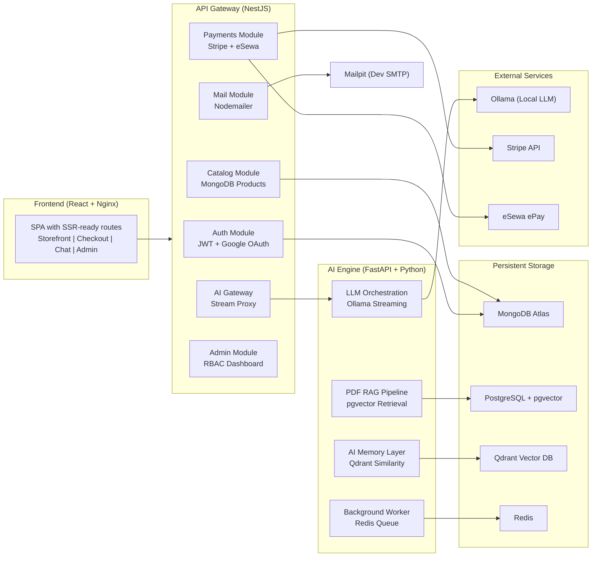

# 🧑‍💻 Resume Showcase — Atlas Commerce Lab

> **How to use this file:** Copy the bullet points that match the role you are applying for.
> Each section maps to a real part of the codebase so you can speak to every line in an interview.

---

## 🎯 One-Line Project Summary (for "About" / LinkedIn Headline)

> Built a production-style AI-commerce platform from scratch — combining a local LLM concierge, vector-memory RAG pipeline, dual-provider payments (Stripe + eSewa), and a real-time streaming chat UI — all wired together across nine containerized microservices.

---

## 🏗️ System Architecture At a Glance

---

## 🤖 AI & Machine Learning Engineering

- **Designed and shipped an end-to-end local-LLM orchestration layer** using Ollama as the inference engine, routing requests through a FastAPI microservice that normalizes streaming NDJSON events (`start → delta → done`) back to the React frontend — zero cloud dependency, runs fully offline.

- **Built a RAG (Retrieval-Augmented Generation) pipeline from the ground up** — upload a PDF, chunk it with configurable overlap, embed every chunk with `nomic-embed-text` via Ollama, persist vectors into a pgvector (PostgreSQL) database with IVFFlat cosine-similarity indexing, then retrieve the top-6 semantically nearest chunks at query time and ground the LLM answer strictly to the document context.

- **Implemented a Qdrant-backed long-term AI memory layer** — every user message is embedded and upserted into a Qdrant vector collection; at inference time the service performs a similarity search (score threshold 0.6) and injects relevant past context into the system prompt, enabling the AI to remember facts across sessions without storing raw chat logs.

- **Engineered an LLM response normalizer** that handles the full spectrum of local-model output quality — it attempts direct JSON parsing, then regex-extracts embedded JSON blocks, then gracefully degrades into an NLP-based fallback that extracts a summary from the first two sentences, heuristically surfaces bullet-point key-points, and synthesizes follow-up prompts — so the UI always receives a stable, typed contract regardless of model behavior.

- **Exposed a product-aware AI assistant** that fetches the live catalog from the NestJS backend at inference time, injects it as structured context into the system prompt, and parses structured action tags (`[PRODUCT:id]`, `[ADD_TO_CART:id]`, `[CREATE_PRODUCT:{…}]`) out of the model's response — letting the LLM drive real UI actions and even create new catalog entries through chat.

- **Streamed real-time AI tokens from Ollama through three service hops** (Python → Node.js → Nginx → browser) using `httpx` async streaming, Node.js `pipe()`, and `X-Accel-Buffering: no` headers to guarantee zero-buffering token delivery — resulting in a typing-cursor UX with sub-100 ms perceived latency for the first token.

- **Architected a background AI worker module** using Redis and RQ as a job queue, separating heavy async tasks (bulk embedding, document ingestion, evaluation pipelines) from the synchronous HTTP request path — the pattern mirrors how production ML systems avoid request-time timeouts for CPU/GPU-intensive operations.

- **Built a conversation thread persistence layer** in MongoDB with a dedicated `ChatThreadsService`, enabling the AI chat UI to reload full conversation histories and maintain context across browser refreshes.

---

## 🔧 Backend & Systems Engineering

- **Designed a multi-provider payment orchestration layer** in NestJS that normalizes Stripe Checkout and eSewa ePay behind one internal order lifecycle — the backend reprices every cart from the database before creating a payment session, rejecting any client-supplied totals, which is the foundational security practice of production commerce systems.

- **Implemented Stripe webhook signature verification** against the raw request body (before JSON parsing), handled four lifecycle events (`checkout.session.completed`, `async_payment_succeeded`, `async_payment_failed`, `checkout.session.expired`), and reconciled order state from a secondary `GET /session-status` endpoint — providing a resilient, dual-confirmation model so a missed webhook never strands an order.

- **Built eSewa ePay integration from scratch** — generated HMAC-SHA256 signatures over `total_amount|transaction_uuid|product_code`, returned a signed hidden-form redirect payload to the frontend, verified the base64-decoded callback signature on the success redirect, and performed a secondary server-to-server transaction status API call before marking any order as paid — all without relying on client-reported values.

- **Implemented JWT-based authentication with Google OAuth 2.0** using Passport.js strategies, bcrypt password hashing (salt rounds 10), cryptographic password-reset tokens with 1-hour expiry, and a "link existing account" flow that merges a returning Google user with a previously email-registered account — all without exposing whether a given email exists (timing-safe 401 responses).

- **Built an API gateway pattern in NestJS** that proxies all browser traffic away from direct service access — MongoDB, Ollama, Stripe, and eSewa are never reachable from the browser; every call passes through NestJS, which validates DTOs, normalizes errors, injects secrets, and owns rate-limiting hooks.

- **Designed a MongoDB catalog and order data model with Mongoose** including Mongoose schemas for products (with category, pricing, and visual metadata), orders (unified across payment providers), and users — with auto-index on first boot and optional Atlas URI override for zero-friction production promotion.

- **Architected a seed-on-boot system** that checks for an empty collection at startup and bulk-inserts a realistic product catalog, so any fresh Docker environment is immediately demo-ready without manual data setup.

---

## 🖥️ Frontend Engineering

- **Built a stateful streaming chat UI in React** that opens a native Fetch stream to the backend, runs a `TextDecoder` line-by-line on the NDJSON stream, appends delta tokens to React state on every chunk, and auto-scrolls only when the user is already at the bottom — avoiding forced scroll hijacking during manual review of long responses.

- **Engineered a server-trusted checkout flow** where the frontend never calculates or stores a payable total — it submits cart item IDs and quantities, receives a server-priced quote, captures customer details, then redirects to a provider-hosted payment page; the result page re-fetches order status from the backend rather than trusting URL query parameters.

- **Implemented a persistent cart context** with React Context + local storage hydration so the cart survives navigation, browser refresh, and checkout redirects, then re-syncs with server pricing on the next quote call.

- **Built a markdown renderer with syntax-highlighted code blocks** using a custom `MarkdownRenderer` component that detects fenced code blocks, applies editor-style formatting, and provides a one-click copy action — matching the UX pattern of modern AI chat tools.

- **Designed a dynamic model-picker sidebar** that sources available local models directly from the Ollama API via the backend, showing parameter size, quantization level, and family metadata — so the user sees exactly what is running on their hardware.

---

## 🐳 DevOps & Infrastructure

- **Orchestrated a nine-service Docker Compose stack** — Frontend (React/Nginx), Backend (NestJS), AI Service (FastAPI), AI Worker (RQ), MongoDB (Atlas), Redis, Qdrant vector DB, pgvector, Mailpit (local SMTP), and Dozzle (real-time log viewer) — with `depends_on` health checks that sequence startup correctly and prevent partial-boot race conditions.

- **Implemented production-grade container healthchecks** for every service using the appropriate native tooling: Node.js `fetch()` for NestJS, Python `urllib.request` for FastAPI, `redis-cli ping` for Redis, `pg_isready` for pgvector — so Docker Compose can reliably detect degraded services and block dependent container startup.

- **Configured Nginx as a reverse proxy in the frontend container** to transparently route `/catalog/*`, `/payments/*`, and `/ai/*` to the backend over Docker's internal bridge network — the browser sees one origin, CORS is a non-issue, and the backend topology is completely hidden.

- **Supported dual database targets** — MongoDB Atlas via URI environment variable and a local Mongo container via Docker Compose — with zero code changes required; the environment variable fallback chain handles both cases at runtime.

- **Wired a local SMTP testing environment with Mailpit** so transactional emails (password reset, order confirmation) are intercepted and viewable at `localhost:8025` during development, with a live production mail server drop-in via environment variables.

---

## 📊 Impact & Scale Indicators (for the interview conversation)

| Dimension | Detail |
|-----------|--------|
| **Services** | 9 containerized microservices coordinated by Docker Compose |
| **AI models** | Works with any Ollama model: qwen, llama, mistral, codellama, deepseek |
| **Payment providers** | 2 (Stripe Checkout + eSewa ePay) behind one unified order model |
| **Auth flows** | 3 (email/password, Google OAuth 2.0, password-reset with token expiry) |
| **Vector stores** | 2 (Qdrant for AI memory, pgvector for PDF RAG) |
| **Streaming hops** | 4 (Ollama → Python → Node.js → Nginx → Browser) |
| **Languages** | TypeScript (NestJS, React), Python (FastAPI), SQL (pgvector), Nginx config |

---

## 💬 Senior Full-Stack Engineer Interview Q&A

### Q1: "Tell me about a challenging technical problem you solved."

> "The trickiest part was the streaming pipeline. Ollama emits tokens as NDJSON over HTTP, Python reads them with `httpx` async streaming, Node.js forwards the response stream using `pipe()`, and Nginx has to not buffer anything before it hits the browser. If any layer adds buffering, the user sees a blank screen for 10 seconds and then the whole answer dumps at once. I had to set `X-Accel-Buffering: no`, `Cache-Control: no-cache, no-transform`, and `flushHeaders()` in the NestJS response — and verify each hop individually before the token-by-token UI worked end to end."

**Follow-up: "How did you debug each hop?"**

> "I used `curl --no-buffer -N` directly against each service port. First `localhost:11434` (Ollama) — tokens streamed fine. Then `localhost:8000` (FastAPI) — tokens streamed. Then `localhost:3000` (NestJS) — blank for 8 seconds, then dump. That isolated the problem to the NestJS layer. I found that `res.write()` without calling `res.flushHeaders()` first causes Node's HTTP to batch the response until the internal 16KB buffer fills."

---

### Q2: "How did you design the payment security?"

> "The core rule is: the server is the only source of truth for money. The frontend never sends a price. It sends product IDs and quantities. The backend fetches current prices from MongoDB, recalculates the total, creates the payment session with those server-computed numbers, and stores an order snapshot before redirecting. After payment, we don't trust the redirect URL parameters — Stripe has a signed webhook, and eSewa gets a secondary server-to-server status API call. A user can't manipulate the URL to mark their own order as paid."

**Follow-up: "What's the most dangerous payment vulnerability you've seen?"**

> "Trusting client-submitted prices. I've seen codebases where the frontend sends `{price: 0.01, quantity: 1}` and the backend just creates the payment session with that price. An attacker opens DevTools, changes the price in the request body, and buys a $500 product for $0.01. Our architecture makes this impossible because the backend completely ignores any price the client sends."

---

### Q3: "How does your RAG pipeline work?"

> "When a PDF is uploaded, I parse it with `pdf-parse`, normalize whitespace, then split into 1200-character chunks with 200-character overlap so context isn't lost at boundaries. Each chunk gets embedded with `nomic-embed-text` via Ollama's `/api/embed` endpoint and stored in pgvector with an IVFFlat cosine index. At query time, I embed the question, run a `ORDER BY embedding <=> $query LIMIT 6` vector similarity query, inject those chunks into a grounded system prompt that tells the model to answer only from the excerpts, and stream the response back. The model literally cannot hallucinate about the document because it only sees those six chunks."

**Follow-up: "What happens when a user asks a question that isn't covered by the document?"**

> "The system prompt includes an explicit instruction: 'If the answer is not found in the provided excerpts, say so clearly. Do not fabricate information.' The model's context window only contains the 6 retrieved chunks, so it has no training data to hallucinate from about that specific document. In practice, it responds with something like 'Based on the provided document, I don't see information about X.' This is a core RAG design principle — grounding over generation."

---

### Q4: "Your 4-hop streaming pipeline adds latency. Wouldn't it be simpler to have the browser talk directly to Ollama?"

> "Simpler, yes. But catastrophically insecure and unmaintainable. Direct browser-to-Ollama means:
> 1. **Ollama's IP and port are exposed** in the browser's network tab. Anyone can enumerate your models, submit arbitrary prompts, or DDoS your GPU.
> 2. **No authentication gate**. The chat feature should require login. That auth check lives in NestJS.
> 3. **No rate limiting**. Without the gateway, a single browser tab can fire 100 concurrent generation requests and exhaust your GPU.
> 4. **No context injection**. The system prompt (catalog data, conversation memory, RAG context) is assembled server-side. The browser doesn't have access to MongoDB or Qdrant.
> 5. **Vendor lock-in**. If we switch from Ollama to OpenAI's API tomorrow, the frontend code changes in zero files. The gateway absorbs the provider switch.
>
> The 4-hop latency overhead is <5ms per hop (Docker bridge networking). The actual latency bottleneck is Ollama's token generation speed (~15ms/token), which is 1000x larger."

---

### Q5: "Walk me through how your seed-on-boot system works and why it matters for developer experience."

> "When the NestJS backend boots, the `CatalogService.onModuleInit()` hook checks if the MongoDB products collection is empty. If it is, it bulk-inserts a curated catalog of ~20 products with realistic data — names, descriptions, prices, categories, images, and stock levels. This means any developer who runs `docker compose up` for the first time sees a fully populated storefront immediately, without needing to run migration scripts or import SQL dumps. It dramatically reduces the 'time to first wow' — the number of minutes between cloning the repo and seeing a working product. In production, you'd disable this with `STORE_SEED_ON_BOOT=false`."

**Follow-up: "What if two NestJS replicas boot simultaneously and both try to seed?"**

> "Race condition. Both check `count === 0`, both proceed to insert. You'd get duplicate products. The fix is to use MongoDB's `findOneAndUpdate` with `upsert: true` on a unique key (like `slug`), or wrap the seed in a distributed lock using Redis `SET NX EX`. For a teaching project with a single replica, the current approach is fine. For production multi-replica deployments, the Redis lock pattern is the standard solution."

---

## 🏷️ Skills Tags (for ATS keyword matching)

`React` · `TypeScript` · `NestJS` · `Node.js` · `FastAPI` · `Python` · `MongoDB` · `Mongoose` · `PostgreSQL` · `pgvector` · `Qdrant` · `Redis` · `Ollama` · `LLM` · `RAG` · `Vector Search` · `Embeddings` · `Streaming` · `NDJSON` · `Stripe` · `Webhooks` · `JWT` · `OAuth 2.0` · `Passport.js` · `bcrypt` · `HMAC-SHA256` · `Docker` · `Docker Compose` · `Nginx` · `Microservices` · `REST API` · `API Gateway` · `CI/CD-ready` · `MongoDB Atlas` · `Feature-Sliced Design` · `Vite`

---

*All bullet points above are backed by actual code in this repository. Every claim can be demonstrated live by running `docker compose up --build` and walking through the codebase.*
