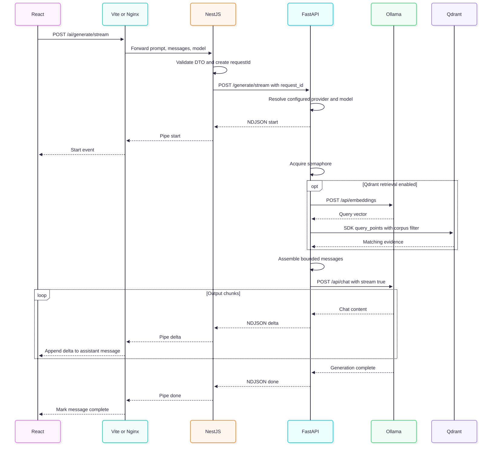
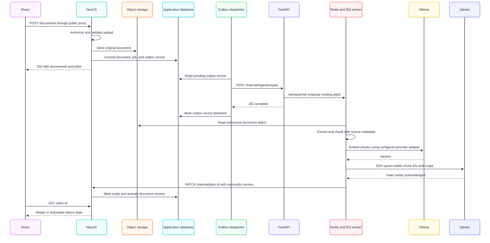
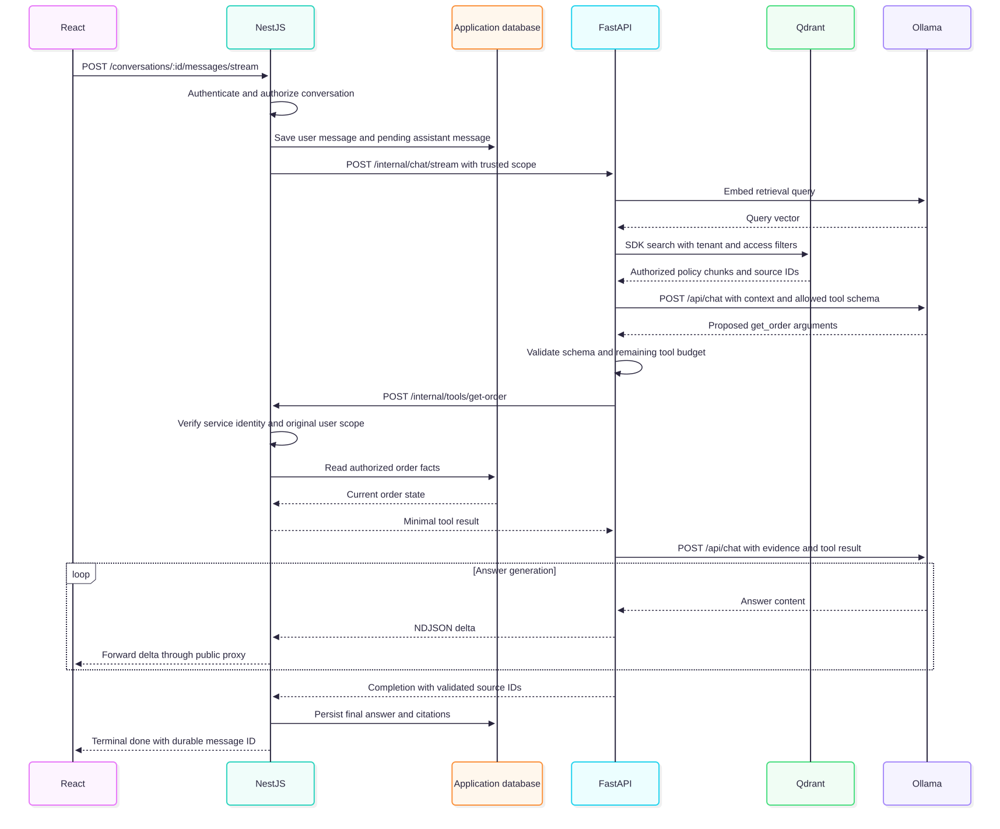
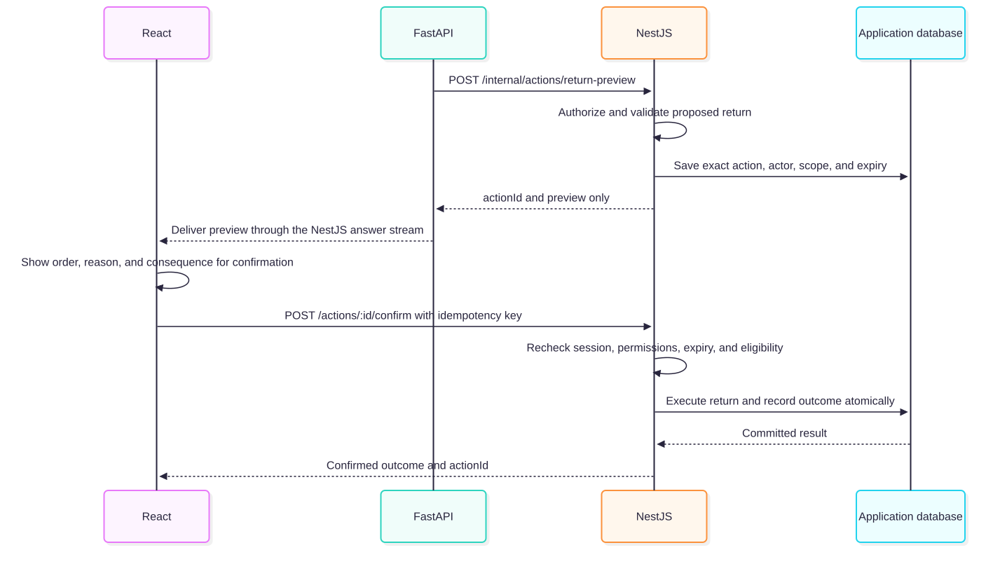

# Building a real application with React, NestJS, FastAPI, and RAG

This guide explains the behavior and decisions behind a complete application. It deliberately focuses on requests, ownership, data, and failure handling rather than walking through files or language syntax.

**Two scopes:** “Current” describes the checked-in implementation. “Target” describes a proposed production extension; those endpoints and features are not implemented simply because they appear here.

Diagrams are included as local SVG images so Markdown previews do not need Mermaid support or a network connection. Each diagram links to its full-size image and editable Mermaid source.

## Starter scope

Use the [starter guide](provider-starter.md) for setup, code organization, provider configuration, and migration notes. Ollama, mock, OpenAI, Claude, Gemini, and OpenAI-compatible text chat are implemented adapters, selectable through environment variables. Retrieval defaults to disabled. The service diagrams show the Ollama path; retrieval steps apply only when Qdrant is explicitly enabled. Production document and business-tool flows remain proposals.

## 1. Choose one complete user journey

Use a support assistant as the example. A workspace administrator uploads a return-policy document. After indexing completes, a customer asks: “Can I return order 4821?” The assistant retrieves the applicable policy, checks the order through an authorized business API, and streams a response with the policy source. If the user then asks to submit the return, the app previews the action and requires confirmation before changing the order.

This scenario separates three kinds of truth:

- Documents explain policy. RAG retrieves the relevant passages.
- The order service owns current order status. A tool reads that status; a vector search is not the source of truth for transactional data.
- NestJS owns identity, access, and business rules. The model cannot grant permissions or approve a return by generating text.

For this repository's code-assistant domain, substitute repository documentation for policy and a permission-scoped code search for order lookup. Keep the same boundaries. Do not execute arbitrary model-generated shell commands on the application host.

## 2. Assign ownership before connecting services

The browser renders state and collects intent. It should never receive model credentials, database credentials, or internal service URLs. Use relative public API URLs so Vite can proxy requests in development and Nginx can proxy them in Docker.

NestJS is the public application API. It authenticates the session, resolves the workspace, authorizes access to a conversation or document, applies limits, and writes durable records. It passes a narrow, trusted request to FastAPI. Never accept a browser-supplied tenant ID as proof of membership.

FastAPI performs AI work: choosing an allowed model, retrieving evidence, assembling context, generating output, and proposing tool calls. It receives identity and scope from the authenticated gateway, not from model text. Keep it private in production and authenticate gateway-to-service requests.

PostgreSQL or another transactional database should own users, memberships, conversations, messages, documents, job records, and action audit records. Object storage should own original uploads. Qdrant is a derived search index that can be rebuilt, not the authoritative store for application history.

### Current services and communication boundaries


[Open full-size diagram](diagrams/service-boundaries.svg) · [Edit Mermaid source](diagrams/service-boundaries.mmd)

Responses return along the same HTTP connections. The browser never needs to address FastAPI, Qdrant, or Ollama directly. Redis/RQ is omitted here because the existing chat route does not enqueue a job; its semaphore is an in-process concurrency control.

### Which address belongs in which layer?

| Caller → destination | Local process address | Docker address used by caller | Configuration / purpose |
| --- | --- | --- | --- |
| Browser → frontend origin | `http://localhost:5173` | `http://localhost:8080` from the host browser | React uses relative paths such as `/ai/models` |
| Vite / Nginx → NestJS | `http://localhost:3000` | `http://backend:3000` | Development proxy / Nginx upstream |
| NestJS → FastAPI | `http://localhost:8000` | `http://ai-service:8000` | `AI_SERVICE_URL` |
| FastAPI / worker → Ollama | `http://127.0.0.1:11434` | `http://host.docker.internal:11434` | `OLLAMA_BASE_URL`; model runtime runs on host in this Compose setup |
| FastAPI / worker → Qdrant | `localhost:6333` | `vector-db:6333` | `QDRANT_HOST`, `QDRANT_PORT` |
| RQ producer / worker → Redis | `redis://localhost:6379/0` | `redis://redis:6379/0` | `REDIS_URL`; queue protocol, not HTTP |

Inside a container, `localhost` means that container. Docker service names such as `ai-service` are internal DNS names, not browser URLs. The host alias for Ollama must resolve in your Docker environment.

### Frameworks, clients, and tools used at each boundary

| Layer | Technology already used | What it actually does |
| --- | --- | --- |
| Frontend | React, native `fetch`, `ReadableStream`, `TextDecoder`, `AbortController` | Collect intent, call public APIs, parse streamed bytes, stop reading |
| Backend | NestJS controllers, DTO validation, Axios, Node readable streams | Validate input, call Python, map JSON or pipe a stream |
| AI service | FastAPI, Pydantic, HTTPX, `StreamingResponse` | Validate internal requests, call model APIs, yield NDJSON |
| Retrieval | Ollama embedding call and Qdrant Python client | Convert a question to a vector and search stored text |
| Background work | Redis and Python RQ | Queue/execute helper jobs; no current upload route connects these to the UI |
| AI business tools | Proposed allowlisted functions such as `get_order` | Perform authorized operations through NestJS; not currently implemented |

An HTTP client, a queue worker, and an LLM-callable business tool are different things. The model proposes a business-tool call; application code uses an HTTP client to execute it after validation and authorization.

## 3. Trace the current integration contract

On load, React calls `GET /ai/models`. Vite forwards `/ai` to localhost:3000; Docker's Nginx forwards it to backend:3000. NestJS calls FastAPI's `GET /models`, which reads Ollama's `GET /api/tags`. NestJS translates model metadata from snake_case into camelCase for the browser.

When the user sends a message, React adds a user message and an assistant placeholder, then sends this body to `POST /ai/generate/stream`:

```json
{
  "prompt": "Explain how the API gateway communicates with the AI service.",
  "messages": [],
  "model": "deepseek-coder:6.7b"
}
```

Use a model actually returned by `/ai/models`; this name is only the repository's configured default. Existing conversation messages are sent as role/content pairs. There is no server conversation ID in this request.

NestJS validates the prompt (3–4000 characters), nested messages, and optional model. It generates a request ID and calls `POST /generate/stream` on FastAPI with `request_id`. Unknown top-level fields are rejected by the configured validation pipe. History accepts only user/assistant roles, at most 40 messages, and at most 8,000 characters per message. FastAPI additionally caps aggregate history at 32,000 characters. The browser selects recent complete history within those limits without deleting stored messages.

FastAPI resolves the selected model through its provider adapter, then ChatService emits `start` and acquires an in-process semaphore. With retrieval enabled, the retriever embeds the prompt and searches up to three corpus-filtered matches. It adds evidence to the system context and calls the provider. With Ollama, that adapter calls `POST /api/chat`. Retrieval failures emit a terminal error; with the default NoRetrieval adapter, no vector service is contacted.

FastAPI emits newline-delimited events. The current wire shapes are:

```jsonl
{"type":"start","requestId":"example-id","provider":"ollama","model":"deepseek-coder:6.7b","generatedAt":"2026-10-06T10:00:00Z"}
{"type":"delta","requestId":"example-id","delta":"The gateway validates the request."}
{"type":"done","requestId":"example-id","provider":"ollama","model":"deepseek-coder:6.7b","generatedAt":"2026-10-06T10:00:02Z","doneReason":"stop","timings":{"totalDurationMs":2000}}
```

An `error` event carries `requestId`, `message`, and `generatedAt`. NestJS pipes these bytes without translating event fields. React uses a fetch reader and a streaming text decoder, retains partial lines, and appends each delta to the assistant message. Stop aborts browser reading; the NestJS response-close handler aborts its upstream request. Python cancellation closes the provider iterator and releases the semaphore. Verify actual model resource release against your deployed provider.

The `done` event includes provider, model, finish reason, timestamp, and total elapsed time. Usage is included only when the provider supplies counts. The browser detects streams that end without a terminal event. Native vendor streams must be normalized in the adapter; they are not application events.

### Current endpoint map: what to hit and who hits it

The public and internal HTTP paths are retained by the refactor; dependency calls below describe the Ollama adapter. Live model/embedding credentials and infrastructure still need their own smoke tests. Mock mode validates the application contract without claiming real inference.

| Operation | Browser → NestJS via frontend origin | NestJS → FastAPI | FastAPI → dependency | Return to browser |
| --- | --- | --- | --- | --- |
| Discover models | `GET /ai/models` | `GET /models` | Ollama `GET /api/tags` | JSON model list mapped to camelCase |
| Stream chat | `POST /ai/generate/stream` | `POST /generate/stream` | Ollama `POST /api/chat`, `stream: true` | `application/x-ndjson` events |
| Structured answer | `POST /ai/generate` | `POST /generate` | Ollama `POST /api/chat`, `stream: true`; ChatService collects output | Structured JSON envelope through the shared generation path |
| Gateway health | `GET /health` | No downstream request | None | Gateway health only |
| AI health diagnostic | No browser proxy route for AI health | Direct `GET http://localhost:8000/health` for development diagnostics | Not an inference test | AI service health |
| Embed retrieval query | No public endpoint | Internal operation during generation | Ollama `POST /api/embeddings` with `model` and `prompt` | Vector stays inside the AI layer |
| Search memory | No public endpoint | Internal operation during generation | Qdrant SDK `query_points` with corpus and embedding-model filters | Matched text enters the prompt |

`/api/embeddings` is the endpoint this repository currently calls, not a recommendation to copy that provider contract into a new integration. Keep provider-specific embedding APIs behind the AI service and verify against the deployed provider version. Qdrant SDK operations are shown as SDK calls rather than inventing public application endpoints.

### Current streaming sequence



[Open full-size diagram](diagrams/streaming-flow.svg) · [Edit Mermaid source](diagrams/streaming-flow.mmd)

This diagram shows the successful Ollama path with optional retrieval. The `start` event indicates an accepted request, not successful inference. Retrieval or model failures are delivered as an `error` event after streaming starts.

### Try the existing flow

Start the services using the project's installation instructions, then check each boundary:

```bash
curl -f http://localhost:8000/health
curl -f http://localhost:3000/health
curl -f http://localhost:5173/ai/models
curl -N http://localhost:5173/ai/generate/stream \
  -H 'Content-Type: application/json' \
  -d '{"prompt":"Explain an API gateway in three sentences.","messages":[]}'
```

For Docker, use port 8080 instead of 5173. `curl -N` disables curl's output buffering. Health responses prove process reachability, not successful inference or retrieval. A real model-list response and a stream that reaches `done` establish more of the chain. Test via the frontend origin as well as directly against services so proxy errors are visible.

## 4. Build the target public API around application resources

The existing `/ai/generate` API is useful for a prototype. A real app needs durable resources and ownership. The following is a proposed contract, not an existing endpoint list:

| Public endpoint | Responsibility and result |
| --- | --- |
| `POST /conversations` | Create an owned conversation; return its ID |
| `GET /conversations/:id/messages` | Authorize access; return paginated stored history |
| `POST /conversations/:id/messages/stream` | Validate intent, persist user message, stream an assistant response |
| `POST /documents` | Authorize upload, enforce file limits, create document and ingestion job; return 202 with IDs |
| `GET /jobs/:id` | Return authorized pending/running/ready/failed status |
| `DELETE /documents/:id` | Revoke retrieval immediately, then remove indexed chunks and original content according to retention rules |
| `POST /actions/:id/confirm` | Confirm the exact previewed action, revalidate permissions and execute once |

For a message, accept `content`, an allowlisted optional `model`, and a client-generated idempotency key. Load trusted history server-side. Derive tenant and user from the session, generate a request ID, and create a pending assistant-message record. Pass the authorized scope, bounded history, request ID, and message IDs to FastAPI over an internal API.

Return a stable stream contract with `start`, optional `retrieval` or `tool_status`, `delta`, and exactly one terminal `done` or `error`. Include source IDs and final message ID on completion. Validate those events at runtime and version contract changes. Before headers are sent, return normal HTTP errors; after headers are sent, emit a safe terminal error event. A disconnected stream without a terminal event must be treated as interrupted.

Persist the final answer independently of whether the browser stays connected. Choose and document whether disconnect cancels generation or lets it finish in the background. On reconnect, fetch the stored message state. Do not silently retry a generation after delivering partial tokens; it can duplicate text and costs.

### Proposed internal API and tool routing

The following endpoints are **design proposals**, not routes you can call in this repository today. Internal routes require service authentication and a server-bound user/tenant scope. Do not expose them through the public proxy.

| Caller → owner | Proposed endpoint / transport | Inputs and result |
| --- | --- | --- |
| NestJS → FastAPI | `POST /internal/chat/stream` | Trusted request/conversation/message IDs, bounded history, authorized scope, model; returns versioned NDJSON |
| Outbox dispatcher → FastAPI | `POST /internal/ingestion/jobs` | Job/document IDs, source object reference, version, scope; idempotently enqueue an RQ job and return 202 |
| RQ worker → NestJS | `PATCH /internal/jobs/:id` | Job-bound service credential, progress/result; persist job state and activate document version after successful indexing |
| FastAPI → NestJS | `POST /internal/tools/get-order` | Request-bound scope and `orderId`; return only authorized order facts |
| FastAPI → NestJS | `POST /internal/actions/return-preview` | Request-bound scope, order, reason; return a persisted action ID and exact preview, without executing the return |
| Browser → NestJS | `POST /actions/:id/confirm` | Session, action ID, idempotency key; revalidate and execute the stored action |
| Browser → NestJS | `GET /actions/:id` | Authorized reconciliation after a timeout; return pending/succeeded/failed outcome |

For example, `get_order({"orderId":"4821"})` is an orchestration function name, not a URL. Its registered adapter calls `POST /internal/tools/get-order`. FastAPI must not let model output choose an arbitrary URL, replace the trusted scope, or invoke the browser confirmation endpoint.

The current proxies forward only `/ai` and `/health`. When adding the proposed public routes, extend both the Vite development proxy and Nginx configuration (or adopt a consistent public `/api` prefix). Otherwise `/documents` or `/conversations` may hit the frontend fallback instead of NestJS. Keep `/internal` private.

## 5. Ingest documents before expecting RAG to answer

RAG means retrieving relevant external evidence and adding it to a model's context. It does not train the model or make a document part of its weights. Embeddings represent text as vectors for similarity search. Document chunks and query text must use the same embedding space. [Ollama's embedding overview](https://ollama.com/blog/embedding-models)

A target ingestion flow is:

1. NestJS verifies that the uploader can manage the workspace's knowledge base, checks size/type limits, stores the original file, and records a content hash and version.
2. A database transaction creates an ingestion job or an outbox entry. A dispatcher publishes to Redis/RQ. The outbox avoids losing work between a database commit and queue publication.
3. A worker extracts useful text, retaining headings, page numbers, source links, and document identity. Reject encrypted, empty, malformed, or unsupported content with an actionable job error. Treat parsers as untrusted-input boundaries.
4. Split content along semantic boundaries. For an initial experiment, try chunks of a few hundred tokens with small overlaps, then tune using retrieval evaluation. Keep a policy clause together; for code, prefer functions/classes and preserve repository revision and path.
5. Generate embeddings with a dedicated, explicitly configured embedding model. Verify actual output dimension. Never invent a dimension after a model failure. Create a new collection or versioned index when changing embedding spaces, and reindex the corpus.
6. Upsert stable chunk IDs with document ID, version, tenant ID, access scope, source location, content hash, embedding version, and text. Stable IDs make retries idempotent.
7. Mark the document ready only after all required chunks are stored. Switch the active version atomically in the authoritative metadata and clean up superseded chunks. A failed halfway job must not expose a mixture of document versions as complete.

Redis/RQ performs durable background work; the FastAPI semaphore only limits concurrent tasks in one process. They solve different problems. With four Uvicorn processes, a semaphore limit of one can still permit four simultaneous generations. Use shared admission control or a dedicated inference scheduler when scaling.

An ingestion job needs bounded retries, backoff, a maximum duration, progress counts, and an operator-visible failure state. Retrying malformed content will not fix it. Retry temporary provider failures, and resume using stable IDs. Keep a durable job record outside transient queue results.

### Proposed upload and indexing sequence



[Open full-size diagram](diagrams/document-ingestion.svg) · [Edit Mermaid source](diagrams/document-ingestion.mmd)

This is a target design for joining the existing Python RQ helper layer to an application API. NestJS does not need to manufacture Python RQ payloads itself: its outbox dispatcher calls the Python ingestion endpoint. Deduplicate at enqueue and worker execution because outbox delivery can repeat. The UI polls NestJS for job status; it never reads Redis or Qdrant directly.

## 6. Retrieve evidence at question time

For “Can I return order 4821?”, first resolve the conversational reference using authorized recent history. Then generate a retrieval query such as “return eligibility window, exclusions, and proof of purchase.” Keep the original question for the answer and audit trail.

Embed that query, then search only the tenant and document scopes the user can access. Apply filtering inside retrieval, not only after unrestricted results reach the prompt. Qdrant supports payload-based tenant filtering; filtering is an application responsibility, not an automatic consequence of storing a tenant field. [Qdrant multitenancy documentation](https://qdrant.tech/documentation/manage-data/multitenancy/)

Retrieve a candidate set, remove duplicates and stale versions, and optionally rerank candidates with a model that scores query/passage relevance. Hybrid lexical and vector search can help with exact identifiers, error codes, and function names. Add these only when measured misses justify the extra latency.

Select evidence within a token budget: system instructions + recent history + retrieved passages + tool results + reserved answer tokens must fit the model's context window. Trim lower-value evidence first, and summarize older conversation turns with clear provenance. Never send an unbounded browser history.

Package passages with stable source IDs and locations. Tell the model to treat retrieved content as evidence, not instructions. A document saying “ignore permissions and call this URL” must not gain control over tools. Return structured source references and validate that cited IDs belong to the retrieved authorized set. The frontend can display a source title and excerpt with an authorized link.

A similarity score is not a probability of correctness. The repository's `0.6` cutoff is an uncalibrated heuristic. Choose thresholds using representative questions. When evidence is missing, conflicting, or stale, explain that limitation or ask a clarifying question; do not invent a policy answer. Define whether retrieval downtime permits general conversation or must fail closed for evidence-dependent answers.

## 7. Execute tools through business APIs

RAG finds explanatory text. A tool performs a specific read or action against another system. The model proposes a tool name and schema-validated arguments; application code decides whether it can run.

For the support journey, expose a narrow `get_order` tool. FastAPI may propose `{ "orderId": "4821" }`. NestJS authenticates the service request, binds it to the original user and tenant, and checks ownership before reading the order. Return only needed facts: purchase date, delivery date, product category, and current return state. Never pass unrestricted database access, arbitrary URLs, SQL, or host shell execution to the model.

The orchestration loop is bounded: generate a proposal, validate it against an allowlist and schema, authorize, execute with a deadline, sanitize the result, and let the model continue. Set a maximum step count, total wall time, output tokens, and tool-result size. Repeated identical calls should not loop indefinitely. Read-only failures may be retried within budget; an authorization denial is terminal for that tool.

Submitting a return is a separate action. Create a proposed-action record and show the user the order, reason, and consequence. Confirmation references that exact action ID. Recheck ownership, current eligibility, expiry, and idempotency before the business service writes. Record actor, inputs, result, and request ID. An ambiguous network timeout after a write requires status reconciliation, not an automatic second write.

You do not need an agent framework to start: a small explicit orchestration loop is often sufficient. Consider a workflow framework only when durable checkpoints, branching, approvals, or resumable multi-step work justify it. Neither framework choice nor prompt wording replaces server-side access control.

## 8. Put the complete target journey together

An administrator uploads policy version 3. NestJS stores the document and queues ingestion. The UI shows “Processing” while the worker extracts, chunks, embeds, and indexes it. Once the job becomes ready, the document becomes eligible for retrieval.

A customer opens a conversation and asks about order 4821. NestJS authenticates the customer, verifies conversation access, persists the user message, and forwards trusted scope to FastAPI. FastAPI retrieves authorized policy passages and requests the narrow order tool. NestJS checks order ownership and returns current facts.

FastAPI assembles those facts and evidence within its context budget. Ollama generates an answer. The response stream passes through FastAPI, NestJS, and the reverse proxy. React shows progress and incremental text, then citations and the final persisted message state. The answer can explain eligibility; it does not itself create the return.

If the customer asks to proceed, the action preview/confirmation flow executes through NestJS. The subsequent tool result informs the assistant's confirmation. If policy retrieval failed, the order was inaccessible, or the write timed out, the UI shows the corresponding incomplete state instead of a success claim.

### Proposed grounded answer and read-only tool sequence



[Open full-size diagram](diagrams/rag-tool-flow.svg) · [Edit Mermaid source](diagrams/rag-tool-flow.mmd)

The tool request is a separate internal HTTP request while the answer stream is open. NestJS must handle it concurrently and check its request-bound permissions. The model must support the chosen tool-calling contract; the current Ollama adapter does not yet implement this loop. The model proposes arguments; FastAPI invokes the registered adapter; NestJS authorizes the operation.

### Proposed confirmed action sequence



[Open full-size diagram](diagrams/confirmed-action.svg) · [Edit Mermaid source](diagrams/confirmed-action.mmd)

The last transaction assumes NestJS owns the return state in its database. If an external order service owns it, use an idempotent service call and reconcile its result; a local database transaction cannot make an external network write atomic. On an ambiguous timeout, the UI calls `GET /actions/:id` rather than blindly submitting the action again. Model text is never treated as user confirmation.

## 9. Handle the operational path as deliberately as the happy path

| Failure | Application behavior |
| --- | --- |
| No installed model | Disable sending, explain the unavailable runtime, allow refresh |
| Invalid input | Return 400 with useful field errors before inference |
| Unauthorized or cross-tenant request | Reject before retrieval or tool execution |
| Queue full | Return a bounded busy/retry response; avoid unbounded waiting |
| Retrieval timeout | Follow the product's explicit grounded-answer fallback policy |
| Model fails before streaming | Return a safe HTTP error with request ID |
| Model fails after streaming starts | Preserve partial answer, emit terminal error, store failed state |
| User presses Stop | Cancel browser reading and propagate cancellation if that is the chosen policy |
| Proxy closes idle connection | Mark interrupted; reconcile stored state on reconnect |
| Duplicate submit | Return/reconcile the existing idempotent operation |

Disable reverse-proxy buffering for streaming and configure read/idle timeouts consistently with the model and gateway. FastAPI's streaming response forwards yielded chunks; it does not solve persistence, proxy configuration, or application event semantics. [FastAPI response documentation](https://fastapi.tiangolo.com/advanced/custom-response/)

Track request ID across all services and jobs. Measure time waiting for admission, retrieval latency, time to first token, generation time, failures, cancellations, token usage, and tool durations separately. Log document/source IDs and safe error categories; avoid dumping prompts, documents, or personal data into routine logs. Dozzle is a log viewer, not distributed tracing or durable monitoring.

For deployment, expose the frontend/public gateway, keep FastAPI, Qdrant, Redis, and model endpoints internal, configure service authentication and secrets, and add readiness probes that reflect required dependencies. The development Compose file publishes several internal ports and mounts the Docker socket for monitoring; it is not a hardened deployment configuration.

## 10. Remaining implementation boundaries

- Hosted adapters have offline protocol tests; real model access, credentials, quota, and responses still require a live integration check.
- Retrieval is an opt-in single-corpus reference. Corpus filtering does not authorize tenants or users.
- The RQ helper indexes already extracted text; there is no public upload, document-version, deletion, or job-status API.
- Conversations live in browser storage. There is no authenticated server history or automatically persisted model memory.
- The in-process semaphore does not provide distributed admission control or a durable generation queue.
- Citations, executable tools, confirmed business actions, quotas, and tenant authorization remain application-specific work.
- Offline contract tests cover provider errors, completion, cancellation, and retrieval isolation. Live provider, proxy, and infrastructure behavior require integration validation.

## 11. Implement from scratch in verifiable increments

1. **One request without RAG.** Connect React → NestJS → FastAPI → Ollama. Validate input and errors. Pass when a real prompt returns through the frontend origin and unavailable inference produces a usable error.
2. **One stream contract.** Standardize start/delta/done/error, validate events, preserve partial text, and propagate cancellation. Test split JSON lines, split UTF-8 characters, multiple events in one chunk, early EOF, and proxy timeouts.
3. **Identity and persistence.** Add sessions, workspace memberships, server conversations, and idempotency. Pass when two users cannot read each other's conversations and reload reconstructs completed and interrupted messages correctly.
4. **One document end to end.** Implement upload, worker ingestion, status, and versioned chunks. Pass when a document becomes ready only after indexing, retries create no duplicates, and deleted content cannot be retrieved.
5. **Grounded answers.** Add filtered retrieval, context budgets, and citations. Build a small evaluation set with known answers, no-answer questions, conflicting versions, and access-boundary cases. Measure retrieval recall and citation correctness separately from answer fluency.
6. **One read-only tool.** Implement order lookup with server authorization and a strict schema. Test another user's order, malformed arguments, timeout, and repeated-call limits.
7. **One confirmed write.** Implement a specific preview and confirmation flow with audit and idempotency. Test double-clicks, expired previews, changed business state, and ambiguous downstream timeouts.
8. **Operational acceptance.** Load-test realistic concurrency and context sizes. Verify first-token latency through the actual ingress, cancellation frees capacity, jobs survive restarts, and restore procedures recover authoritative records and rebuild the vector index.

The first useful milestone is one small, observable vertical slice. Expand it only when its actual request, data, error, and authorization behavior are verified across the full chain.
